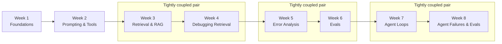

# Course Roadmap

An overview of the whole 8-week AI engineering curriculum: what each week covers, how difficult
it is, and how the weeks connect to each other.

## The Eight Weeks

| Week | Title | Focus | Difficulty | Link |
|---|---|---|---|---|
| 1 | Foundations | How a language model actually works — tokens, cost, context, embeddings, sampling, hallucination | Beginner | [Week-01/](/Week-01/README) |
| 2 | Prompting, Structured Output & Tool Calling | Writing prompts an engineer can rely on, forcing structured output, and letting models call real tools | Beginner-to-Intermediate | [Week-02/](/Week-02/README) |
| 3 | Retrieval & RAG | Building a Retrieval-Augmented Generation pipeline: chunking, embeddings, vector databases, grounded generation | Intermediate | [Week-03/](/Week-03/README) |
| 4 | Debugging Retrieval | Separating retrieval failures from generation failures; hybrid search, reranking, query rewriting, retrieval metrics | Intermediate-to-Advanced | [Week-04/](/Week-04/README) |
| 5 | Error Analysis | Reading traces systematically: open coding, error taxonomies, frequency × severity, choosing a fix target | Intermediate | [Week-05/](/Week-05/README) |
| 6 | Evals | Proving a change actually helped: eval sets, LLM-as-judge, G-Eval, RAGAS, before/after deltas | Intermediate-to-Advanced | [Week-06/](/Week-06/README) |
| 7 | Agent Loops | The think→act→observe loop, ReAct, tool design, stop conditions, agent memory, and when *not* to use an agent | Advanced | [Week-07/](/Week-07/README) |
| 8 | Agent Failures & Trajectory Evals | Spotting failure modes, trajectory evaluation, prompt injection defenses, tool sandboxing, and OWASP | Advanced | [Week-08/](/Week-08/README) |

## Week-to-Week Progression

Three pairs of weeks are tightly coupled and worth reading back-to-back rather than with a gap
between them:

- **Week 3 → Week 4**: Week 3 builds a working RAG pipeline; Week 4 immediately teaches you how
  to tell *why* it's wrong when it's wrong (retrieval failure vs. generation failure) and how to
  fix retrieval specifically. Reading Week 4 without a working mental model of Week 3's pipeline
  makes half its content abstract.
- **Week 5 → Week 6**: Week 5 is diagnosis (reading traces, naming failure categories, picking
  one to fix). Week 6 is the measurement machine that proves whether the fix worked. Week 6
  explicitly assumes you already have a labeled set of real failures from Week 5 to build eval
  sets from.
- **Week 7 → Week 8**: Week 7 builds the autonomous agent loop; Week 8 teaches you how that loop
  breaks (looping, tool misdispatch, outcome-trajectory gap) and how to defend it against direct/indirect
  prompt injection, least privilege vulnerabilities, and the OWASP LLM Top 10.

Weeks 1 and 2 are foundational prerequisites for everything downstream: Week 2's tool calling
is the direct building block for Weeks 7 and 8, while Week 1's embeddings underpin Weeks 3 and 4.

## How to Use This Site

The 8 weeks are meant to be read **linearly, in order** — each week's README states its
prerequisites explicitly. Alongside that linear path, several sections are **cross-cutting
references** you'll return to repeatedly rather than read once end-to-end:

- **[Concepts/](/Concepts/)** — one encyclopedia-style page per major term (LLM, RAG, Attention,
  Agent Loop, MCP, ...). Use it when a topic page assumes a term you want the fuller picture of.
- **[CheatSheets/](/CheatSheets/)** — dense, master (cross-week) quick-reference sheets for
  RAG, Prompt Engineering, LangChain, Vector Databases, and more.
- **[AI-GLOSSARY.md](/AI-GLOSSARY)** — single-line term lookups when you just need a definition,
  not a full explanation.
- **[Interview-Notes/](/Interview-Notes/)** — theory-only interview prep, organized by subject
  rather than by week.
- **[Visual-Guides/](/Visual-Guides/)** (and its [Comparisons/](/Visual-Guides/Comparisons/)
  subsection) — Mermaid-diagrammed mechanism walkthroughs and side-by-side comparison tables.
- **[SEARCH-INDEX.md](/SEARCH-INDEX)** — a full, flat list of every page on the site, useful when
  you know what you're looking for but not which folder it's in.
- **[Resources/](/Resources/)** — per-week further-reading lists (official docs, papers, blogs,
  videos, books) at Beginner/Intermediate/Advanced tiers.

For a progression that goes beyond these 8 weeks (into MCP, fine-tuning, and multi-agent
systems, which live only in the reference sections above), see
[LEARNING-PATH.md](/LEARNING-PATH).

## See Also

- [Learning Path](/LEARNING-PATH) — the broader Beginner → Multi-Agent-Systems progression.
- [Search Index](/SEARCH-INDEX) — the full site map.
- [Project README](/README) — what this project is and how to run it locally.
