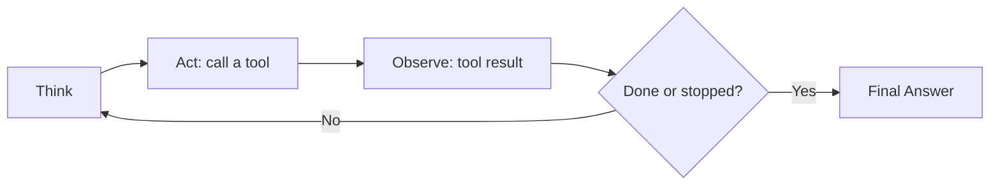

# AI Agents — Master Cheat Sheet

Cross-week reference (Week 7) plus general industry patterns.

## Core Terminology

| Term | Meaning |
|---|---|
| Agent | Model decides the step sequence at run time |
| Workflow | Engineer decides the step sequence at design time |
| Agent loop | Think → Act → Observe → Repeat, until done or stopped |
| ReAct | Thought → Action → Observation prompting pattern |
| Tool | Name + description + argument schema the model can call |
| Stop condition / budget | Code-enforced limit guaranteeing loop termination |
| Short-term memory | Current task's transcript, kept lean via truncation/summarization |
| Long-term memory | Durable facts stored externally, retrieved by relevance |
| Orchestrator-worker | One agent plans/delegates, sub-agents execute focused tasks |
| Human-in-the-loop | Explicit approval gate before high-stakes/irreversible actions |
| Multi-agent system | Several cooperating agents, each with a scoped role and tools |

## Agent Loop

## Agent-vs-Workflow Decision Checklist

1. Can I list every step needed, for every input I expect, right now? → **Yes: build a fixed
   workflow, stop here.**
2. Is only one specific sub-step unpredictable? → **Keep the rest a workflow; scope a small
   agent loop to just that sub-step.**
3. Is the entire task's step sequence genuinely unknowable in advance? → **Full agent loop —
   but only after step 4.**
4. Have stop conditions and budgets been set *before* shipping? → **Do this first.**
5. Have you measured (not assumed) the agent beats a workflow on real inputs? → **Run the
   comparison before committing.**

A conditional (if/else) inside a fixed pipeline is still a workflow — the branches are known in
advance even if which one runs depends on input. Using an LLM at a step doesn't make it an
agent; who decides the *sequence* does.

## Stop-Condition / Budget Quick Reference

| Budget | Guards against | Typical default |
|---|---|---|
| Step count | Infinite loops | Hard cap, e.g. 8-15 iterations |
| Token/cost | Runaway spend | Running total vs. a $ or token ceiling |
| Wall-clock time | Slow overall tasks | Timer from task start |
| Per-step timeout | One hanging tool call | Timeout per tool execution |
| Repetition detection | Stuck/cyclical behavior | Compare current action to recent history |
| Soft warning | Abrupt cutoffs | Inject "wrap up now" note at ~80% of any limit |

Always log the stop reason (final_answer / step_limit / cost_limit / timeout / repetition).

## Memory-Tier Comparison

| | Short-Term | Long-Term |
|---|---|---|
| Scope | One agent run | Across runs/sessions |
| Lives in | Model's context window | External store (vector DB, etc.) |
| Technique | Truncation, rolling summarization | Extract → embed → similarity retrieval |
| Risk if skipped | Context overflow, rising cost | Repeats questions, forgets preferences |

## Tool Design Quick Rules

- One tool, one job — split anything bundling two decisions.
- Name clearly (`get_order_status`, not `handle_order`).
- Description states *when* to use it, not just what it does.
- Strict schema: types, required/optional, enums where possible.
- Return compact, structured results — not raw API dumps.
- Design informative error messages — they're the model's only recovery signal.
- Fewer, well-scoped tools beat many overlapping ones.

## Framework Landscape (general knowledge)

| Framework | Model | Best fit |
|---|---|---|
| LangChain (`AgentExecutor`) | Implicit loop over chains/tools | Quick prototyping, rich integrations |
| LangGraph | Explicit graph: nodes, edges, conditional/loop-back control | Production control flow, custom loops |
| AutoGen | Multi-agent conversation framework | Research/experimentation with agent teams |
| CrewAI | Role-based multi-agent orchestration | Structured team-of-agents tasks |
| Hand-rolled loop | Direct while-loop calling the model | Full control, no framework lock-in — build once to learn it |

## Quick Reminders

- The loop has no hidden state between iterations — everything the model "knows" is in the
  transcript you feed it.
- Cost and latency scale with steps and history size, not just the final answer.
- The model never sees your code — tool name/description/schema *is* its entire interface.
- Build the loop by hand at least once — frameworks are convenience layers over concepts you
  should already understand.
- Default to a workflow. Require a concrete reason before reaching for an agent.
- Never ship an agent without stop conditions and budgets already in place.
- Least-privilege tool access — no agent should hold more tool/data access than its task needs.
