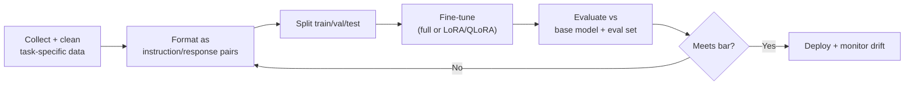

# Fine-Tuning — Master Cheat Sheet

General industry reference (not covered by the 7-week curriculum, which is RAG/prompting-focused).

## Core Terminology

| Term | Meaning |
|---|---|
| Fine-tuning | Continuing training of a pretrained model on a smaller, task/domain-specific dataset |
| Full fine-tune | Update all model weights — expensive, most flexible |
| PEFT | Parameter-Efficient Fine-Tuning — update only a small added set of parameters |
| LoRA | Low-Rank Adaptation — inject small trainable low-rank matrices into frozen weight layers |
| QLoRA | LoRA on a quantized (e.g., 4-bit) base model — cuts memory further |
| Instruction tuning | SFT on (instruction, response) pairs so the model follows directions well |
| RLHF | Reinforcement Learning from Human Feedback — align outputs to human preference |
| DPO | Direct Preference Optimization — RLHF-like alignment without a separate reward model |
| Catastrophic forgetting | Fine-tuning degrades previously-strong general capabilities |
| Overfitting | Model memorizes the fine-tune set, generalizes poorly beyond it |
| Adapter | Small trainable module inserted into a frozen network (LoRA is one kind) |

## Fine-Tuning vs RAG vs Prompting — Decision Table

| Need | Best fit |
|---|---|
| Inject fresh/changing facts | RAG — retraining for every data change doesn't scale |
| Teach a new output *style*, *format*, or *tone* consistently | Fine-tuning |
| Teach a narrow domain *vocabulary/jargon* the base model misuses | Fine-tuning (or domain-tuned embeddings for retrieval) |
| Improve reasoning on a task type quickly, cheaply, reversibly | Prompting (few-shot/CoT) first |
| Reduce prompt length/cost by baking in instructions | Fine-tuning (behavior becomes default, shorter prompts) |
| Ground answers in proprietary documents | RAG |
| Need the model to call tools in a very specific house style | Fine-tuning + prompting combined |

Default order to try: **prompting → RAG → fine-tuning.** Fine-tuning is the most expensive and
least reversible option — reach for it only when prompting/RAG demonstrably can't hit the target.

## Types of Fine-Tuning

| Type | What changes | Cost | Use case |
|---|---|---|---|
| Full fine-tune | All model weights | High (compute + storage per model copy) | Large behavior shift, ample data + budget |
| LoRA / PEFT | Small added low-rank matrices, base frozen | Low-medium | Most practical fine-tunes today |
| QLoRA | LoRA + quantized base | Low | Fine-tune large models on modest hardware |
| Instruction tuning | Weights (full or PEFT), via (instr, response) pairs | Varies | Make a base model follow instructions/chat |
| RLHF / DPO | Weights, via preference-ranked pairs | High (RLHF), medium (DPO) | Align tone, safety, helpfulness to human preference |

## Fine-Tuning Workflow (typical)

## Data Requirements

| Factor | Guidance |
|---|---|
| Format | Consistent (instruction, response) or (prompt, completion) pairs; match target inference format |
| Quantity | Can range from ~50-100 (style/format tuning, PEFT) to tens of thousands (full FT, new domain) |
| Quality over quantity | A small, clean, representative set beats a large noisy one |
| Diversity | Cover edge cases and the full range of expected inputs, not just the easy majority |
| Held-out eval set | Never fine-tune-and-eyeball — always hold out real examples for evaluation |

## Tradeoffs

| | Pro | Con |
|---|---|---|
| Full fine-tune | Maximum control, best fit for large shifts | Expensive, slow, own-and-serve a full model copy, forgetting risk |
| LoRA/PEFT | Cheap, fast, small artifact, swappable adapters | Slightly less capacity than full FT for very large shifts |
| RLHF/DPO | Aligns nuanced preferences prompting can't capture | Needs quality preference data, more complex pipeline |
| vs RAG | Bakes behavior in permanently, no retrieval latency | Stale as soon as facts change; requires retraining to update |
| vs Prompting | Shorter prompts, more consistent behavior at inference | Slower iteration loop, real cost/data investment |

## Quick Reminders

- Fine-tuning changes *behavior/style*, RAG changes *what the model knows at answer time* — they
  solve different problems and are often combined.
- Prefer PEFT (LoRA/QLoRA) over full fine-tuning unless you have strong evidence you need it.
- Always keep a held-out eval set — fine-tuning without measurement risks silent regressions.
- Catastrophic forgetting is real: a model fine-tuned narrowly can get *worse* at unrelated tasks.
- Closed-API providers (OpenAI, etc.) typically only expose fine-tuning, not full pretraining —
  "fine-tuning" in industry conversation almost always means this smaller-scale adaptation.
- Version fine-tuned models and their training data like any other production artifact.
