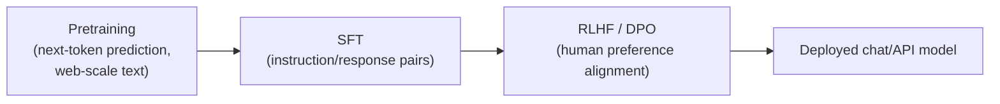

# LLM Fundamentals — Master Cheat Sheet

Master reference for Week 1 (tokens, context, decoding, model families, hallucination).

## The One Sentence That Explains Everything

> A language model predicts the next token, over and over, based on learned statistical
> patterns — it does not look facts up. Sounding right and being right are different things to it.

## Core Terminology

| Term | Meaning |
|---|---|
| Token | Chunk of text the model reads/writes — often a word-piece |
| Context window | Max tokens (input + output) a model can process at once |
| Embedding | Numeric vector representing a token's meaning (see Embeddings.md) |
| Temperature | Sharpens (low) or flattens (high) the next-token probability distribution |
| Top-k | Keep only the k most likely next-token candidates |
| Top-p (nucleus) | Keep smallest candidate set whose probabilities sum to p |
| Greedy decoding | Always pick the top-probability token; deterministic |
| Sampled decoding | Randomly draw a token weighted by probability; varied |
| Hallucination | Confident but false/fabricated model output |
| Pretraining | Next-token prediction over huge unlabeled text corpora |
| SFT (Supervised Fine-Tuning) | Training on curated instruction→response pairs |
| RLHF/DPO | Aligning outputs to human preference after SFT |
| Encoder-only | Bidirectional attention; understanding tasks (BERT) |
| Decoder-only | Causal attention; generation tasks (GPT, Claude, LLaMA) |
| Encoder-decoder | Both; input→output transformation tasks (T5) |
| Context rot / lost-in-the-middle | Uneven attention across a very long context window |

## Key Numbers and Formulas

| Fact | Value |
|---|---|
| Token-to-word ratio (English) | 1 token ≈ ¾ word ≈ 4 characters |
| 1,000 words ≈ | ~1,300 tokens |
| Output vs. input price | Output typically 3-5x more expensive |
| Old/small model context window | ~4K-8K tokens |
| Modern flagship context window | ~128K-1M+ tokens |
| Temperature = 0 | ≈ Greedy decoding |
| Temperature = 1 | Model's raw, unmodified distribution |
| Temperature > 1 | Flatter distribution, more randomness |

```
adjusted_logit = logit / temperature
probability     = softmax(adjusted_logit)

vector("king") - vector("man") + vector("woman") ≈ vector("queen")
```

## Model Family Comparison

| Family | Developer | Access | Trait |
|---|---|---|---|
| GPT | OpenAI | Closed API / ChatGPT | Broad ecosystem, multimodal |
| Claude | Anthropic | Closed API / claude.ai | Safety focus, long context |
| Gemini | Google | Closed API | Native multimodal, huge context |
| LLaMA | Meta | Open-weight | Self-hostable, fine-tunable |
| Mistral | Mistral AI | Open-weight + API | Efficient small/medium models |

## Architecture Comparison

| Type | Attention | Example | Use case |
|---|---|---|---|
| Encoder-only | Bidirectional | BERT | Classification, embeddings, search |
| Decoder-only | Causal | GPT, Claude, LLaMA | Chat, generation, code |
| Encoder-decoder | Both | T5 | Translation, summarization |

## Training Pipeline (high level)



## Sampling Settings Cheat Table

| Task type | Suggested temperature | Notes |
|---|---|---|
| Code / structured data / factual Q&A | 0-0.3 | Prioritize consistency and correctness |
| General conversation | 0.5-0.8 | Balance of coherence and naturalness |
| Creative writing / brainstorming | 0.8-1.2+ | Prioritize variety, accept more risk |

## Quick Reminders

- Both prompt (input) AND response (output) cost tokens — resent history compounds cost each turn.
- The model has no memory across separate conversations unless a product feature re-injects facts.
- Non-English text and long numbers often tokenize less efficiently — budget extra tokens.
- Decoding strategy (temperature/top-k/top-p) changes style and variety, never factual accuracy.
- Hallucination risk rises for: recent events (post-cutoff), obscure topics, precise
  numbers/citations, and long multi-step answers.
- RAG reduces hallucination by grounding answers in real retrieved text — it does not eliminate it.
- Open-weight (LLaMA, Mistral) = self-host and fine-tune; closed API (GPT, Claude, Gemini) =
  managed convenience, tighter control.
- "Lost in the middle": a large context window doesn't guarantee even attention across all of it.
