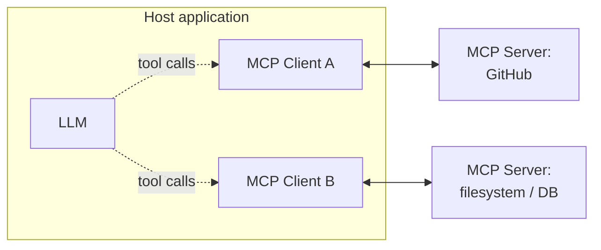

# MCP (Model Context Protocol) — Master Cheat Sheet

General knowledge reference — not covered by the 7-week curriculum.

## What It Is, In One Sentence

> MCP is an open, standardized protocol that lets an LLM application (host) connect to external
> tools, data, and prompts through a common client-server interface, instead of every app writing
> a bespoke integration for every tool/data source.

## Core Terminology

| Term | Meaning |
|---|---|
| Host | The LLM application the user interacts with (e.g., an IDE, chat app, agent runtime) |
| Client | Lives inside the host; manages a 1:1 connection to one MCP server |
| Server | A process exposing tools/resources/prompts over MCP — wraps an API, DB, filesystem, etc. |
| Tool | A callable function the model can invoke (like function/tool calling, but server-hosted) |
| Resource | A readable piece of context (a file, record, or data blob) the host can fetch |
| Prompt | A reusable, server-defined prompt template the host can surface to the user |
| Transport | How client and server talk: stdio (local process) or HTTP/SSE (remote) |
| JSON-RPC | The message format MCP uses under the hood for requests/responses |

## Why It Exists

- Before MCP: every AI app wrote custom, one-off integration code per tool/data source (N apps ×
  M tools = N×M integrations).
- MCP standardizes the interface once, so any compliant host can talk to any compliant server —
  "USB-C for AI tools" is the common analogy.
- Decouples tool/data providers (who build servers) from application builders (who build hosts) —
  each side only implements the protocol once.

## Architecture



- One client per server connection — a host can hold many simultaneous client↔server pairs.
- The server owns the actual integration logic (auth, API calls, business rules); the host never
  talks to the underlying system directly.

## MCP Primitives

| Primitive | Direction | Analogy |
|---|---|---|
| Tools | Model → server (invoked) | Function/tool calling, but hosted externally |
| Resources | Server → host (read) | Files/URIs the host can attach as context |
| Prompts | Server → host (surfaced to user) | Reusable prompt templates/slash-commands |
| Sampling | Server → host (request an LLM completion) | Lets a server ask the host's model to do work |

## MCP vs Plain Function/Tool Calling

| | Function/tool calling (API-native) | MCP |
|---|---|---|
| Definition location | Declared per-app, in your own code | Declared once, in a standalone server |
| Reuse across apps | None — redefine per app | Any MCP-compliant host can use the same server |
| Scope | Just callable functions | Tools + resources + prompts + sampling |
| Transport | In-band with the model API call | Separate client-server connection (stdio/HTTP) |
| Who executes | Your app's own code | The MCP server process |

MCP doesn't replace tool calling — it's a standard way to *supply* tools (and more) to a model
that still uses ordinary tool-calling under the hood between host and LLM.

## Typical Use Cases

- IDE/agent connecting to GitHub, Jira, Slack, databases, or a filesystem via existing servers.
- Exposing an internal company API/data source to any MCP-compliant assistant, once.
- Giving a coding agent structured access to project-specific tools (linters, test runners, docs).
- Composing multiple servers (e.g., filesystem + web search + ticketing) into one agent session.

## Lifecycle (conceptual)

```
Host starts client -> client <-> server handshake (capabilities exchanged)
  -> host lists available tools/resources/prompts
  -> model decides to call a tool -> client sends call -> server executes -> result returned
  -> host injects result into the model's context
```

## Quick Reminders

- MCP standardizes the *interface*, not the underlying capability — a bad tool description is
  still a bad tool description, MCP or not.
- Same tool-design rules apply as in AI-Agents.md: clear name, clear "when to use" description,
  strict schema, compact structured results.
- stdio transport = local process (simple, low latency); HTTP/SSE = remote server (network,
  auth, multi-tenant).
- Treat server-provided resources as untrusted content, same as any retrieved document — delimit
  it from real instructions before it reaches the model.
- MCP is an open spec — anyone can build a server; vet servers before granting them tool access,
  same as vetting any third-party dependency.
