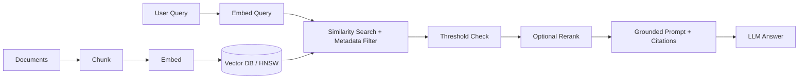

# RAG (Retrieval-Augmented Generation) — Master Cheat Sheet

Consolidated reference across Week 3 (retrieval foundations) and Week 4 (debugging, hybrid
search, reranking).

## The One Sentence

> RAG grounds an LLM's answer in documents fetched at query time, instead of relying only on
> what the model memorized during training.

## Core Terminology

| Term | Meaning |
|---|---|
| Chunking | Splitting documents into focused, embeddable/retrievable units |
| Chunk overlap | Shared text between adjacent chunks to preserve boundary-spanning ideas |
| Dense retrieval | Search by vector similarity (meaning) |
| Sparse retrieval | Search by exact keyword overlap (BM25/TF-IDF) |
| Hybrid search | Dense + sparse combined, fused by rank (RRF) |
| Top-k | Number of highest-ranked chunks returned by a search stage |
| Reranking | Second-pass re-sort of a wide shortlist using a cross-encoder |
| MMR | Diversity-aware selection — trades relevance for reduced redundancy |
| Query rewriting | Transform a raw query into a clearer one before retrieval |
| HyDE | Embed a fabricated hypothetical answer, search with that instead of the raw question |
| Grounded generation | Answer only from retrieved context; say "I don't know" otherwise |
| Citation | Reference tying a claim back to its source chunk |
| Retrieval failure | Wrong/missing chunk reached the model |
| Generation failure | Right chunk reached the model; it still answered badly |

## RAG Pipeline



## Chunk Size Rules of Thumb

| Content type | Chunk size | Overlap |
|---|---|---|
| General prose / KB articles | 200-500 tokens | 10-20% |
| Dense legal/technical | 400-500+ tokens | 15-20% |
| FAQ / short Q&A | ~1 pair per chunk | Little/none |

Count tokens with the real tokenizer for your embedding model/LLM — character count is not a
reliable proxy across languages.

## Retrieval Formulas

```
BM25(D,Q) = Σ IDF(qᵢ) · [f(qᵢ,D)·(k1+1)] / [f(qᵢ,D) + k1·(1 − b + b·|D|/avgdl)]
  k1 ≈ 1.2-2.0 (term-frequency saturation), b ≈ 0.75 (length normalization)

RRF_score(d) = Σ (over each ranked list d appears in)  1 / (k + rank(d))     [k ≈ 60]

MMR = argmax_d [ λ · Sim(d, query) − (1 − λ) · max_d' Sim(d, d') ]
  λ=1 → pure relevance. λ=0 → pure diversity. Typical λ ≈ 0.5-0.7.
```

## Evaluation Metrics

```
Hit-Rate@k = (# queries with a relevant doc in top k) / (total queries)
Recall@k   = avg over queries of: (# relevant docs found in top k) / (total relevant docs)
MRR        = avg over queries of: 1 / (rank of first relevant doc), or 0 if not found
```

Track more than one — reranking can leave Hit-Rate@k unchanged while raising MRR notably
(moving the right doc from rank 3 to rank 1 doesn't change "is it in top-k", but MRR sees it).

## Reranker Options

| | Cohere Rerank | BGE Reranker |
|---|---|---|
| Deployment | Hosted API | Self-hosted, open weights |
| Setup effort | Minimal | Requires inference infra |
| Data privacy | Leaves your infra | Stays in-house |
| Best fit | Prototyping, low ML-ops capacity | High volume, strict privacy |

## Debugging Checklist (retrieval vs. generation failure)

1. Build an inspection view: question + retrieved chunks + answer, side by side.
2. Is the right chunk even present in the retrieved set?
   - No → **retrieval failure**: fix chunking, embedding model, hybrid search, or query rewriting.
   - Yes → **generation failure**: fix prompt, grounding instructions, or context ordering.
3. Re-measure Hit-Rate@k / Recall@k / MRR after any retrieval-side change.

## Quick Reminders

- Same embedding model for indexing AND querying — always.
- Attach metadata (source, section, page, date, access tags) at chunking time, not later.
- Set a minimum similarity score threshold — not just a fixed `top_k`.
- Retrieve broad (e.g., top 50) → rerank with cross-encoder → keep narrow (top 3-5) for the prompt.
- Enforce access-control filters at the database query layer, never at the prompt/LLM layer.
- BM25 catches exact codes/IDs; semantic search catches paraphrase — hybrid covers both.
- RRF fuses by rank, never by summing raw incompatible scores (BM25 vs cosine scales differ).
- "I don't know" is a correct answer when the documents don't cover the topic — never prompt it away.
- Re-embed the entire corpus if you ever switch embedding models.
- Diagnose retrieval-vs-generation failure *before* choosing a fix — the fixes don't overlap.
