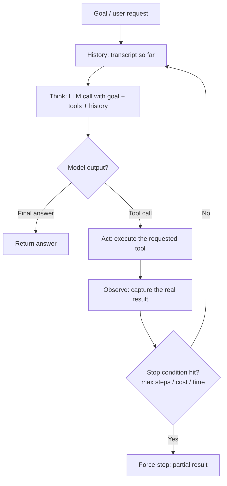

# AI Agent

## Definition

An AI agent is a system built around a language model that decides its own sequence of actions at run time — thinking, acting (usually via tool calls), observing the result, and deciding what to do next — rather than following a sequence of steps fixed in advance by a developer. The defining property is not "it uses an LLM" or "it uses tools" (plenty of ordinary pipelines do both); it's that **the number and order of steps are chosen dynamically, one decision at a time, based on what previous actions revealed.**

## Detailed Explanation

Every LLM-powered system can be placed somewhere on a spectrum from **fixed pipeline** to **fully autonomous agent**. At one end, a workflow runs a predetermined sequence — classify, retrieve, draft, send — where an LLM might power any individual step but the *shape* of execution never varies. At the other end, an agent is handed a goal and a set of tools, and it alone decides which tool to call, with what arguments, how many times, and when it has done enough to answer. Most production systems sit somewhere in between: a fixed pipeline with a small, deliberately scoped agent loop embedded at the one sub-problem that genuinely needs run-time judgment.

Mechanically, an agent is nothing exotic — it is a `while` loop wrapped around a single LLM call, plus a way to execute the actions the model requests:

```
while not done and steps < max_steps:
    next_step = call_llm(goal, history, tools)
    if next_step is final_answer:
        done = True
    else:
        result = execute_tool(next_step.tool, next_step.args)
        history.append((next_step, result))
```

The "intelligence" is entirely the underlying model's ability to pick a sensible next action given the transcript so far; the loop itself is orchestration code. What makes this powerful is that each iteration reasons over **strictly more grounded information** than the last — the model isn't guessing what a database query will return, it's reading what it actually returned, which lets it adapt to failures, surprises, and ambiguity that could never have been anticipated in a hand-written decision tree.

That power isn't free. Every iteration re-sends the accumulating transcript to the model (nothing persists between API calls except what's explicitly in that transcript), so cost and latency scale with the number of steps and the size of history, not just the size of the final answer. A five-step agent task can easily burn 5–10x the tokens of a single well-crafted pipeline call. This is why the first engineering question when someone says "build an agent" should be "does this task actually need one?" — a task whose steps can be enumerated in advance, even with conditional branches, is cheaper, faster, and far easier to test as a fixed workflow. An agent earns its cost only when the correct next step genuinely cannot be known until a previous step's real result is observed.

Agents typically combine three ingredients: a **loop** (the think-act-observe cycle), **tool access** (the model's only channel to affect or query the real world — see Function-Calling), and **memory** (a strategy for keeping the loop's growing context usable across a long task or across sessions). A system missing any one of these is usually something else: no loop and it's a single tool-augmented call; no tools and it's just a chatty conversation; no memory management and it's an agent that will eventually blow its context window or forget everything the moment the session ends.

It also helps to be precise about what "the agent decides" actually means at the API level. There is no separate "planning module" holding a secret roadmap — every iteration, the model is handed the entire transcript from scratch and asked, in effect, "given everything that has happened so far, what's the single best next action?" What looks like multi-step planning from the outside is really the same one-shot decision repeated many times over an ever-growing record of real outcomes. This is a deliberate design property, not a limitation to work around: it's exactly what lets an agent abandon a bad plan the moment new evidence contradicts it, rather than stubbornly executing a stale plan formed before that evidence existed. The trade is that nothing is free — every one of those "re-decide from scratch" calls costs the tokens of the full transcript, which is why unbounded agent loops are treated as a cost and safety risk that needs explicit limits (max steps, max spend, a timeout) from the very first version, not added later once something goes wrong.

## Diagram



## Examples

- **Coding agents** (Cursor's Agent Mode, GitHub Copilot Workspace, Claude Code itself) read a file, run a test, see it fail, edit the code, and rerun — because which file needs fixing next cannot be known until the last test result is in.
- **Research agents** that decide, step by step, which sources to search, when a source is insufficient, and when to keep digging versus synthesize an answer.
- **A support-triage agent** that tries looking up an account by customer ID, then falls back to email, then order number, adapting based on what each lookup actually returns — often embedded as one narrow agentic step inside an otherwise fixed support workflow.
- **Autonomous browsing agents** that click, read the resulting page, and decide the next click based on what appeared — a task with genuinely unpredictable branching.

## Advantages

- Handles tasks whose correct steps cannot be enumerated ahead of time, without an explosion of hand-written if/else branches.
- Recovers from unexpected tool failures or surprising results by reasoning over them in the next iteration, rather than crashing on an unanticipated case.
- Generalizes across many task variations with the same loop and tool set, instead of needing new code for every new scenario.
- Scales naturally to multi-step tasks that would otherwise require a large, brittle, hand-authored decision tree.

## Limitations

- Costs and latency scale with the number of loop iterations and the size of accumulated history — often 5-10x a single pipeline call for a modest multi-step task.
- Behavior is less predictable run to run than a fixed pipeline, which makes capacity planning, testing, and SLAs harder.
- Has no hidden "plan" between iterations — it re-reads the whole transcript and re-decides every time, so it can drift, repeat itself, or compound an earlier mistake without firm stop conditions.
- Tool calls can trigger real, sometimes irreversible side effects (refunds, deletions, emails), so the trust boundary around what an agent is allowed to do unsupervised is a first-class safety concern, not an afterthought.
- Individually testing an agent's behavior is harder than testing a fixed pipeline's named steps, since behavior emerges from the interaction of model, transcript, and tool set at run time.

## Related Concepts

- [Agent-Loop](./Agent-Loop.md)
- [Memory](./Memory.md)
- [Multi-Agent-System](./Multi-Agent-System.md)
- [MCP](./MCP.md)
- [Function-Calling](./Function-Calling.md)
- Week topic: [The Agent Loop](../Week-07/Topics/01-The-Agent-Loop.md)
- Week topic: [Workflows vs. Agents](../Week-07/Topics/05-Workflows-Vs-Agents.md)

## Interview Questions

**1. What is the precise property that makes a system "an agent" rather than a pipeline that happens to use an LLM and tools?**
- The number and order of steps are decided by the model at run time, not fixed in advance by the developer.
- Using an LLM or calling a tool once does not make something an agent — a single-shot tool-augmented call is still a pipeline.
- A conditional (if/else) inside a fixed pipeline is still a workflow, because the branches are known in advance even if which one fires depends on input.

**2. Why does an agent's cost not scale linearly with the length of its final answer?**
- Every loop iteration re-sends the entire accumulated transcript (goal, prior actions, prior results) to the model, since nothing persists between API calls.
- Cost and latency scale with the number of iterations and the size of history, not just the size of the output text.
- A task needing five tool calls can cost several times more than a single well-crafted pipeline call, purely from reprocessing growing context at each step.

**3. When should you choose a fixed workflow over an agent, and how do you decide?**
- Ask whether the exact steps needed can be enumerated for every expected input, including edge cases — if yes, a workflow suffices even with conditional branches.
- Reserve an agent loop for the specific sub-problem where the correct next action genuinely cannot be known until a prior result is observed.
- Most production systems are hybrids: a fixed pipeline with a narrowly scoped agent loop at just the one step that needs it.

**4. What does it mean to say an agent has "no hidden state between iterations"?**
- At every iteration the model re-reads the entire transcript from scratch and re-decides the next action — it does not carry a secret internal plan forward.
- Apparent "planning" behavior is really consistent re-reasoning over a growing, explicit context, not a persistent hidden state.
- This is why logging every step's full input and output is essential — it's the only way to see what the agent actually "knew" when it made a given decision.

**5. Why do tool calls made by an agent raise different safety considerations than a single tool-augmented LLM call?**
- An agent can chain many tool calls autonomously, so a bad decision at step 3 can compound into worse decisions at steps 4 and 5 before a human ever sees the output.
- Some tool actions are irreversible (refunds, deletions, sent emails), so the scope of what an agent may do unsupervised needs explicit permissioning, not implicit trust.
- Stop conditions and budgets (max steps, max cost, human confirmation for high-stakes actions) are what keep an autonomous loop from running away with itself.
