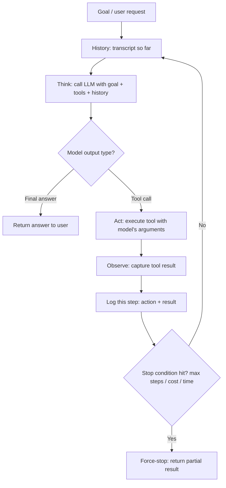

# Agent Loop

## Definition

The agent loop is the think → act → observe → repeat cycle that defines how an AI agent runs: the model looks at the goal and everything learned so far, takes an action (usually a tool call), observes the real result, and decides — based on that result — what to do next, continuing until it produces a final answer or a stop condition is hit. What makes it an "agent loop" rather than a pipeline is that the number and order of steps are decided at run time by the model, not fixed in advance.

## Detailed Explanation

Some tasks genuinely cannot be solved in one shot, because the correct next action depends on information you don't have until a previous action returns it. "Check if invoice #4471 is overdue and draft a reminder in the customer's preferred language" cannot be written as a fixed sequence: you don't know if the invoice exists until you look it up, you don't know it's overdue until you read the due date, and each of these could fail in a way that changes what should happen next. A fixed pipeline would need an explosion of hand-written if/else branches to cover every outcome combination. The agent loop instead lets the model look at each result and decide the next action itself, trading a hand-written decision tree for a model that re-decides the tree at every step.

Structurally, the loop is a `while` loop wrapped around a single LLM call:

```
state = {goal, history = []}
while not done and steps < max_steps:
    next_step = call_llm(goal, history, available_tools)
    if next_step is "final_answer":
        done = True
    else:
        result = execute_tool(next_step.tool_name, next_step.arguments)
        history.append((next_step, result))
```

Each iteration, the entire transcript — goal, every action taken, every result observed — is fed back into the model. This means the loop's own history *is* the agent's working memory for a short task; there is no hidden state carried between calls except what's explicitly in that transcript (see [Memory](./Memory.md) for what happens once that transcript gets too large for the context window). At the API level, "the model decides the next action" is implemented through structured [Function-Calling](./Function-Calling.md): the model is given a list of tool schemas, and instead of only returning text, it can return a structured request to call one of those tools with specific arguments — the loop's job is entirely mechanical: parse the request, execute the real function, serialize the result, and append it before calling the model again.

[ReAct](../Week-07/Topics/02-ReAct.md) is the specific prompting pattern that gives this raw loop its concrete shape: force the model to write a "Thought" (reasoning) before every "Action" (tool call), then feed back the "Observation" (the real result). Reasoning before acting measurably improves action quality — the same phenomenon as chain-of-thought applied to tool use — and produces a natural audit trail for debugging, since the reasoning is written down as part of the transcript rather than hidden inside the model.

The central cost of the loop is that every iteration re-sends the entire growing transcript to the model — cost and latency scale with the number of steps and the size of history, not just the size of the final answer, so a five-step agent task can easily cost 5–10x more tokens than a single well-crafted pipeline call. This is the central engineering tension of agentic systems: the loop buys adaptability to unpredictable outcomes at the price of cost, latency, and predictability, and that price is only worth paying when the task's steps genuinely can't be known ahead of time (see [AI-Agent](./AI-Agent.md) for when a fixed pipeline is the better choice). Multiple agents cooperating on subtasks — each running its own loop — is the basis of a [Multi-Agent-System](./Multi-Agent-System.md).

The loop terminates for one of three reasons: the model emits a final answer, an explicit stop condition fires (a hard cap on steps, cost, or wall-clock time), or an unrecoverable error occurs. A hard step limit is worth setting from day one, before any cost or time budget is added, so a bug or a confused model can never spin the loop forever. Because nothing about the loop requires a framework — it's genuinely a `while` loop and a branch on the model's output type — this course deliberately has learners build it by hand first, so that every "agent framework" encountered afterward is instantly recognizable as this same mechanism with configuration layered on top.

## Diagram



## Examples

- A coding agent (Cursor's Agent Mode, GitHub Copilot Workspace) reads a file, runs a test, sees it fail, edits the code, and reruns the test — because the correct next edit genuinely depends on what the last test run revealed.
- A customer-support agent looks up an order, checks whether it's overdue based on what the lookup actually returned, then looks up the customer's language preference before drafting a reminder — three steps whose necessity and order aren't knowable in advance.
- A research agent searches the web, reads a result, decides it needs a follow-up search based on what that result said, and repeats until it has enough to answer.
- Contrast with a CI/CD pipeline (lint, then test, then build, then deploy): a fixed sequence that never invents a new step no matter what a stage returns — exactly the shape an agent loop is unnecessary for.

## Advantages

- Handles tasks whose correct sequence of steps can't be known ahead of time, without an explosion of hand-written branching logic.
- Recovers from surprises (a failed tool call, an unexpected result) because each iteration reasons over what actually happened, not what was assumed in advance.
- The loop itself is simple, auditable orchestration code — a `while` loop and a branch — with no hidden intelligence beyond the underlying model call.
- Composable with structured tool-calling and validation patterns already used for single-shot structured output.

## Limitations

- Cost and latency scale with the number of iterations and the size of accumulated history, often far more than a single well-crafted pipeline call for the same task.
- More iterations doesn't reliably mean a better answer — the model can wander, repeat itself, or compound an earlier mistake, so loops need firm step/cost/time limits, not open-ended patience.
- The agent has no persistent hidden plan between iterations; it re-reads the whole transcript and re-decides every time, which can look like planning but isn't.
- Unnecessary for tasks with a known, unchanging sequence of steps — those are cheaper and more reliable as a fixed pipeline.

## Related Concepts

- [AI-Agent](./AI-Agent.md)
- [Function-Calling](./Function-Calling.md)
- [Memory](./Memory.md)
- [Multi-Agent-System](./Multi-Agent-System.md)
- [Guardrails](./Guardrails.md)
- [The Agent Loop (Week 7)](../Week-07/Topics/01-The-Agent-Loop.md)
- [ReAct (Week 7)](../Week-07/Topics/02-ReAct.md)

## Interview Questions

**1. What structurally distinguishes an agent loop from a pipeline that also uses an LLM and tools?**
- A pipeline runs a fixed, known sequence of steps regardless of intermediate results.
- An agent loop lets the model decide the number and order of steps at run time, based on what each previous action actually returned.
- Using tools or an LLM alone doesn't make something an agent — the defining trait is that re-decision happens after every observed result.

**2. Why does an agent loop have no separate memory system for a short task?**
- The full transcript — goal, every action, every observed result — is re-sent to the model on every iteration.
- That transcript itself functions as the agent's working memory; there's no hidden state carried between calls beyond it.
- A separate memory system only becomes necessary once the transcript grows too large for the context window on longer tasks.

**3. Why does an agent loop typically cost significantly more than a single pipeline call for a comparable task?**
- Every iteration re-sends the entire growing transcript to the model, since the model retains no memory between API calls.
- Cost and latency scale with the number of steps and the size of accumulated history, not just the length of the final answer.
- A five-step agent task can easily cost 5–10x more tokens than one well-crafted single-shot pipeline call.

**4. Does an agent "have a plan" it's executing across iterations?**
- No — it has no persistent internal plan carried between calls; it re-reads the entire transcript from scratch at every iteration.
- What looks like planning is really consistent re-reasoning over a transcript that keeps growing with new, real information.
- This is why logging every step is essential — it's the only way to see what the model actually "knew" at each decision point.

**5. When should a team prefer a fixed pipeline over an agent loop?**
- When the task's steps and their order are genuinely knowable in advance and don't depend on intermediate results.
- Pipelines are cheaper, faster, and more predictable/debuggable than a loop for the same well-understood task.
- The loop should only be reached for when the correct next step truly can't be determined until a previous step's real result is known.
