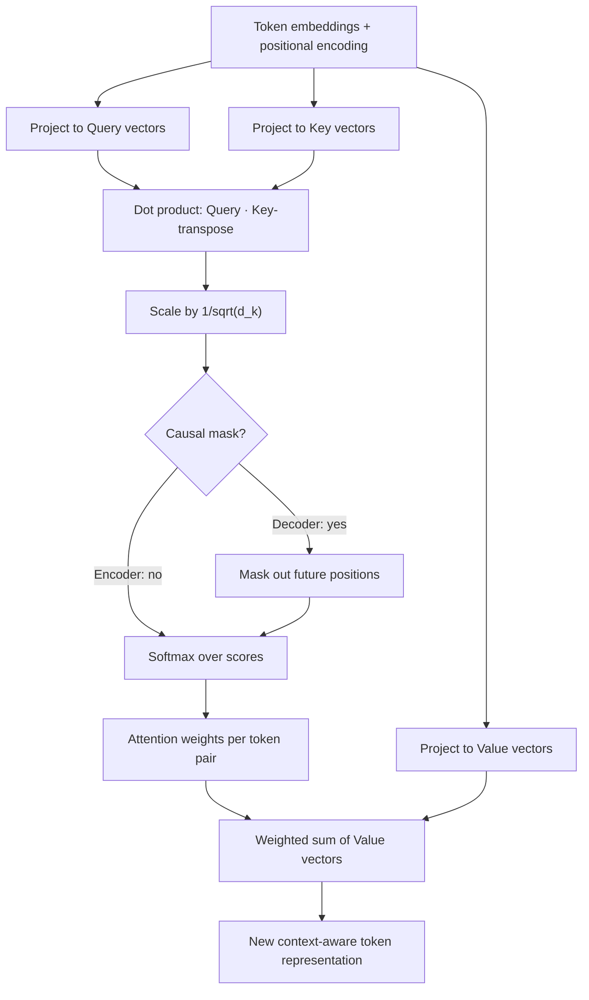

# Attention

## Definition

**Attention** (specifically **self-attention**, as used in Transformers) is a mechanism that lets every token in a sequence dynamically look at every other token and decide how much "weight" to give each one when building its own updated representation. Instead of processing text strictly left-to-right one word at a time and hoping earlier context survives, attention lets each token directly and simultaneously incorporate information from anywhere else in the sequence.

This mechanism is not covered as a standalone topic in the Week 1 curriculum — it underlies the "Transformer layers" step described in **Language Models** (Week 1) but is treated here in full depth since it, along with the Transformer architecture it powers, is foundational to everything else in this curriculum.

## Detailed Explanation

Attention replaced the previous dominant approach to sequence modeling, recurrent neural networks (RNNs/LSTMs), which processed tokens one at a time in order and had to squeeze all prior context into a single fixed-size hidden state — a bottleneck that made it hard to retain information from far earlier in a long sequence. Attention solves this by letting each token access *all* other tokens directly, regardless of distance, in a single computation.

Mechanically, self-attention works with three learned projections of each token's vector, computed by multiplying it against three separate weight matrices:

- **Query (Q)** — "what am I looking for?" (derived from the current token)
- **Key (K)** — "what do I contain?" (derived from every token, including itself)
- **Value (V)** — "what information do I actually offer?" (also derived from every token)

For a given token, its Query vector is compared (via dot product) against every token's Key vector, producing a raw relevance score for each pair. These scores are scaled down by dividing by the square root of the key dimension (`√d_k`) — this keeps the dot products from growing too large as dimensionality increases, which would otherwise push the following softmax into regions with vanishingly small gradients. The scaled scores are passed through a **softmax**, turning them into a probability distribution ("attention weights") that sum to 1. Finally, the token's new representation is a weighted sum of every token's Value vector, weighted by those attention weights:

```
Attention(Q, K, V) = softmax(QKᵀ / √d_k) · V
```

Because this happens for every token against every other token simultaneously (via matrix multiplication), the whole computation is highly parallelizable — a major advantage over RNNs, which are inherently sequential and can't be parallelized across the time dimension during training.

**Multi-head attention** runs several of these Q/K/V attention computations in parallel ("heads"), each with its own learned weight matrices, then concatenates and linearly combines their outputs. Different heads empirically tend to specialize — one head might track short-range syntactic relationships (e.g. subject-verb agreement), another might track long-range coreference (which noun a pronoun refers to), another might attend mostly to adjacent tokens. Using multiple heads lets the model capture several different kinds of relationships at once, rather than forcing one attention pattern to do everything.

A crucial detail: **attention itself is permutation-invariant** — it has no inherent sense of token order, since it only computes weighted sums based on content similarity. This is why Transformers must add explicit **positional encoding** to token embeddings before attention layers process them (see **Transformer**) — without it, "the dog bit the man" and "the man bit the dog" would look identical to the attention mechanism.

Decoder-style LLMs (GPT, Claude, Llama) use **causal (masked) self-attention**: each token is only allowed to attend to itself and tokens before it, never tokens ahead — enforced by masking out future positions before the softmax. This matches the autoregressive, left-to-right generation process these models use.

There's also a related but distinct variant called **cross-attention**, used in encoder-decoder models (and in some multimodal architectures). There, Query vectors come from one sequence (e.g. the sentence currently being generated) while Key and Value vectors come from a different sequence entirely (e.g. the encoded source sentence, or an encoded image). Self-attention relates a sequence to itself; cross-attention relates one sequence to another, which is how a translation model's decoder stays grounded in the original source sentence while generating the translation word by word.

At inference time, generating each new token with causal self-attention would naively require recomputing Key and Value vectors for every prior token again and again. Production systems avoid this with a **KV cache**: the Key and Value vectors for already-generated tokens are computed once and reused, so each new token only requires computing its own Query, Key, and Value and attending back against the cached ones. This is a major reason long generations don't get proportionally slower per token as they go — it's an inference-time engineering optimization built directly on top of how self-attention is mathematically structured.

## Diagram



## Examples

- In "The animal didn't cross the street because **it** was too tired," self-attention lets the representation of "it" assign a high attention weight to "animal" (not "street"), resolving the pronoun's referent — something a model must learn purely from data, without explicit grammar rules.
- In machine translation, cross-attention (a variant where Queries come from the output sequence being generated and Keys/Values come from the input sequence) lets each generated word attend back to the most relevant source-language words, rather than relying on a single compressed sentence summary.
- Visualized attention maps in smaller models often show one head consistently attending to the immediately preceding token, another attending broadly to the sentence's subject, illustrating head specialization.

## Advantages

- **Parallelizable** — unlike RNNs, all tokens are processed simultaneously via matrix operations, making training on modern hardware (GPUs/TPUs) far faster.
- **Direct long-range access** — any token can attend to any other token in one step, regardless of distance, avoiding the "forgetting" problem RNNs faced with long sequences.
- **Flexible, learned relationships** — the model learns what to attend to from data, rather than relying on hand-designed rules for syntax or coreference.
- **Multi-head design** captures multiple distinct types of relationships (syntactic, semantic, positional) simultaneously.

## Limitations

- **Quadratic cost in sequence length** — computing attention scores between every pair of tokens means compute and memory grow roughly with the square of the context length, a major driver of the cost of very large context windows (see **Context-Window**).
- **Not inherently interpretable** — attention weights show what a token statistically weighted heavily, but research has repeatedly cautioned against treating raw attention weights as a faithful "explanation" of the model's reasoning.
- **Needs positional encoding** — attention alone has no notion of sequence order and must be supplemented, adding architectural complexity.
- **No guarantee of correct focus** — a model can attend to the wrong tokens (contributing to errors or hallucination) despite the mechanism being mathematically well-defined.

## Related Concepts

- [Transformer](./Transformer.md)
- [LLM](./LLM.md)
- [Context Window](./Context-Window.md)
- [Embeddings](./Embeddings.md)
- [Language Models (Week 1) — closest related topic](../Week-01/Topics/01-Language-Models.md)

## Interview Questions

**1. What problem does self-attention solve compared to RNNs/LSTMs?**
- RNNs process tokens sequentially and compress all prior context into one fixed-size hidden state, which struggles to retain long-range dependencies.
- Self-attention lets every token directly access every other token's representation in one step, regardless of distance.
- It also removes the sequential processing bottleneck, enabling full parallelization during training.

**2. Walk through how Query, Key, and Value vectors are used to compute attention output.**
- Each token's embedding is projected into a Query, Key, and Value vector via separate learned weight matrices.
- A token's Query is dot-producted against every token's Key to get relevance scores, scaled and passed through softmax to get attention weights.
- The output is the weighted sum of all tokens' Value vectors, using those attention weights.

**3. Why is the attention score scaled by the square root of the key dimension (√d_k)?**
- Without scaling, dot products grow larger in magnitude as vector dimensionality increases.
- Large dot products push the softmax into regions with extremely small gradients, hurting training.
- Dividing by √d_k keeps the scores in a numerically stable range before the softmax.

**4. What is multi-head attention and why use multiple heads instead of one?**
- Multiple attention computations ("heads") run in parallel, each with its own learned Q/K/V projections.
- Different heads tend to specialize in different relationship types (e.g. local syntax vs. long-range coreference).
- Combining heads lets the model represent several kinds of token relationships simultaneously, which a single attention computation couldn't capture as well.

**5. Why is attention described as "permutation-invariant," and how do Transformers work around it?**
- Attention computes weighted sums based purely on content similarity between Query and Key vectors, with no built-in notion of token order.
- Shuffling the input tokens would produce the same set of pairwise relationships, so order information would otherwise be lost.
- Transformers add positional encoding to each token's embedding before attention layers, injecting order information explicitly.

**6. What is the difference between self-attention and cross-attention?**
- Self-attention: Query, Key, and Value all come from the same sequence — tokens relate to other tokens within that same sequence.
- Cross-attention: Query comes from one sequence (e.g. the output being generated), while Key and Value come from a different sequence (e.g. an encoder's output) — used to ground generation in separately encoded information.
- Encoder-decoder architectures (like translation models) rely on cross-attention to let the decoder reference the source input at every generation step.
