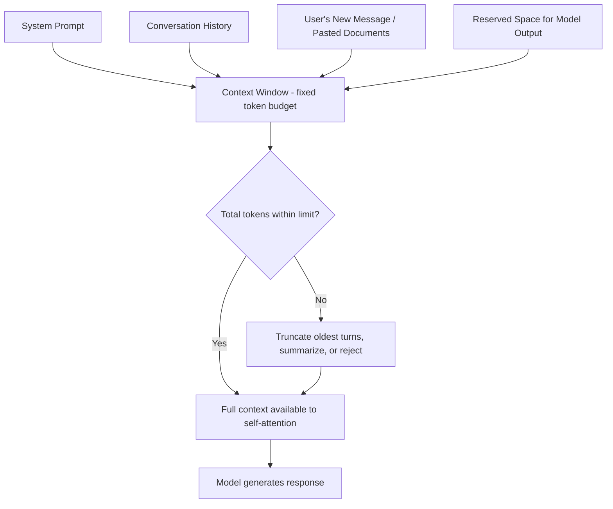

# Context Window

## Definition

The **context window** is the maximum number of tokens a language model can process in a single request — covering the system prompt, the full conversation history sent so far, any documents or code pasted in, and the space reserved for the model's own response. Anything beyond that limit simply isn't seen by the model; it must be dropped, truncated, or summarized before the request is made.

## Detailed Explanation

Every token inside the context window participates in **self-attention**: each token's internal representation gets refined by "looking at" every other token in the window (see **Attention**). This is what lets a model reference something said several paragraphs earlier — but it's also expensive, because naive self-attention cost grows roughly quadratically with sequence length. Doubling the context length roughly quadruples the attention computation, which is a large part of why context windows historically grew slowly and why very long ones remain relatively costly to run.

Architectural advances have pushed this limit up substantially over time: more efficient attention implementations, sliding-window and sparse attention variants, and better positional encoding schemes (like RoPE) have let providers move from a few thousand tokens to context windows of hundreds of thousands or even millions of tokens, without a proportional blowup in inference cost.

A critical nuance: a bigger context window does not guarantee the model uses everything inside it equally well. Long-context research has repeatedly documented a **"lost in the middle"** effect — models tend to weight information near the start and end of a long context more heavily than information buried in the middle, even when that middle content is technically "in view" and relevant.

It's worth explicitly separating two things that get conflated constantly:

- **Context window** — what's visible to the model for *this one request*. It resets with every new, independent call.
- **Memory** (as a product feature) — an external system that stores facts *outside* the model and re-inserts them into the context window on future requests (see **Memory**). The model isn't "remembering" anything on its own; an engineered system is feeding old information back in as fresh input tokens.

Applications built on top of an LLM have to actively manage the context window rather than assuming it's infinite. Common strategies include **sliding-window truncation** (drop the oldest turns once the budget is tight), **summarization** (periodically compress older turns into a shorter summary that stands in for the full history), and **retrieval** (don't resend the whole conversation or document at all — fetch only the currently relevant pieces, see **RAG**). Which strategy is appropriate depends on the use case: a casual chat assistant can usually tolerate lossy summarization of old turns, while a coding agent working across a large repository often needs retrieval so it can bring in exactly the files relevant to the current task without paying for the entire codebase on every turn.

It's also worth distinguishing the **advertised** context window from what a model reliably makes use of. Benchmarks like "needle in a haystack" tests (hiding a specific fact somewhere in a long document and asking the model to retrieve it) are how researchers empirically probe whether a model's effective usable context matches its advertised limit — and results vary meaningfully between models and between where in the context the needle is placed, which is precisely the "lost in the middle" effect in practice.

## Diagram

## Examples

- Early GPT-3.5-era models offered roughly 4,000–8,000 tokens of context (a few pages of text); modern flagship models (GPT-4o, Claude, Gemini) offer 128,000 to over 1,000,000 tokens — enough for entire books or codebases in one request.
- A coding assistant reading an entire multi-file repository to answer "where is this bug coming from?" depends directly on having a large enough context window to hold the relevant files.
- A chat app that "forgets" something mentioned 40 messages ago, in a very long conversation, is very likely dropping or summarizing early turns because the accumulated history is approaching the model's context limit.
- Legal-tech tools that review a 300-page contract in a single pass are a direct product of expanded context windows — flatly impossible on older 4K-token models.

## Advantages

- Enables whole-document, whole-codebase, or long-transcript reasoning in a single request, instead of manual chunking.
- Supports long, coherent multi-turn conversations without immediately losing earlier context.
- Reduces the *need* for retrieval or summarization in many cases — sometimes it's simplest to just paste everything relevant into the prompt.
- A larger window generally gives the model more raw material to ground its answer in, reducing (but not eliminating) hallucination risk on document-grounded tasks.

## Limitations

- Cost and latency scale with tokens used — a bigger context window used in full is a bigger bill and a slower response, not a free upgrade.
- "Lost in the middle": information isn't used uniformly across a long context, so simply fitting something into the window doesn't guarantee the model weighs it correctly.
- No persistent memory across separate requests — each new conversation starts with an empty window unless an external memory system re-injects prior facts.
- Exceeding the limit doesn't always fail gracefully — depending on the application, it can cause outright errors, silent truncation, or quietly degraded answers.
- A large window can tempt teams to skip retrieval/curation entirely ("just paste it all in"), which is often slower and more expensive than retrieving only the relevant sections (see **RAG**).

## Related Concepts

- [Tokens](./Tokens.md)
- [LLM](./LLM.md)
- [Attention](./Attention.md)
- [Memory](./Memory.md)
- [RAG](./RAG.md)
- [Context Window (Week 1)](../Week-01/Topics/04-Context-Window.md)

## Interview Questions

**1. What exactly counts against a model's context window?**
- The system prompt, the full conversation history sent with the request, any pasted documents/code, and the space reserved for the model's output.
- All of it is measured in tokens, not characters or words.
- If the total exceeds the model's limit, something must be truncated, summarized, or the request fails.

**2. Why is context window size an architectural, not just a policy, limit?**
- Self-attention cost grows roughly quadratically with sequence length in its naive form, so longer context is disproportionately more expensive to compute.
- Positional encoding schemes must also support the target length (e.g. RoPE-based extensions).
- Providers use specific architectural techniques (sparse/sliding-window attention, efficient positional encodings) to push windows larger without unmanageable cost.

**3. What is the "lost in the middle" effect and why does it matter?**
- Long-context models tend to attend more strongly to content near the start and end of the input than content in the middle.
- This means simply fitting information inside the window doesn't guarantee it's used with equal weight.
- Practical mitigation: place the most important instructions or facts near the start or end of a long prompt.

**4. How does "context window" differ from a chat product's "memory" feature?**
- Context window = what's visible to the model within one specific request; it resets each new independent call.
- Memory = an external system that stores facts outside the model and re-inserts them into future prompts as ordinary input tokens.
- The model itself never "remembers" across calls on its own — any persistence is engineered.

**5. Why doesn't a huge context window eliminate the need for retrieval (RAG)?**
- Using the full window every time costs more tokens (time and money) than retrieving only the relevant sections.
- Uneven attention across very long contexts means retrieval-narrowed input can actually be answered more reliably.
- Some knowledge bases are simply too large to fit in any context window, however large, making retrieval structurally necessary.

**6. How would you test whether a model actually uses its full advertised context window well?**
- Run a "needle in a haystack" test: place a specific fact at varying positions (start, middle, end) within a long filler document and ask the model to retrieve it.
- Compare retrieval accuracy across positions and context lengths to check for degradation, especially in the middle of long inputs.
- Use the results to decide whether critical information should be placed near the start/end of a prompt rather than assuming uniform attention across the whole window.
