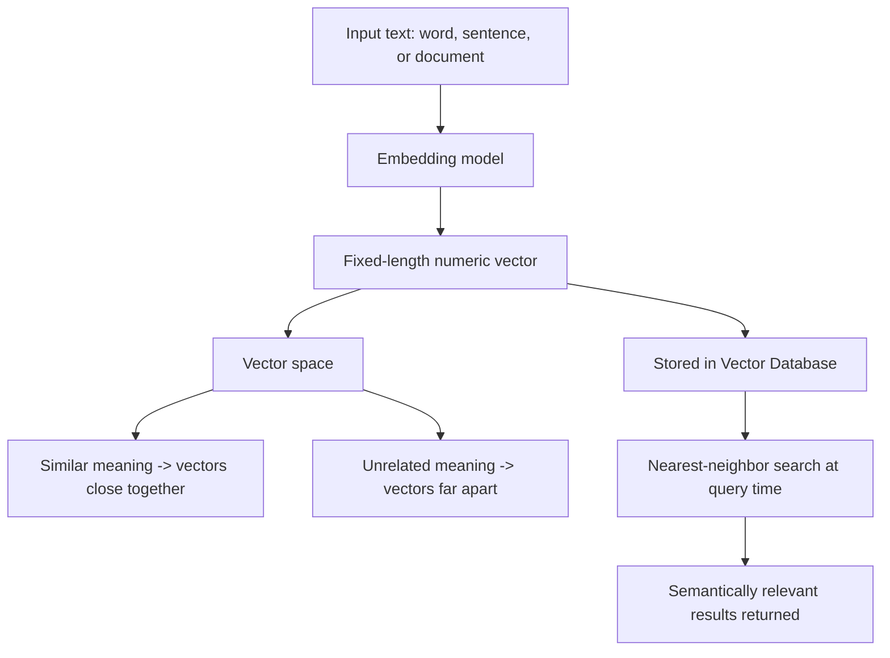

# Embeddings

## Definition

An **embedding** is a representation of a piece of content — a word, a sentence, a document, an image, even a user or product — as a fixed-length vector of numbers, positioned in a high-dimensional space such that semantically similar items end up close together and unrelated items end up far apart. Embeddings are how neural networks, which only operate on numbers, work with meaning at all.

## Detailed Explanation

Embeddings come in two broad flavors:

- **Static embeddings** (e.g. Word2Vec, GloVe) assign exactly one fixed vector per word, learned once from patterns of word co-occurrence across a huge corpus. The word "bank" gets a single vector blending its "riverbank" and "financial institution" senses, because static methods have no mechanism to know which sense is meant in a given sentence (see **Static vs Contextual Embeddings**, Week 1).
- **Contextual embeddings** (produced inside Transformer models like BERT, GPT, or Claude) generate a different vector for the same word depending on its surrounding sentence, because self-attention lets every token's representation absorb information from the rest of the sequence. "Bank" in "river bank" and "bank" in "savings bank" end up with different vectors, computed on the fly for that specific context.

Modern applications typically use a dedicated **embedding model** — a Transformer trained (often with a contrastive objective) specifically to output one good vector per chunk of text, optimized so that cosine similarity or dot product between vectors reflects semantic similarity. This is distinct from the internal token embeddings inside an LLM's first layer; embedding models are usually smaller, faster, and purpose-built for producing a single reusable vector for a whole passage, rather than powering next-token generation.

Once text is embedded, similarity becomes a geometry problem: two pieces of text are "similar in meaning" if their vectors are close together, measured by cosine similarity or Euclidean distance. This is the foundation of **semantic search** — finding relevant documents based on meaning rather than exact keyword overlap — and is what a **Vector Database** stores and indexes at scale for fast nearest-neighbor lookup, which in turn underpins **RAG** pipelines.

A classic illustration of the structure embeddings capture is vector arithmetic: `vector("king") - vector("man") + vector("woman") ≈ vector("queen")`. This shows that embedding spaces encode relationships (like gender, plurality, or tense) as consistent directions in the space, not just raw similarity — though this arithmetic is illustrative, not perfectly reliable across all such relationships in a real embedding space.

Embeddings aren't limited to whole documents or single words — a common design choice in retrieval systems is **chunking**: splitting a long document into smaller passages (a paragraph, a few hundred tokens) and embedding each chunk separately, rather than embedding the entire document as one vector. This is because a single vector for an entire long document tends to blur together many different topics into an averaged, less discriminative representation, while chunk-level embeddings let a search system pinpoint the specific passage relevant to a query. Choosing chunk size and overlap is itself a meaningful design decision in a RAG pipeline — too small loses surrounding context, too large dilutes relevance.

Embeddings also generalize past text: multimodal embedding models (e.g. CLIP) place images and text captions in the *same* shared vector space, so a text query like "a dog running on the beach" can retrieve semantically matching images purely by vector similarity, without any keyword tags on the images. The same core idea — represent meaning as a vector, measure similarity as geometry — extends to audio, code, and other modalities as long as a suitable embedding model exists for them.

## Diagram

## Examples

- `text-embedding-3-large` (OpenAI), Cohere's `embed` models, and open-source sentence-transformer models all convert arbitrary text into fixed-length vectors (commonly 384–3072 dimensions) for search and clustering.
- A support-ticket search tool embedding both the user's query and every past ticket, then retrieving tickets whose embeddings are closest to the query's — surfacing relevant tickets even when they don't share exact keywords.
- Recommendation systems embedding products and user histories as vectors, then recommending items whose vectors are nearby — the same "similarity as geometry" idea applied outside text.
- A RAG pipeline embedding a user's question and a document corpus, retrieving the nearest chunks by vector similarity before feeding them into an LLM's prompt (see **RAG**).

## Advantages

- Captures semantic similarity beyond exact keyword matching — a query for "cancel my subscription" can retrieve a document titled "how to end your plan" purely on meaning.
- Compact, fixed-size representation regardless of input length, making large-scale storage and fast similarity search practical.
- Reusable across many downstream tasks (search, clustering, classification, recommendation) without retraining a whole model.
- Contextual embeddings resolve the ambiguous-word-sense problem that static embeddings cannot.

## Limitations

- Static embeddings collapse multiple word senses into a single vector, losing meaningful distinctions.
- Purely semantic (dense vector) search can miss exact matches that matter — an exact product code, an error string, or a legal citation may be semantically "close" to many things but needs literal matching, which is why **Hybrid Search** combining dense and keyword search often outperforms embeddings alone.
- Embeddings from different models (or different versions of the same model) are generally not comparable — mixing embedding spaces silently produces meaningless similarity scores.
- Like any learned representation, embeddings can encode and reproduce biases present in their training data.
- Higher dimensionality isn't free — very high-dimensional embeddings increase storage and search cost, and don't automatically improve retrieval quality.

## Related Concepts

- [Tokens](./Tokens.md)
- [Attention](./Attention.md)
- [Vector Database](./Vector-Database.md)
- [RAG](./RAG.md)
- [Hybrid Search](./Hybrid-Search.md)
- [Word Embeddings (Week 1)](../Week-01/Topics/05-Word-Embeddings.md)
- [Static vs Contextual Embeddings (Week 1)](../Week-01/Topics/06-Static-Vs-Contextual-Embeddings.md)
- [Embeddings and Dense Retrieval (Week 3)](../Week-03/Topics/02-Embeddings-And-Dense-Retrieval.md)

## Interview Questions

**1. What is an embedding, in plain terms?**
- A numeric vector representation of text (or other content) placed in a space where semantic similarity corresponds to geometric closeness.
- It's how a model converts meaning into something math (dot products, distances) can operate on.
- Used both internally by neural networks and externally as reusable representations for search/clustering.

**2. What's the difference between static and contextual embeddings?**
- Static (Word2Vec, GloVe): one fixed vector per word, independent of surrounding sentence.
- Contextual (BERT/GPT-style): a different vector for the same word depending on context, computed via self-attention over the full sequence.
- Contextual embeddings resolve ambiguous word senses that static embeddings conflate.

**3. How is embedding similarity typically measured, and what does closeness mean?**
- Commonly cosine similarity (angle between vectors) or dot product/Euclidean distance.
- Closer vectors indicate more similar meaning as learned by the embedding model, not guaranteed factual relatedness.
- The metric used must match how the embedding model was trained/optimized to be meaningful.

**4. Why can semantic (dense vector) search fail for things like exact codes or IDs?**
- Embeddings capture semantic similarity, not exact string matching.
- An exact product SKU or error code may not be "close" in vector space to its exact match, or may be close to many unrelated-but-similar-looking items.
- This is why hybrid search (combining dense vector search with keyword/lexical search) is often used in production retrieval systems.

**5. Why can't you freely mix embeddings from two different models or versions?**
- Each embedding model defines its own learned vector space, shaped by its own training objective and data.
- Vectors from different models aren't calibrated to the same geometry, so distances/similarities between them are not meaningful.
- Practically, this means re-embedding an entire corpus is usually required after switching embedding models.

**6. Why do RAG pipelines split documents into chunks before embedding them, rather than embedding whole documents?**
- A single vector for a long document averages together many different topics, producing a less discriminative representation.
- Chunk-level embeddings let retrieval pinpoint the specific passage relevant to a query, rather than only ranking whole documents.
- Chunk size and overlap are tunable trade-offs: too small loses surrounding context, too large dilutes relevance back toward the whole-document problem.
