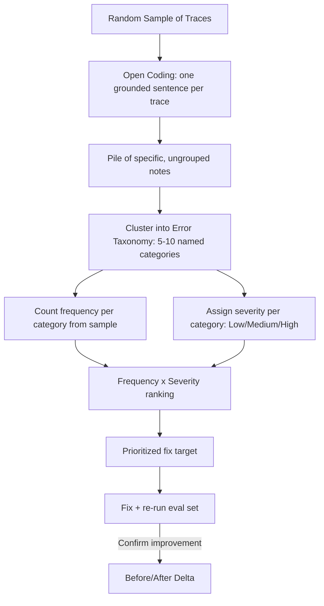

# Error Analysis

## Definition

Error analysis is the disciplined process of manually reading a sample of a system's real outputs, writing specific notes about what went wrong (open coding), grouping those notes into a small set of named recurring problems (an error taxonomy), and ranking those problems by how often they happen and how much damage they do (frequency × severity) — turning "something feels off" into a concrete, prioritized list of what to fix next.

## Detailed Explanation

Error analysis exists because the failure modes that actually matter in a deployed LLM system are rarely the ones you'd predict from a whiteboard before looking at real traces. The process runs in a deliberate order, and the order is the point:

1. **Sample traces**, ideally an unbiased random sample rather than only escalated or complained-about cases, so what you find actually represents overall behavior.
2. **Open code each trace** — write one specific, grounded sentence describing exactly what happened ("the retriever fetched the 2022 refund policy instead of the current one"), *before* assigning any category label. This step is borrowed from grounded theory in qualitative research, and it exists specifically to prevent premature categorization: deciding categories before reading the data acts like a mold, forcing every real observation into a pre-existing bucket and quietly hiding problems that don't fit any bucket you already had in mind.
3. **Build an error taxonomy** by clustering the open-coding notes bottom-up into five to ten named, recurring categories with concrete definitions — a process analogous to axial coding in qualitative research. A taxonomy imported wholesale from a generic academic checklist ("faithfulness / relevance / toxicity") tends to mismatch a specific app's real failure modes; a taxonomy grown from your own traces does not.
4. **Rank by frequency × severity** — for each taxonomy category, estimate roughly what fraction of the sample falls into it (frequency) and how bad it is when it does (severity, e.g. Low/Medium/High), then multiply the two rather than optimizing for either alone. This mirrors expected-loss framing in risk management and vulnerability scoring in security (CVSS combines exploitability and impact the same way): a rare-but-catastrophic error and a common-but-mild one can both deserve attention, and neither dimension alone tells you which to fix first.

The reason this sequence matters, in each direction, is that skipping a step corrupts everything downstream. Categorizing before open coding hides unexpected failure modes. Skipping unbiased sampling in favor of a curated "worst cases" pile makes the frequency estimate meaningless, which silently misranks every category built on top of it — even though every later step was executed carefully. Error analysis is also the direct upstream input to two other practices: the resulting taxonomy becomes the categories an [LLM-As-Judge](./LLM-As-Judge.md) or automated classifier can be built to tag at scale (only after validation by careful manual reading), and the ranked list of problems is what a team actually chooses to fix and re-measure via before/after evals.

A subtlety worth internalizing: open coding is the one part of this whole process that genuinely cannot be automated, because it requires a human to understand, in context, what the system did wrong for this specific request. A second reader independently coding a subset of the same traces is a cheap way to catch individual blind spots — a single reader's notes reflect that person's assumptions as much as the actual traces reviewed. Coding a few clearly-successful traces alongside the failures also helps calibrate what "working correctly" actually looks like, rather than building a mental model of the system that's skewed entirely toward its worst moments.

## Diagram

## Examples

- A RAG support bot's open-coding pass surfaces notes like "answer cited last year's pricing" and "answer used an outdated return window," which get clustered into a "Stale Document Retrieval" taxonomy category.
- A team ranks "Stale Document Retrieval" (30% frequency, High severity) above "Correct Facts, Wrong Format" (25% frequency, Low severity) despite the latter being nearly as common, because severity pulls it down the priority list.
- A content-moderation team periodically reviews a random sample of flagged and unflagged content, writing specific edge-case notes and updating their internal violation taxonomy rather than moderating solely against a static external policy document.
- A coding agent's error analysis reveals a recurring "Correct Fix, Wrong File" category — the model's proposed change was logically sound but applied to the wrong module — which a generic "code quality" taxonomy would never have surfaced.

## Advantages

- Surfaces real, unpredicted failure modes that a whiteboard brainstorm or a generic checklist would never turn up.
- Produces a shared vocabulary (named categories) the whole team can use consistently to track whether a problem is getting better or worse.
- Turns a vague sense of "the app has some issues" into an explicit, comparable, arguable ranking of what to work on.
- Directly informs what an automated eval (assertion checks, an LLM judge) should even be checking for in the first place.

## Limitations

- Manual reading doesn't scale indefinitely — it's a periodic, sampled practice, not continuous monitoring of every trace.
- Frequency and severity estimates from a small sample carry real statistical uncertainty, especially for rare categories.
- The taxonomy is a living artifact, not a one-time deliverable — it needs revisiting as the app and its failure modes change.
- Frequency × severity ranks how much a problem hurts, not how cheap or tractable it is to fix — cost-to-fix still has to be weighed separately when choosing what to work on.

## Related Concepts

- [LLM-As-Judge](./LLM-As-Judge.md)
- [Hallucination](./Hallucination.md)
- [RAG](./RAG.md)
- [Guardrails](./Guardrails.md)
- [Open Coding (Week 5)](../Week-05/Topics/03-Open-Coding.md)
- [Error Taxonomy (Week 5)](../Week-05/Topics/04-Error-Taxonomy.md)
- [Frequency x Severity (Week 5)](../Week-05/Topics/05-Frequency-Times-Severity.md)

## Interview Questions

**1. Why should you write open-coding notes before deciding on error categories, rather than categorizing as you read?**
- Categorizing early acts like a mold, forcing every observation into a pre-existing bucket whether or not it truly fits.
- It biases attention toward confirming or rejecting a candidate category instead of noticing the specific details of the current trace.
- Delaying categorization is what allows genuinely unexpected failure modes to surface from the data itself.

**2. Why is unbiased random sampling so important for the frequency side of error analysis?**
- A frequency estimate computed from a biased or curated sample (e.g. only escalated complaints) misrepresents true prevalence.
- Every later step — taxonomy building, prioritization, fix selection — inherits that bias silently.
- Even careful downstream analysis can't correct for a skewed sample at the source.

**3. Why multiply frequency and severity instead of prioritizing by one alone?**
- Frequency alone can overweight a common but low-stakes annoyance and underweight a rare but catastrophic failure.
- Severity alone can overinvest in a dramatic edge case that almost never actually occurs.
- Multiplying the two (as in expected-loss framing or CVSS-style vulnerability scoring) forces both dimensions to be weighed together.

**4. Why shouldn't a team just adopt a generic, published error taxonomy instead of building their own?**
- Published or academic taxonomies (faithfulness/relevance/toxicity) were designed for a different purpose, like general model benchmarking.
- They often don't match the specific ways a given app, with its specific retrieval corpus and users, actually fails.
- A taxonomy grown bottom-up from real traces surfaces the actual, sometimes unexpected, failure modes of that specific system.

**5. What's the relationship between error analysis and building an LLM-as-judge or automated classifier?**
- The error taxonomy produced by manual analysis defines the categories a judge or classifier would tag going forward.
- Automating categorization should only happen after the taxonomy has been validated by careful manual reading.
- Skipping straight to automated classification on an unvalidated taxonomy risks quietly automating the wrong categories at scale.
