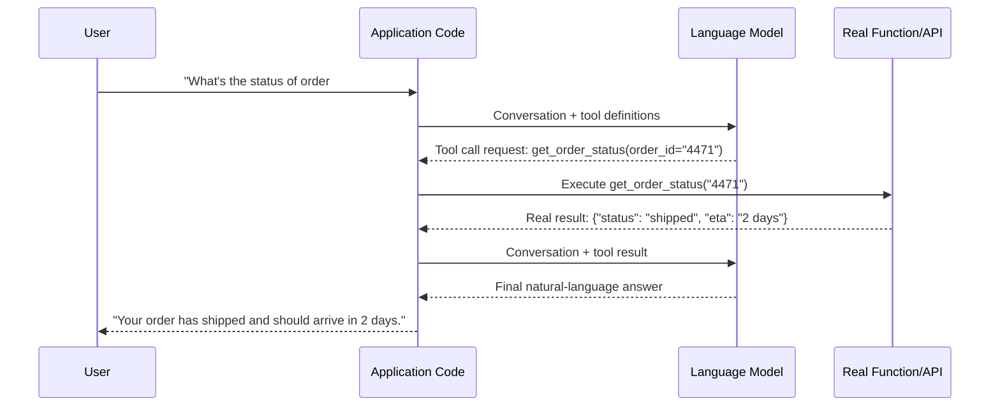

# Function Calling

## Definition

Function calling (also called tool calling) is the mechanism that lets a language model request
that your application run a specific function — look up an order, query a database, call an
external API — and then use that function's real result to continue answering. The model never
executes any code itself; it only ever outputs structured data naming a function and its
arguments. Your application reads that request, actually runs the function, and returns the
result to the model as more context.

## Detailed Explanation

Language models are pure text predictors with no live access to today's date, a customer's real
order history, or a calculator's guaranteed arithmetic. Left alone, a model asked "what's the
status of order #4471?" can only guess or [hallucinate](./Hallucination.md) a plausible-sounding
answer, because it has no channel to real, current data. Function calling closes that gap without
retraining or changing the model at all: you describe a small set of functions the model is
allowed to request, the model decides *when* one is needed and *what arguments* to pass, and your
code supplies the real, verified answer back into the conversation.

The full round trip has four parts. First, **tool definition** — you describe each available tool
to the model as a schema: a name, a natural-language description of what it does and when to use
it, and typed parameters, structurally identical to a [JSON Schema](./Structured-Output.md). Second,
**tool call request** — given the conversation, the model decides whether a tool is needed and, if
so, emits a structured object naming the tool and its arguments instead of a plain-text answer.
Third, **tool execution** — your application, not the model, parses that request and actually runs
the corresponding real function. Fourth, **tool result injection** — your code sends the function's
real return value back to the model as a new message, and the model generates its final answer
using that real data. Multiple tools can be defined at once, and the model chooses which one(s) to
call and with what arguments based purely on the conversation and how well each tool is described —
a vaguely named or poorly described tool gets used inconsistently no matter how capable the
underlying model is, in exactly the way a vague prompt produces inconsistent answers.

Under the hood, a tool call is generated via the same schema-constrained mechanism as structured
output: the tool's parameter schema is passed to the API, and the model's output is constrained to
match it, guaranteeing syntactically valid arguments — though never guaranteeing they're the
*right* choice for the situation. This is a strict separation of responsibilities: the model
decides *what* action would help and *what arguments* it needs, based on patterns learned during
training about tool use; your application code is responsible for *actually performing* that
action and guaranteeing its correctness and safety. Because tool calls can trigger real,
sometimes irreversible actions — issuing a refund, sending an email, deleting a record — the trust
boundary around which tools a model can call, with what permissions, and whether any need human
confirmation first, is a first-class design decision, not an afterthought.

Some APIs also support **parallel tool calls**: a model requesting several independent tool calls
in a single turn instead of one at a time, so your application can execute them concurrently and
cut total latency to roughly the time of the slowest single call instead of the sum of all of
them. This only applies validly to genuinely *independent* subtasks — if one call's result feeds
into another's arguments, they're sequential by necessity, and parallelizing them anyway can
silently produce wrong results (e.g., applying a discount code concurrently with, rather than
before, calculating a charge). Supporting this well on the application side also means having an
explicit policy for partial failures — what happens if two of three concurrent calls succeed and
one errors — rather than assuming every call in a batch will always succeed together.

Repeating this single request-execute-respond cycle multiple times in sequence, letting the model
chain several real actions together to accomplish a larger goal, is exactly what an
[agent loop](./Agent-Loop.md) is — understanding the single-call version thoroughly is what makes
the multi-step agentic version straightforward rather than mysterious.

## Diagram

## Examples

- A support assistant calling `check_order_status(order_id)` against a real backend instead of
  guessing whether an order has shipped.
- A coding assistant requesting a `read_file(path)` or `run_tests()` tool call, with the
  surrounding application actually executing it and reporting back the real result.
- A travel assistant emitting three independent tool calls in one turn — flight prices, hotel
  availability, and a currency conversion rate — executed concurrently to keep response latency low.

## Advantages

- Gives a model access to live, verified, real-world data and actions without any retraining.
- Keeps a hard separation of responsibility: the model only ever proposes an action, your code
  retains full control over what's actually allowed to execute.
- Tool schemas are precise, typed contracts, which makes the model's argument-filling behavior far
  more reliable than free-text instruction following.
- Parallel tool calls can cut multi-lookup latency from the sum of all calls down to roughly the
  slowest single one, when the calls are genuinely independent.
- Is the foundational mechanism underneath agentic systems — understanding it generalizes directly.

## Limitations

- The model can select the wrong tool, or fill arguments incorrectly, especially when tool
  descriptions are vague or ambiguous — this must be validated in application code, not trusted
  blindly.
- Tool calls are not automatically safe to execute — actions with real side effects need explicit
  permission checks and, often, human confirmation before running.
- Parallelizing tool calls that actually had a hidden dependency can produce silently wrong
  results rather than an obvious error, since each call may succeed individually.
- Not every model or API version supports emitting multiple tool calls per turn, and even when
  supported, the model can misjudge which calls are truly independent.
- Function calling only helps for tasks that genuinely require external data or action — it does
  not improve a model's general reasoning ability.

## Related Concepts

- [Structured Output](./Structured-Output.md)
- [Agent Loop](./Agent-Loop.md)
- [AI Agent](./AI-Agent.md)
- [Guardrails](./Guardrails.md)
- [Prompt Engineering](./Prompt-Engineering.md)
- [Tool / Function Calling (Week 2)](../Week-02/Topics/10-Tool-Function-Calling.md)
- [Parallel Tool Calls (Week 2)](../Week-02/Topics/11-Parallel-Tool-Calls.md)

## Interview Questions

**1. Does the model itself ever execute code during function calling?**
- No — the model only ever emits a structured request naming a function and its arguments.
- The application is solely responsible for parsing that request and actually executing it.
- This separation is what keeps the model from having direct access to real systems.

**2. What determines whether a model reliably selects and correctly fills in the right tool?**
- The clarity and precision of the tool's name, description, and parameter schema.
- A vague or ambiguous tool description leads to inconsistent or incorrect selection, regardless
  of the underlying model's general capability.
- Tool schemas function as a contract, similar to a structured-output JSON Schema.

**3. Why is it risky to blindly trust that a tool call is safe to execute?**
- Tool calls can trigger real, sometimes irreversible side effects (refunds, deletions, emails).
- The model's decision to call a tool doesn't include any guarantee of safety or correctness.
- Applications should validate arguments and enforce permissions, with human confirmation
  required for high-stakes actions.

**4. When is it valid to let a model make parallel tool calls, and when is it not?**
- Valid only when the calls are genuinely independent of each other's results.
- If one call's output feeds into another's input, they must run sequentially.
- Parallelizing calls with a hidden dependency can produce silently incorrect results rather than
  a visible failure.

**5. How does function calling relate to agent loops?**
- An agent loop is essentially the same request-execute-respond cycle repeated multiple times.
- Each iteration lets the model decide on a tool call based on the result of the previous one.
- Understanding a single tool call round trip is what makes the repeated, multi-step agentic
  version straightforward to reason about.
