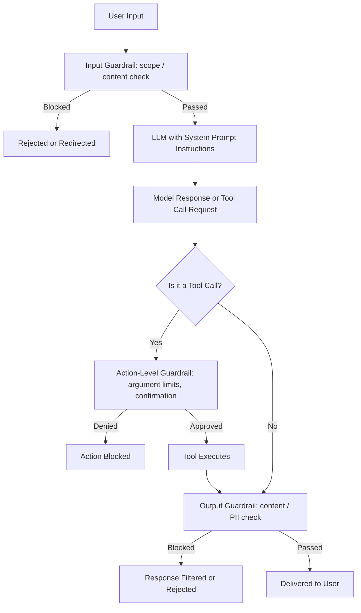

# Guardrails

## Definition

Guardrails are the layer of checks, constraints, and safeguards wrapped in code around a language-model-powered system to keep its behavior, content, and real-world actions within acceptable bounds — because a system prompt shapes what the model is *likely* to do, but does not guarantee it, and the gap between "usually behaves" and "always behaves safely" is a real business and safety risk the moment real users or real tool-call side effects are involved.

## Detailed Explanation

A model's behavior is probabilistic. Telling it in a system prompt "never reveal internal pricing" or "never issue a refund over $500 without approval" raises the bar for good behavior — it does not create a hard boundary the model is architecturally incapable of crossing. An unusual input, an adversarial user, or simple bad luck can still produce an output that violates even a clearly stated instruction. Guardrails accept this and respond with defense in depth: multiple, independent, non-probabilistic checkpoints, so that even if one instruction fails to hold, another layer catches the problem before real harm occurs.

Guardrails typically operate at three boundaries:

- **Input guardrails** — screening a request before it ever reaches the model: blocking obviously out-of-scope or disallowed requests, often with a lightweight classifier or rule-based check.
- **Output guardrails** — screening the model's response before it reaches the user: catching unsafe content, PII leakage, or policy violations, typically via a moderation classifier or pattern-matching pass run separately from the main model.
- **Action-level guardrails** — validating any tool-call arguments against hard limits (a refund tool rejecting any amount above a threshold without human approval), and requiring explicit confirmation for high-stakes or irreversible actions, enforced by code the model's own output cannot override.

The core design principle is treating the model as an **untrusted component** even though it does most of the useful work: every hard constraint — never exceed this spending cap, never expose this class of data, never call this tool without confirmation — must be enforced by code, not merely requested through a prompt. This is the same least-privilege principle from traditional software security, applied to an LLM system: the model should only ever be *able* to trigger actions within a boundary your code enforces, regardless of what it's told to do or how convincingly a user (or a [prompt injection](../Week-02/Topics/13-Prompt-Injection.md) attack) tries to talk it out of that boundary.

Guardrails are broader in scope than [Validation and Retry](../Week-02/Topics/09-Validation-And-Retry.md): validation-and-retry is mainly about shape and business-logic correctness of structured output, while guardrails are about safety, policy compliance, and action authorization across the whole system — inputs, outputs, and every tool-call side effect. They also carry a real cost/latency trade-off: running a separate moderation classifier on every input and output adds an extra model call's worth of overhead, so production systems typically tier their checks — cheap rule-based checks first, expensive classifier-based checks only when needed — and log every trigger for ongoing tuning, because guardrails that are too strict create as real a product problem (frustrated legitimate users) as guardrails that are too weak.

Guardrails can be implemented at several levels of rigor, and mature systems combine all of them rather than picking one: instructions in the system prompt (the weakest layer, still fundamentally probabilistic); deterministic rule-based checks (regex, allow/deny lists, numeric thresholds); and a separate, smaller, faster classifier model trained specifically to screen inputs or outputs. None of these layers is assumed sufficient on its own — the whole point of layering is that even if one probabilistic instruction fails to hold, another, non-probabilistic layer catches the problem before real harm occurs.

## Diagram

## Examples

- A refund tool that hard-caps any single automated refund at $200 in code, regardless of what the model's tool call requests, routing anything above that to a human.
- A healthcare chatbot's output guardrail that scans every response for specific medical dosage language and blocks it unless a licensed-content flag is set.
- An input guardrail that classifies and redirects any question resembling investment advice away from a customer-support assistant not licensed to give it.
- An AI browser agent whose tool access is scoped to read-only browsing, with any action that would submit a form or send data requiring a separate, explicitly-granted permission.

## Advantages

- Provides deterministic, non-probabilistic enforcement for anything genuinely safety- or business-critical.
- Defense in depth means no single failure point (one bypassed instruction) causes real-world harm.
- Tiered checks (cheap rules first, expensive classifiers second) keep the safety net affordable at scale.
- Applies equally well to consumer chatbots and internal agentic tools with real tool-call side effects.

## Limitations

- Adds latency and cost, especially when classifier-based checks run on every input and output.
- Overly aggressive guardrails create false positives that block legitimate requests and frustrate users — tuning is an ongoing trade-off, not a one-time setup.
- Guardrails reduce risk; they do not eliminate it, especially against a determined adversarial attacker probing for gaps — prompt injection remains a fundamentally unsolved threat.
- A guardrail relying purely on a prompt instruction rather than code-level enforcement offers no real guarantee at all.

## Related Concepts

- [Structured-Output](./Structured-Output.md)
- [Hallucination](./Hallucination.md)
- [AI-Agent](./AI-Agent.md)
- [Function-Calling](./Function-Calling.md)
- [Guardrails (Week 2)](../Week-02/Topics/12-Guardrails.md)
- [Prompt Injection (Week 2)](../Week-02/Topics/13-Prompt-Injection.md)

## Interview Questions

**1. Why isn't a well-written system prompt sufficient as a guardrail on its own?**
- A system prompt shapes the model's behavior probabilistically; it does not create a hard, architecturally enforced boundary.
- An unusual, adversarial, or simply unlucky input can still produce output that violates a clearly stated instruction.
- Real guardrails add deterministic, code-level enforcement that doesn't depend on the model choosing to comply.

**2. What are the three main boundaries at which guardrails typically operate?**
- Input guardrails, screening a request before it reaches the model.
- Output guardrails, screening the model's response before it reaches the user.
- Action-level guardrails, validating tool-call arguments and requiring confirmation for high-stakes actions, enforced independently of the model's own decision.

**3. Why does risk escalate sharply once tool calling is involved?**
- A pure text-generation system that misbehaves says something wrong — contained, if unpleasant.
- A tool-using system that misbehaves can trigger a real action: an unauthorized refund, a deleted record, a sent email.
- This is why action-level guardrails (hard limits, confirmation requirements, least-privilege tool access) are the primary practical defense once tools are involved.

**4. What is the "least privilege" principle as applied to LLM guardrail design?**
- The model, or any agent using it, should only ever have access to the tools and data strictly required for its specific task.
- Even if the model's output is manipulated or wrong, its ability to cause harm is bounded by what it's actually permitted to do.
- This mirrors the same access-control principle long used in traditional software security.

**5. Why might a team decide against adding an expensive moderation-classifier check on every single input and output?**
- Every classifier call adds real latency and cost, multiplied across every request.
- Production systems typically tier checks: cheap deterministic rules first, expensive classifier-based checks only when the cheap checks don't resolve the situation clearly.
- The trade-off must be tuned against the actual risk profile of the system, not applied uniformly regardless of stakes.
