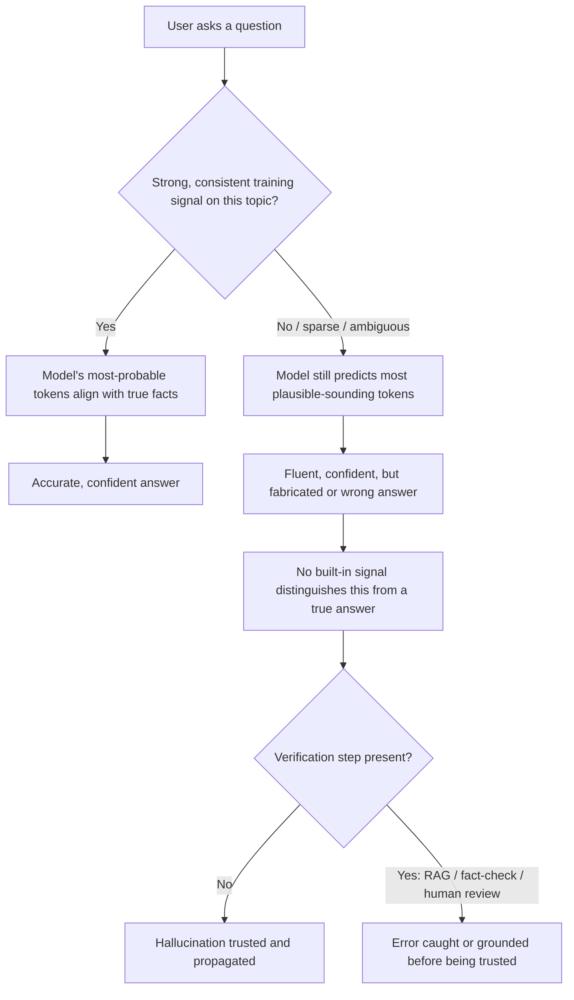

# Hallucination

## Definition

Hallucination is when a language model produces text that sounds fluent, confident, and plausible but is factually wrong, unsupported, or entirely fabricated — an invented citation, a nonexistent API method, a precise-sounding statistic that was never real. It's a direct consequence of a model being a next-token predictor rather than a fact-checking or lookup system.

## Detailed Explanation

Nothing "goes wrong" mechanically when a model hallucinates — it is doing exactly what it was trained to do: predicting the next most probable token given everything so far. The problem is that "most probable given learned patterns" is not the same computation as "verified true against evidence." These only coincide when training data contains a clear, consistent, unambiguous answer. For common, well-represented facts ("what's the capital of France?"), the statistically likely answer and the true answer are the same, and the model looks flawless. For rare, recent, ambiguous, or highly specific information — an obscure legal citation, an exact API parameter, a statistic — the model still must produce *some* next-token prediction, and it fills the gap with something that matches the shape of a correct answer without being one.

Several distinct mechanisms drive this, and it isn't just one bug:

- **Statistical guessing, not lookup.** When the true fact is rare or absent in training data, "plausible" and "true" diverge, and the model fills the gap with pattern-shaped text.
- **Training data gaps or noise.** The model has no reliable pattern to draw from on underrepresented or contradictory topics, and it's rarely trained to reliably recognize and admit that gap.
- **Confident tone is a learned behavior, not a truth signal.** Most training text is written assertively, so the model learns to *write* confidently regardless of whether the underlying content is accurate.
- **Compounding errors in long generation.** An early small inaccuracy in a long response can snowball, since later tokens are generated to stay consistent with what was already written, even if that was wrong.
- **Calibration failure.** Calibration is how well a model's stated confidence tracks its actual accuracy; poorly calibrated models sound equally confident whether right or wrong, which is exactly what makes hallucination deceptive.

The primary structural mitigation is [RAG](./RAG.md): fetching real, verified documents and inserting them into the [Context-Window](./Context-Window.md) before generation, so the model can ground its answer in supplied text rather than relying purely on parametric (trained-in) memory. This significantly reduces — but does not eliminate — hallucination, because the model can still misread, misquote, or fabricate details even from real, provided sources. Faithfulness (whether every claim in an answer is actually supported by retrieved context) is the metric that measures exactly this residual risk, and it is a distinct question from whether the retrieved sources themselves are correct. [Guardrails](./Guardrails.md) and [Validation and Retry](../Week-02/Topics/09-Validation-And-Retry.md) can catch some downstream symptoms (a malformed value, a value outside a plausible range) but cannot, on their own, detect a plausible, well-typed, entirely fabricated fact — that requires grounding checks against a real source, or human review.

Fine-tuning and alignment techniques (RLHF, and specific "honesty" training) can reduce hallucination rates and improve a model's willingness to hedge or say "I'm not sure" — but no current production model eliminates the behavior entirely, and pushing too hard in this direction trades off against helpfulness: an overly cautious model that constantly refuses to answer is also a poor user experience. This is why hallucination is best understood as a dial to manage across several levers (grounding, calibration, verification workflows) rather than a switch any single technique can fully flip off.

Some hallucination is domain-specific and predictable rather than a random surprise: models tend to hallucinate more on very recent events that fall after training cutoff, extremely niche or obscure topics, precise numbers and citations, and multi-step factual chains where one wrong link corrupts everything downstream. Knowing these patterns in advance is useful precisely because it tells a team where to invest extra grounding and verification effort, rather than treating every output as equally risky.

## Diagram

## Examples

- A model citing a legal case with a realistic-sounding name and docket number that does not exist — the class of error that got real-world lawyers sanctioned in 2023 for submitting fabricated citations in a court filing.
- A coding assistant inventing a plausible but nonexistent library function or parameter, which only fails when a developer actually tries to run the code.
- A support bot confidently stating an outdated return-window policy because its trained-in memory predates a recent policy change, when no current document was retrieved to ground the answer.
- A model asked for a precise statistic ("what percentage of X happened in year Y") producing a specific-sounding number with no real source behind it, simply because a numeric answer matches the expected shape of a good response.

## Advantages

Hallucination itself is a limitation, not a capability — there is no "advantage" to the phenomenon. What's worth noting instead is that the same underlying mechanism (generating plausible continuations rather than looking up facts) is also what gives models their fluency, creativity, and ability to handle novel phrasing — the trade-off is inseparable from how these models work, not an optional side effect that could be switched off without cost.

## Limitations

- It is a structural consequence of next-token prediction, not a bug a patch can simply remove.
- Bigger, newer models hallucinate less often on many benchmarks, but no current production model eliminates it.
- Confidence of tone and accuracy of content are unrelated — a hallucinated answer often reads identically to a correct one.
- Asking a model "are you sure?" is not a dependable detection method; it can confidently double down on a wrong answer or hedge on a correct one.
- Even RAG-grounded generation can still misquote or misread a real, retrieved source.

## Related Concepts

- [RAG](./RAG.md)
- [LLM](./LLM.md)
- [Guardrails](./Guardrails.md)
- [Error-Analysis](./Error-Analysis.md)
- [LLM-As-Judge](./LLM-As-Judge.md)
- [Structured-Output](./Structured-Output.md)
- [Hallucination (Week 1)](../Week-01/Topics/11-Hallucination.md)

## Interview Questions

**1. Why does a language model hallucinate instead of simply saying "I don't know"?**
- The model has no built-in "abstain" pathway by default — it must produce some next-token prediction regardless of how sparse the underlying training signal is.
- It generates text matching the style and shape of a correct, confident answer even when it has no reliable factual basis for it.
- Saying "I don't know" reliably requires specific training or calibration work; it isn't the model's default behavior.

**2. Does Retrieval-Augmented Generation eliminate hallucination?**
- No — it significantly reduces it by grounding the answer in retrieved, real documents instead of purely trained-in memory.
- The model can still misread, misquote, or fabricate details even from the correctly retrieved source.
- Faithfulness checks and human review are still needed to catch residual grounding failures.

**3. Why is model confidence a poor signal of factual accuracy?**
- Confident tone is a learned stylistic pattern from training data written assertively, not a truth-tracking mechanism.
- Poorly calibrated models sound equally confident whether they are right or wrong.
- This is precisely why hallucinated answers are dangerous — they don't come with a visible warning sign.

**4. What kinds of questions or topics are models more likely to hallucinate on?**
- Very recent events that fall after the model's training cutoff.
- Extremely niche or obscure topics with sparse training signal.
- Precise numbers, statistics, or citations, and multi-step factual chains where one wrong link corrupts everything downstream.

**5. Why can't schema or business-logic validation alone catch a hallucinated fact?**
- Those checks only verify shape, type, and internal consistency, not truthfulness against any external source.
- A hallucinated but well-typed and internally consistent value passes every such check.
- Catching it requires grounding against a real source (RAG, fact-checking) or human review, which is a fundamentally different kind of check.
