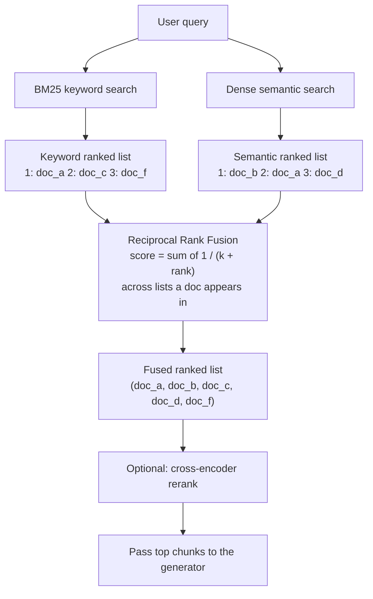

# Hybrid Search

## Definition

Hybrid search combines keyword search ([BM25](../AI-GLOSSARY.md)) and semantic search (dense
[embeddings](./Embeddings.md)) by running both against the same query and fusing their two
ranked result lists into one, most commonly using Reciprocal Rank Fusion (RRF). It exists because
keyword and semantic retrieval fail in complementary ways, and combining them catches queries that
either method alone would miss.

## Detailed Explanation

Dense/semantic search is excellent at matching *meaning* — a query like "how do I reset my
password" retrieves a chunk titled "Account Recovery Steps" even with almost no shared words. But
it's comparatively bad at matching *exact tokens* it has no strong learned association for: error
codes, product SKUs, people's names, version numbers, legal clause numbers. BM25, the standard
statistical keyword-ranking formula, is exactly the opposite: it has zero notion of synonymy or
paraphrase, but perfect recall on literal tokens — an error code either is or isn't in a document,
and BM25 finds it deterministically. Hybrid search runs both and merges the results so a system
gets "catches exact codes" and "catches paraphrases" at the same time, rather than picking one
failure mode over the other.

The hard part is the merging step. The naive approach — add the two scores together — is broken,
because BM25 scores are unbounded and corpus-dependent while cosine similarity is bounded between
-1 and 1; summing them lets whichever method's numbers happen to be larger numerically dominate,
regardless of which method is actually more reliable for a given query. Even normalizing both
lists to `[0,1]` doesn't fully fix this, because it assumes the *shape* of relevance within each
list is comparable, which it often isn't — a semantic list where the top five results all cluster
around 0.80 similarity conveys much less discriminative signal than a keyword list where the top
result scores far above the rest.

**Reciprocal Rank Fusion (RRF)** sidesteps the problem entirely by discarding raw scores and using
only rank position — a document's 1st, 2nd, 3rd place, and so on — which is comparable across any
two ranked lists no matter how their underlying scores were computed:

```
RRF_score(d) = Σ (over each ranking list the document appears in)  1 / (k + rank(d))
```

`k` is a small constant, commonly 60, that softens the impact of being exactly rank 1 versus rank
2 so the fusion isn't overly sensitive to a single list's exact ordering noise. A document ranking
near the top of *both* lists gets a high combined score; a document appearing in only one list
still contributes, just less; a document in neither list contributes nothing. This also means a
document with zero BM25 lexical overlap simply doesn't appear in the keyword list at all — but if
it ranked highly in the semantic list, it still earns a respectable score from that half alone,
and the reverse holds too.

RRF is deliberately rank-based rather than score-based, which is both its strength (no scale
normalization or corpus-specific tuning required) and its limitation (it can't distinguish
"barely made rank 3" from "dominantly the best match at rank 3" — both get exactly the same
credit). Weighted score-based fusion alternatives exist but require careful, corpus-specific
calibration that has to be re-tuned as data changes, which is why RRF is the default starting
point across most production hybrid search implementations, including Elasticsearch's, OpenSearch's,
and Weaviate's built-in hybrid retrievers.

Hybrid search solves *recall* — getting the right document somewhere into a shortlist. It is
usually followed by [reranking](./Reranking.md), which solves *precision* — making sure the single
best chunk out of that shortlist actually lands in position 1 before it reaches the generator.

## Diagram



## Examples

- A support-desk query containing both an exact error code (`ERR-4032`) and a conversational
  description ("my app keeps crashing on login") — BM25 catches the code, semantic search catches
  the paraphrase, and fusion surfaces the one chunk that matters either way.
- Elasticsearch's and OpenSearch's built-in hybrid retrievers, which run BM25 and vector search
  together and combine them via RRF by default.
- A product-search system merging exact SKU matches from a keyword index with semantically similar
  product descriptions from an embedding index.

## Advantages

- Catches both exact-token queries (BM25's strength) and paraphrased/conceptual queries (dense
  search's strength) in one pipeline.
- RRF requires no training, no score normalization, and no per-corpus calibration — it's a
  deterministic formula that works reasonably well out of the box.
- Recovers cases where a document has zero score in one method but ranks highly in the other,
  rather than requiring both signals to agree.
- Widely supported as a built-in feature in major search and vector systems, so it rarely requires
  custom infrastructure to adopt.

## Limitations

- RRF discards raw score magnitude, so it can't distinguish a barely-adequate rank-3 match from an
  obviously dominant one — both get identical credit.
- Hybrid search improves recall (finding the right chunk *somewhere*), not precision at the very
  top — it's typically still followed by reranking for that.
- Running two retrieval systems (an inverted index and a vector index) means two pieces of
  infrastructure to build, keep in sync, and maintain, instead of one.
- Hybrid search doesn't always beat either method alone — for a corpus that's almost entirely
  exact-code lookups or almost entirely paraphrased natural language, one method might already
  suffice, and this should be measured, not assumed.

## Related Concepts

- [RAG](./RAG.md)
- [Reranking](./Reranking.md)
- [Vector Database](./Vector-Database.md)
- [Embeddings](./Embeddings.md)
- [Hybrid Search: RRF Fusion (Week 4)](../Week-04/Topics/05-Hybrid-Search-RRF-Fusion.md)
- [Keyword Search: BM25 (Week 4)](../Week-04/Topics/03-Keyword-Search-BM25.md)

## Interview Questions

**1. Why can't you just add BM25 and cosine-similarity scores together to combine two result lists?**
- BM25 scores are unbounded and corpus-dependent; cosine similarity is bounded between -1 and 1.
- Summing them lets whichever scale happens to produce larger numbers dominate the result.
- This has nothing to do with which method is actually more reliable for the given query.

**2. What does Reciprocal Rank Fusion actually compute, and why use rank instead of score?**
- It sums `1 / (k + rank)` for each list a document appears in, using ordinal rank position.
- Rank is comparable across any two lists regardless of how the underlying scores were computed.
- This avoids the need for scale normalization or corpus-specific score calibration.

**3. What is the role of the constant `k` in RRF, and how sensitive is the result to it?**
- `k` softens the impact of very top ranks so the fusion isn't dominated by a single list's #1 result.
- A common default is `k=60`; RRF is comparatively insensitive to this constant compared to
  weighted score-fusion approaches.
- It doesn't require per-corpus tuning the way a weighted linear fusion would.

**4. Why does hybrid search typically get followed by a reranking step?**
- Hybrid fusion is good at recall — getting the right chunk somewhere into a wide shortlist.
- It's not as precise as a cross-encoder at deciding exactly which single chunk is best.
- Reranking re-scores the fused shortlist with a model that judges query and document jointly,
  putting the single best result at position 1.

**5. Does hybrid search always outperform keyword-only or semantic-only search?**
- Not necessarily — it depends on the query distribution and corpus.
- A corpus dominated by exact-code lookups may not benefit much from adding semantic search.
- Its benefit should be measured with retrieval metrics on real queries, not assumed by default.
