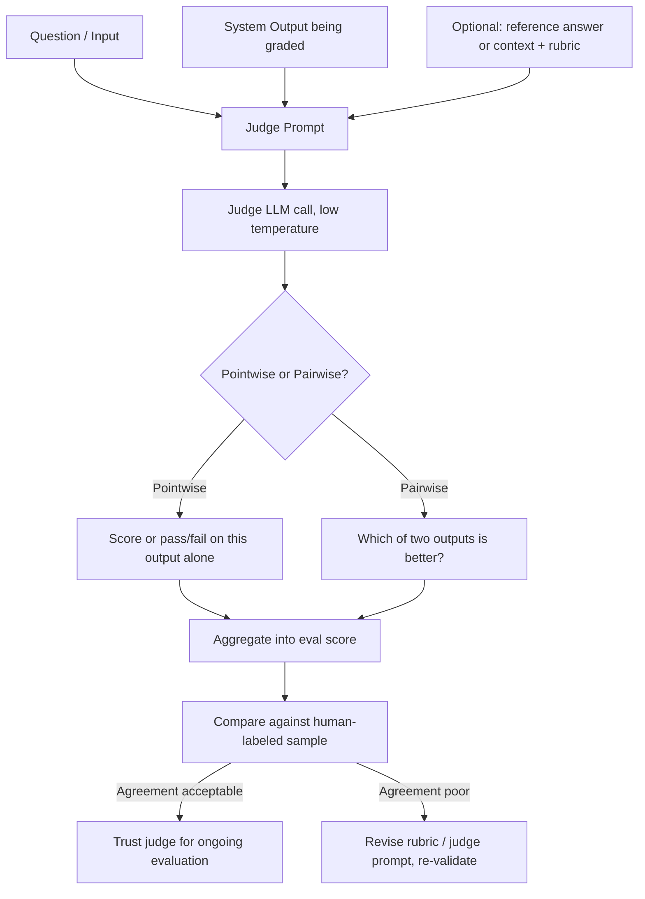

# LLM-As-Judge

## Definition

LLM-as-judge means using one AI model call to grade another system's output — for qualities like helpfulness, tone, or whether an answer actually addresses the question, none of which a simple rule can reliably check. The judge is given the input, the output being graded, optional reference material or grounding context, and explicit grading criteria, and returns a structured verdict such as a score, a pass/fail, or a pairwise preference.

## Detailed Explanation

Deterministic assertion checks (is this valid JSON, does the response contain a required disclaimer) are free and reliable but can only catch mechanical properties. Most of what makes an answer genuinely good — helpfulness, appropriate tone, whether it actually resolves the user's underlying need — is semantic, not mechanical, and a rule can't touch it. Hiring humans to grade every output at scale is accurate but slow and expensive. LLM-as-judge fills the gap: dramatically cheaper and faster than human grading, and able to evaluate nuanced qualities rules simply cannot capture.

There are two common judging modes. **Pointwise** judging scores a single output on its own, either against fixed criteria or a reference answer. **Pairwise** judging shows the judge two outputs (e.g., old prompt vs. new prompt) and asks which is better — this tends to be more reliable than absolute scoring, because comparative judgments are cognitively easier than absolute ones, for both humans and models.

Judge design has to actively guard against several known failure modes:

- **Self-preference bias** — a model tends to rate its own outputs, or outputs in its own style, more favorably; using a different model as judge than the one being evaluated mitigates this.
- **Position bias** — in pairwise judging, the order in which two outputs are shown can influence which one is picked; running both orderings and averaging counters this.
- **Verbosity bias** — judges often rate longer answers as better even when they aren't; explicit rubric criteria penalizing padding help.
- **Prompt sensitivity** — small wording changes in the judge prompt can shift scores substantially.

[G-Eval](../Week-06/Topics/05-G-Eval.md) is a specific, more rigorous recipe that addresses the coarseness and inconsistency of naive "rate this 1–10" prompting: it has the judge auto-generate its own chain-of-thought evaluation steps from the criteria, then computes the final score as a probability-weighted average over possible score values (`score = Σ p(s) · s`) rather than reading off a single sampled token — producing a more consistent, finer-grained signal, particularly useful for detecting small before/after improvements.

None of this makes a judge trustworthy by default. A judge is itself a language model with all the same failure modes as the system it grades — inconsistency, bias, plain wrongness — and none of that is visible unless actively checked. [Judge Validation](../Week-06/Topics/07-Judge-Validation.md) is the non-negotiable step that earns a judge the right to be trusted: draw a representative, stratified sample, grade it yourself (or with a trusted human panel), run the judge on the exact same sample, and measure agreement with a metric matched to the scoring type (Cohen's Kappa for categorical labels, Pearson/Spearman correlation for graded scales). Only once agreement clears an acceptable bar — and only until the next judge-model upgrade or rubric edit, which requires re-validation — should the judge's scores drive real decisions like gating a release.

When agreement between judge and human labels is poor, the right response is rarely to abandon LLM judging altogether — it's to inspect the specific disagreements, look for a pattern (a judge that's systematically too lenient on verbose answers, say), revise the rubric with concrete examples closing that gap, and re-validate. This validate-inspect-revise loop is the actual skill involved, not a one-shot pass/fail gate performed once and forgotten.

## Diagram

## Examples

- MT-Bench and AlpacaEval use a strong LLM to judge chat response quality head-to-head via pairwise comparison.
- A RAG eval framework like RAGAS uses an LLM judge internally to compute faithfulness (are the answer's claims supported by retrieved context) and answer relevancy.
- A team validates a new judge prompt against 80 human-labeled examples stratified across their error taxonomy, reporting Cohen's Kappa before letting it gate any release.
- A support-quality team uses a pointwise judge with a rubric scoring "empathy without being saccharine" on a 1-5 scale, a quality no keyword rule could reliably capture.

## Advantages

- Evaluates qualities — tone, helpfulness, nuanced correctness — that no deterministic rule could check.
- Dramatically cheaper and faster than having a human grade every output at scale.
- G-Eval-style methods produce a continuous, fine-grained signal sensitive to small quality changes, useful for before/after comparisons.
- Composable with other eval methods (assertion checks, RAGAS metrics) inside one eval set.

## Limitations

- A judge's score is an estimate from another fallible model, not ground truth, until validated against human judgment.
- Susceptible to self-preference, position, and verbosity biases if not explicitly designed around them.
- Prompt-sensitive: small rubric wording changes can shift scores meaningfully.
- Requires ongoing re-validation — agreement measured once can silently drift after a model upgrade, rubric edit, or shift in the kinds of inputs the system receives.

## Related Concepts

- [Error-Analysis](./Error-Analysis.md)
- [Hallucination](./Hallucination.md)
- [Structured-Output](./Structured-Output.md)
- [RAG](./RAG.md)
- [LLM-As-Judge (Week 6)](../Week-06/Topics/04-LLM-As-Judge.md)
- [G-Eval (Week 6)](../Week-06/Topics/05-G-Eval.md)
- [Judge Validation (Week 6)](../Week-06/Topics/07-Judge-Validation.md)

## Interview Questions

**1. Why is pairwise judging generally more reliable than pointwise absolute scoring for "did this change help" questions?**
- Comparative judgments ("which of these two is better") are cognitively easier and more consistent than absolute scores, for both humans and models.
- Absolute scoring is prone to models clustering around a small set of "favorite" numbers regardless of actual quality.
- Pairwise comparison directly answers the question a before/after evaluation usually cares about.

**2. What is self-preference bias, and how do you mitigate it?**
- A model tends to rate its own outputs, or outputs in a similar style to its own, more favorably than an independent evaluator would.
- Mitigation is to use a different model as judge than the one generating the output being graded, where cost allows.
- At minimum, this bias should be accounted for when interpreting scores from a same-model judge.

**3. What problem does G-Eval's probability-weighted scoring solve that naive "rate 1-10" prompting doesn't?**
- Naive prompting reads off a single discrete token, discarding the model's actual underlying uncertainty between adjacent scores.
- G-Eval computes a weighted average across the probability distribution over possible scores, producing a continuous, finer-grained signal.
- This reduces the tendency for models to snap to one favorite integer even when genuinely uncertain between two close values.

**4. Why must an LLM judge be validated against human judgment before it's trusted to drive decisions?**
- A judge is itself a language model with the same failure modes (inconsistency, bias, wrongness) as the system it grades.
- Judge reliability varies by task and rubric quality and cannot be assumed generally — it has to be checked per use case.
- Skipping validation risks silently basing real decisions (shipping a change, prioritizing a fix) on an uncalibrated instrument.

**5. Why is validating a judge once, at launch, not sufficient going forward?**
- A judge-model version upgrade, a rubric edit, or drift in the kinds of inputs the system receives can all silently degrade previously-fine agreement.
- Periodic re-validation is needed to catch this drift before it misleads a decision.
- Treating validation as a one-time gate rather than an ongoing practice is a common way eval systems quietly stop telling the truth.
