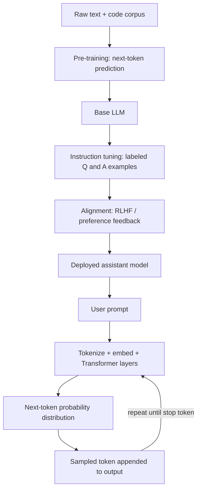

# LLM (Large Language Model)

## Definition

A **Large Language Model (LLM)** is a neural network — almost always a **Transformer** — trained on huge amounts of text to predict the next token in a sequence. Scale is the defining feature: billions of parameters, trained on trillions of tokens of text, code, and other data. Everything an LLM appears to "do" — answer questions, write code, hold a conversation, summarize a document — is an emergent side effect of getting very good at one narrow skill: guessing what text comes next.

## Detailed Explanation

An LLM has no separate reasoning module, no built-in fact database, and no live connection to the world by default. Its entire behavior is encoded in its parameters — numeric weights tuned during training so the model's predicted probability distribution over the next token matches patterns observed in real text.

Building a modern LLM happens in stages:

1. **Pre-training** — the model reads a massive, mostly unlabeled text corpus and learns to predict the next token, over and over, across trillions of examples. This is where the bulk of the model's "knowledge" of language, facts, and patterns gets baked in.
2. **Instruction tuning / supervised fine-tuning** — the base model, which is really just a very good autocomplete engine, is further trained on examples of well-formed question-answer and instruction-following behavior so it acts like an assistant instead of continuing arbitrary internet text.
3. **Alignment (e.g. RLHF, DPO)** — human or model-generated preference feedback nudges the model's outputs toward being more helpful, honest, and harmless, and away from unhelpful or unsafe completions.

The result is a single, general-purpose model that can be pointed at very different tasks (translation, coding, classification, conversation) just by changing the prompt, rather than requiring a new model architecture per task — the defining shift that separates LLMs from earlier, task-specific NLP systems.

It's important to separate two things that get conflated: "predicting plausible text" and "knowing the truth." An LLM learned statistical regularities in text, not a verified fact database. Most of the time these line up, because most written text about a topic is accurate — but they can diverge, which is the root cause of hallucination (see **Hallucination**).

LLMs are also stateless between requests: nothing is remembered from one conversation to the next unless an external system explicitly saves and re-feeds that information into a later prompt (see **Memory**).

"Large" is doing real work in the name. Scale isn't just about being bigger for its own sake — empirical **scaling laws** show that model quality improves in a fairly predictable way as parameter count, training data, and compute are increased together, which is why the field's dominant strategy for years was simply "train a bigger model on more data." Scale also produces **emergent capabilities** — abilities like multi-step arithmetic, translation between languages never explicitly paired in training, or following complex multi-part instructions, that appear only once a model crosses a certain size/data threshold and are largely absent in smaller models trained the same way. This is part of why a smaller model isn't just a "worse" version of a larger one — it can lack a capability outright rather than merely performing it less well.

Not every LLM is a general-purpose chat assistant. The same architecture underlies narrower deployments: a classification-only fine-tune that just labels support tickets, a code-completion model tuned purely on source code, or a domain-specific model fine-tuned on legal or medical text. What makes all of these "LLMs" is the shared foundation — a Transformer trained at scale on a next-token (or similar) objective — not the specific product surface built on top.

## Diagram

## Examples

- **GPT-4 / GPT-4o (OpenAI)**, **Claude (Anthropic)**, **Gemini (Google)**, **Llama (Meta)** — all decoder-only Transformer LLMs, differing mainly in training data, scale, fine-tuning approach, and safety tuning.
- A support chatbot built on an LLM answering "How do I reset my password?" by pattern-matching against similar phrasing seen during training, not by querying a database.
- A coding assistant (e.g. GitHub Copilot, Claude Code) generating a function body by continuing the pattern of the surrounding code as plausible "next tokens."
- Retrieval-augmented setups (see **RAG**) where an LLM's next-token prediction is grounded by inserting fresh, retrieved documents directly into the prompt.

## Advantages

- **Generality** — one model handles translation, summarization, coding, reasoning-style tasks, and conversation without task-specific retraining.
- **Few-shot / zero-shot capability** — can perform new tasks from a handful of examples (or a plain instruction) in the prompt, no gradient updates required.
- **Natural language interface** — no need to learn a query language or API to get useful output; plain instructions work.
- **Composability** — LLMs can be wrapped with tools, retrieval, and function calling to extend beyond raw text generation (see **Function-Calling**, **Agent-Loop**).

## Limitations

- **Hallucination** — confident, fluent, and sometimes entirely wrong, especially on niche facts, citations, and numbers.
- **Static knowledge cutoff** — knows nothing about events after its training data was collected unless external information is added to the prompt.
- **No inherent memory** — each request is stateless; apparent "memory" is an engineered feature re-injecting saved data.
- **Cost and latency scale with tokens** — longer prompts and longer outputs are slower and more expensive (see **Tokens**).
- **Prompt sensitivity** — small wording changes can meaningfully change output quality or behavior.
- **Bounded by context window** — cannot consider more information than fits in a single request (see **Context-Window**).

## Related Concepts

- [Tokens](./Tokens.md)
- [Context Window](./Context-Window.md)
- [Transformer](./Transformer.md)
- [Attention](./Attention.md)
- [Embeddings](./Embeddings.md)
- [Hallucination](./Hallucination.md)
- [Prompt Engineering](./Prompt-Engineering.md)
- [AI Agent](./AI-Agent.md)
- [Language Models (Week 1)](../Week-01/Topics/01-Language-Models.md)

## Interview Questions

**1. What is an LLM, fundamentally, at inference time?**
- A Transformer neural network estimating `P(next_token | previous_tokens)`.
- It generates text one token at a time, feeding each new token back in as input for the next step.
- No separate reasoning engine or fact lookup is involved by default.

**2. What is the difference between pre-training, instruction tuning, and alignment (RLHF)?**
- Pre-training: next-token prediction over a massive general corpus — builds raw language/world-pattern knowledge.
- Instruction tuning: supervised fine-tuning on labeled instruction-response pairs — teaches assistant-like behavior.
- Alignment: human/preference feedback further shapes outputs toward helpful, honest, harmless responses.

**3. Why can an LLM be confidently wrong (hallucinate)?**
- It optimizes for statistically plausible next tokens, not verified truth.
- Plausible-sounding and factually correct usually coincide but are not the same objective.
- No built-in mechanism forces the model to say "I don't know" when it lacks reliable information.

**4. Why don't LLMs "remember" previous conversations by default?**
- Each API/chat request is stateless — the model only sees what's in the current context window.
- Apparent memory across sessions is a product feature that stores facts externally and re-inserts them into future prompts.
- The model itself has no persistent internal state between calls.

**5. Why has the decoder-only Transformer become the dominant LLM architecture?**
- It naturally fits the next-token-prediction training objective used for large-scale pre-training.
- It scales well with more data and parameters (empirically well-behaved scaling laws).
- Causal (masked) self-attention supports efficient autoregressive generation one token at a time.

**6. What are "emergent capabilities" and why do they matter when comparing model sizes?**
- Abilities (e.g. multi-step arithmetic, complex instruction-following) that appear only once a model crosses a certain scale of parameters/data, rather than improving smoothly from the smallest models upward.
- They mean a smaller model can lack a capability entirely, not just perform it worse, making "just use a smaller model" a risky assumption for capability-sensitive tasks.
- This motivates empirically testing a task on the actual candidate model rather than assuming capabilities transfer linearly with size.
