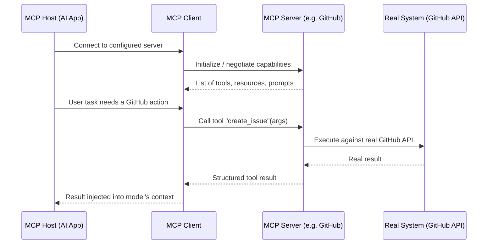

# MCP (Model Context Protocol)

## Definition

MCP (Model Context Protocol) is an open standard, introduced by Anthropic, for connecting AI applications to external tools, data sources, and systems through a single, uniform client-server protocol — instead of every AI application writing its own bespoke integration for every external system it needs to reach.

*A note on scope:* this concept goes beyond what the 7-week curriculum covers directly. The closest curriculum material is Week 2's coverage of tool/function calling, which MCP builds directly on top of — see Related Concepts below. What follows is a standalone treatment based on the protocol's public specification and general practice, not a topic taught step-by-step elsewhere in this course.

## Detailed Explanation

Tool/function calling (see Function-Calling) solves the core mechanism of letting a model request a real action — but it says nothing about *how* an application discovers, wires up, and maintains the many tools, data sources, and prompt templates a given system might need. Before MCP, every application that wanted to give a model access to, say, GitHub, a filesystem, Slack, and a company database had to write four separate bespoke integrations, each shaped around that specific application's internal tool-calling code — an "M applications × N systems" integration problem, often summarized as needing its own USB-C-style solution: one standard connector instead of a different cable for every device.

MCP standardizes this with a **client-server architecture**:

- An **MCP host** is the AI application itself (e.g., Claude Desktop, Claude Code, an IDE plugin, a custom agent).
- The host runs one or more **MCP clients**, each maintaining a 1:1 connection to a single **MCP server**.
- An **MCP server** is a lightweight program that exposes a specific system's capabilities — a GitHub server, a filesystem server, a Slack server, a company's internal API — through a standardized schema, regardless of what that underlying system actually is or how it's implemented internally.

A server can expose three kinds of primitives:

- **Tools** — executable functions the model can call, structurally the same schema-driven request/response pattern as ordinary function calling (a name, a description, typed parameters), just exposed by a separate, reusable server process instead of hardcoded into the host application.
- **Resources** — read-only data the host can fetch and feed into context, such as a file's contents, a database record, or a ticket's details — the "give the model information" counterpart to tools' "let the model take an action."
- **Prompts** — reusable, parameterized prompt templates a server can offer, so common interaction patterns for that system (e.g., "summarize this GitHub issue") don't need to be reinvented by every host that connects to it.

Some servers also support **sampling**, letting the server itself request a completion from the host's LLM to accomplish part of its own work, inverting the usual direction of control — though this is used far less commonly than tools and resources.

Communication happens over one of two standard transports: **stdio** (the server runs as a local subprocess and communicates over standard input/output — simple, and the natural choice for local tools like a filesystem server) or **HTTP with Server-Sent Events** (for remote servers reached over a network). In both cases, messages are exchanged as JSON-RPC, and the protocol handles capability negotiation up front — a client asks a server what tools/resources/prompts it exposes, and the server responds with a structured list, so a host application never needs to be hardcoded against a specific server's capabilities in advance.

The result is a genuine decoupling: a company can build **one** MCP server for its internal ticketing system, and every MCP-compatible AI application (Claude Desktop, an internal agent, a third party's tool) can connect to it immediately, with no per-application integration work on either side. Symmetrically, an AI application that supports MCP gains access to the entire ecosystem of existing MCP servers (GitHub, Slack, Google Drive, databases, and hundreds of community and enterprise servers) without writing custom code for each one — this is the same "write once, plug in anywhere" value proposition that made ODBC/JDBC valuable for databases or that a plugin architecture provides for an editor.

Capability negotiation deserves a bit more detail, since it's what makes MCP genuinely dynamic rather than a fixed contract. When a client connects, it doesn't need to already know what a server offers — the initialization handshake has the server report its available tools (with their schemas), resources, and prompts, and this list can change over the lifetime of a connection (a server can notify a connected client that its tool list changed, for example if a user's permissions changed a moment ago). A host application can therefore support an arbitrary, evolving set of servers, chosen by the end user or an administrator at configuration time, without the application's own code needing to be updated for each new server it might connect to — the discovery step is part of the protocol, not something each integration reinvents.

It's worth being precise about what MCP is *not*: it is not a replacement for function calling, and it does not make a model smarter or more capable on its own. It is a **wiring standard** — it standardizes how tools/resources/prompts are described and invoked across many independent servers, so the underlying request-model-decides / application-executes mechanism from Function-Calling stays exactly the same. An MCP tool call still goes through the same "the model only ever emits a structured request; your code performs the real action" discipline — MCP just standardizes the format of that request and where it's routed, and expands the surface of that discipline to cover which servers, run by which parties, get to intercept and act on it.

## Diagram

## Examples

- **Claude Desktop / Claude Code** connecting to a local filesystem MCP server (read/write files), a GitHub MCP server (issues, PRs, repo search), and a Slack MCP server, all through the same client-side protocol, without bespoke integration code per server.
- An enterprise building one internal MCP server in front of its ticketing system, immediately usable by every MCP-compatible AI tool employees use, instead of separately integrating that system into each one.
- A design tool (e.g., Figma) exposing an MCP server so any MCP-compatible AI assistant can read design context, generate diagrams, or push a design back into the file — one server, usable by any compliant host.
- A database MCP server exposing read-only "resources" (schema, sample rows) alongside "tools" (run a parameterized query), so an agent can both understand and act on the data source through one connection.

## Advantages

- Solves the "M applications × N systems" integration problem with one standardized protocol instead of bespoke, pairwise integrations.
- Decouples AI applications from the systems they connect to — a server built once is usable by any compliant host, and a host that supports MCP gains the entire existing server ecosystem for free.
- Standardizes discovery (a client can query exactly what a server offers) rather than requiring hardcoded knowledge of each server's capabilities in advance.
- Separates "tools" (actions), "resources" (read-only context), and "prompts" (reusable templates) as distinct, well-defined primitives rather than overloading a single mechanism.
- Encourages reusable, community- and vendor-maintained servers, similar to how package registries reduced duplicated integration work across the broader software ecosystem.

## Limitations

- Expands the trust and security surface: a host now executes tool calls routed through third-party server code it doesn't control, and a malicious or compromised server's tool descriptions or resource content can attempt prompt injection against the model, the same class of risk covered under Guardrails.
- Still a relatively young standard — server quality, security practices, and adherence to the spec vary widely across the ecosystem, and tooling for auditing what a given server actually does is less mature than for established integration patterns.
- Adds an extra process/connection to manage (a running server per connected system), which is operational overhead compared to a single in-process function call.
- Does not remove the need for careful tool/resource description writing — a poorly described MCP tool is just as likely to be mis-selected or misused by the model as a poorly described local function.
- Discovery of *which* servers to trust and connect to in the first place is a governance problem the protocol itself does not solve — an organization still has to vet servers before granting them access to real systems.

## Related Concepts

- [Function-Calling](./Function-Calling.md)
- [AI-Agent](./AI-Agent.md)
- [Multi-Agent-System](./Multi-Agent-System.md)
- [Guardrails](./Guardrails.md)
- Week topic (closest related, not a direct match): [Tool / Function Calling](../Week-02/Topics/10-Tool-Function-Calling.md)

## Interview Questions

**1. What integration problem does MCP solve, and what is the standard analogy used to describe it?**
- Before MCP, every AI application needed a separate bespoke integration for every external system it wanted to reach — an "M applications × N systems" problem.
- MCP standardizes this into one client-server protocol, so a server built once for a given system works with any MCP-compatible host.
- It's commonly compared to USB-C: one standard connector replacing a different bespoke cable for every device.

**2. Describe the three primitives an MCP server can expose and how they differ.**
- Tools: executable functions the model can call to take an action, following the same schema-driven request/response pattern as ordinary function calling.
- Resources: read-only data (file contents, database records) the host can fetch and feed into context — information, not action.
- Prompts: reusable, parameterized prompt templates the server offers so common interaction patterns for that system don't need to be reinvented by every host.

**3. Is MCP a replacement for function calling? Explain the relationship.**
- No — MCP builds directly on top of function calling; the model still only ever emits a structured request, and application code still performs the real action.
- MCP standardizes how tools (and resources and prompts) are described and routed across many independent servers, rather than introducing a new request mechanism.
- It expands where that discipline applies — across potentially many third-party servers — without changing the underlying model-requests/code-executes separation.

**4. What new security consideration does MCP introduce that a single hardcoded tool integration doesn't have?**
- A host now executes calls routed through third-party server code it doesn't necessarily control or fully audit.
- A malicious or compromised server's tool descriptions or resource content can attempt prompt injection against the model.
- This expands the trust and governance surface — an organization must vet which servers it connects to, not just validate individual tool arguments.

**5. What are MCP host, client, and server, and how do they relate to each other?**
- The host is the AI application itself (e.g., an IDE plugin or desktop assistant).
- The host runs one or more clients, each maintaining a 1:1 connection to a single server.
- Each server exposes a specific system's tools/resources/prompts through the standardized protocol, over either a local stdio transport or a networked HTTP/SSE transport.
