# Memory

## Definition

Memory, in the context of an AI agent, is the set of techniques for managing what the system retains — within a single long-running task (short-term/working memory) and across separate tasks or sessions (long-term memory) — given that the model itself has no persistent state between API calls and a finite context window it can hold at once.

## Detailed Explanation

An agent loop's default "memory" is just the growing transcript fed back into the model at every iteration (see Agent-Loop). That works fine for a short task, but two distinct failure modes appear as tasks get longer or span multiple sessions: the transcript eventually exceeds the model's context window (or grows large enough that relevant details get "lost in the middle" even while technically still in-window), and by default nothing survives once a task ends — a new invocation starts from zero, with no memory that a preference was already stated or a fact already established.

These two failure modes map to two different mechanisms, not one problem at two scales:

| | Short-term (working) memory | Long-term (persistent) memory |
|---|---|---|
| What it holds | The current task's transcript: recent thoughts, actions, observations | Durable facts, preferences, or summaries from past tasks |
| Where it lives | The model's context window, for the current run only | An external store (vector DB, key-value store) outside any single context window |
| Lifespan | One agent run/session | Persists across runs, sessions, even returning users |
| Main technique | Truncation, rolling summarization, selective retention | Explicit write (save a fact) + relevance-based retrieval |
| Failure if missing | Context overflow, "lost in the middle," runaway cost | Repeating solved questions, forgetting stated preferences |

Every memory technique sits on a spectrum between **fidelity and compression**. The raw transcript is maximum fidelity and zero compression — nothing is lost, but it grows unbounded. A single one-line summary of a whole session is maximum compression and minimal fidelity. Practical techniques occupy points along this spectrum: plain truncation (keep the last N turns verbatim, discard the rest), rolling summarization (periodically compress older turns into a running summary while keeping recent turns verbatim), and vector-indexed long-term storage (embed many small facts, retrieve only the most relevant few back into context per task).

Vector memory works exactly like a small RAG pipeline pointed at an agent's own experience instead of a document corpus: when something worth remembering happens, it's written as a short text entry, embedded, and stored with metadata (user, topic, timestamp); at the start of a new task, the current query is embedded and compared against stored memory vectors, and only the top-K most relevant memories are retrieved and injected into context. This means everything that makes RAG retrieval good or bad — chunk/entry granularity, embedding quality, whether a rerank step runs before injection — transfers directly, and the same failure looks the same too: an irrelevant or stale "memory" surfacing in an answer is the memory-store equivalent of a bad RAG retrieval.

A finer-grained taxonomy, borrowed loosely from cognitive science, distinguishes **episodic** memory (specific past events — "this customer's refund was denied on March 3rd"), **semantic** memory (distilled general facts — "this customer prefers email over phone"), and **procedural** memory (learned patterns of how to do something — "check inventory before promising a ship date for this class of order"). Most production long-term-memory systems store some blend of these, and the hardest engineering problem is not storage but **retrieval relevance**: retrieving too little means the agent misses something it already learned; retrieving too much reproduces the exact context-overflow problem memory was meant to solve, just with older instead of newer information.

A practical rule of thumb ties these mechanisms to task shape rather than treating "add more memory" as a universal fix. A single, long coding session benefits most from rolling summarization of what's been tried, so the agent never repeats a dead end — dumping every past coding session from other users into that context would add nothing but noise. A customer-support agent talking to a returning user benefits most from a small set of durable, semantic facts (preferred language, unresolved-issue history) fetched fresh each time — re-injecting that user's *entire* past conversation history would risk resurfacing complaints that were already resolved as if they were still open. Choosing the wrong mechanism for the task — verbatim history where a summary would do, or a summary where a precise fact retrieval is needed — is a common, avoidable source of agents that either forget things they should know or drown in things they shouldn't.

Purpose-built memory layers like **Mem0** package this whole pipeline — extraction of durable facts from raw conversation, conflict resolution against existing stored memories (a new fact updates or supersedes an old one rather than sitting alongside it as a contradiction), storage, and relevance-scoped retrieval — behind a simple `add`/`search` API, the same way a vector database packages "store and search embeddings" so teams don't hand-roll HNSW indexing per project. Such tools automate the *mechanism* but not the *policy*: you still decide when to write to memory, how to scope it by user/session, and how much retrieved memory to actually spend tokens injecting.

## Diagram

```mermaid
flowchart TD
    subgraph ST["Short-Term / Working Memory"]
        A[Current transcript] --> B{Over size threshold?}
        B -- Yes --> C[Compress older turns:<br/>truncate or summarize]
        B -- No --> A
        C --> A
    end

    subgraph LT["Long-Term / Persistent Memory"]
        D[(External store:<br/>facts + embeddings + metadata)]
    end

    A -- "At checkpoint: extract<br/>durable fact" --> D
    D -- "At new task: retrieve<br/>top-K relevant memories" --> E[New task's initial context]
    E --> A
```

## Examples

- A multi-hour coding agent periodically compressing "what's been tried and ruled out" into a running summary so it doesn't repeat failed approaches or blow its context window.
- A customer-support agent retrieving a returning user's preferred language and past complaint history from a vector store at the start of a new conversation, instead of re-reading the entire chat history.
- Consumer assistants (Claude, ChatGPT) that "remember things about you across chats" by extracting durable facts from conversations and selectively retrieving them into future sessions.
- Mem0-style `memory.add()` / `memory.search()` calls wired into an agent loop to persist and recall user-specific facts with automatic conflict resolution.

## Advantages

- Keeps a long task's working context lean and affordable instead of letting cost balloon with every additional tool call.
- Prevents relevant early details from being silently dropped by naive truncation, by compressing rather than discarding.
- Lets an agent carry durable facts, preferences, and lessons across sessions instead of starting from zero every time.
- Borrows mature, well-understood retrieval techniques (embeddings, similarity search, reranking) from RAG rather than inventing a new mechanism.

## Limitations

- Summarization is lossy by construction — an LLM deciding what's "important enough to keep" can drop a detail that matters later, and this is a real trade-off, not an engineering bug to fully eliminate.
- Retrieval can surface irrelevant or stale memories, especially without a recency signal or periodic pruning of superseded facts.
- More retrieved memory is not automatically better — over-injection reproduces the same context-overflow and lost-in-the-middle problems memory was meant to solve.
- Every summarization pass and every retrieval call is a real, metered operation (extra LLM calls, extra latency) that must be budgeted, not treated as free housekeeping.
- Long-term memory needs ongoing curation — stale or contradicted facts don't fix themselves, and incorrect scoping (by user/session) either leaks memories across users or fragments one user's memory unnecessarily.

## Related Concepts

- [Agent-Loop](./Agent-Loop.md)
- [AI-Agent](./AI-Agent.md)
- [RAG](./RAG.md)
- [Vector-Database](./Vector-Database.md)
- [Embeddings](./Embeddings.md)
- [Context-Window](./Context-Window.md)
- Week topic: [Agent Memory (Short-Term and Long-Term)](../Week-07/Topics/07-Agent-Memory.md)
- Week topic: [Summarisation and Vector Memory](../Week-07/Topics/08-Summarisation-And-Vector-Memory.md)
- Week topic: [Mem0](../Week-07/Topics/09-Mem0.md)

## Interview Questions

**1. Why are short-term and long-term agent memory considered two distinct problems rather than the same problem at different scales?**
- They have different lifespans: short-term lasts one run/session, long-term persists across runs and sessions.
- They use different mechanisms: in-context compression (truncation, summarization) versus external storage plus relevance-based retrieval.
- Their failure modes differ: short-term failure is context overflow or runaway cost; long-term failure is forgetting stated facts or repeating solved problems.

**2. What is the "retrieval relevance" problem in long-term memory, and why is it harder than the storage problem?**
- Storage (embedding and saving a fact) is mechanically straightforward; deciding which of potentially thousands of stored facts are relevant to the *current* task is not.
- Retrieving too little means the agent misses something it already learned; retrieving too much reintroduces context overflow with older instead of newer information.
- It's the same core challenge as RAG retrieval, just applied to an agent's own past experience instead of a document corpus.

**3. Explain the fidelity-vs-compression trade-off in memory design and where common techniques sit on it.**
- Raw transcript = maximum fidelity, zero compression, grows unbounded.
- Truncation = high fidelity for recent turns, zero fidelity for dropped older turns.
- Rolling summarization = medium compression, recency-weighted; vector-indexed long-term storage = high overall compression but selectively high fidelity for whatever gets retrieved.

**4. Why is summarization described as "lossy by definition," and what mitigation does that call for?**
- An LLM deciding what to keep during summarization can omit a detail that later turns out to matter — this is an inherent property of compression, not a fixable bug.
- The summarizing call is itself an LLM step with its own failure modes and should be logged and occasionally audited.
- A common mitigation is keeping a full, unsummarized log in cold storage for human review, even though the agent's live context only sees the compressed version.

**5. What does a managed memory layer like Mem0 automate, and what does it explicitly leave to the application developer?**
- It automates extraction of durable facts from raw conversation, conflict resolution against existing memories, storage, and similarity-scoped retrieval.
- It does not decide when to call `add` (which interactions are worth remembering), how to scope memories to users/sessions, or how much retrieved memory to actually inject into a prompt.
- It automates mechanism, not policy — those decisions, and their cost/latency accounting, remain the developer's responsibility.
