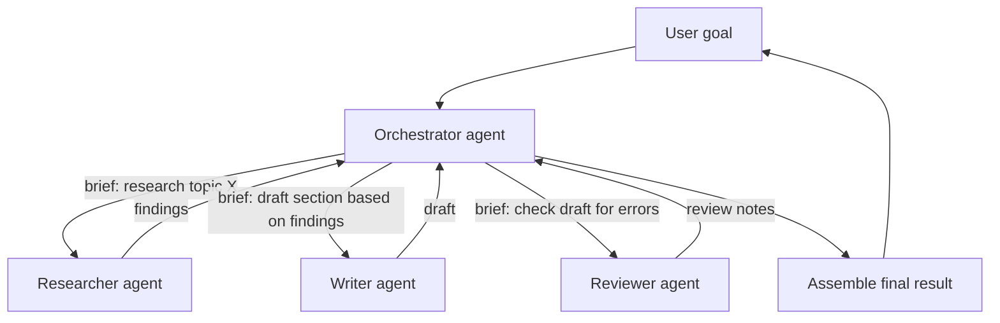

# Multi-Agent System

## Definition

A multi-agent system is an architecture in which multiple distinct AI agents — each typically specialized for a narrower role, with its own prompt, tools, and context — collaborate to accomplish a task that a single agent would handle poorly, slowly, or with too much context crammed into one loop, usually coordinated by an orchestrator (or "supervisor") agent that assigns work and assembles results.

*A note on scope:* this concept goes beyond what the 7-week curriculum covers directly. The closest curriculum material is Week 7's coverage of the single-agent loop and of LangGraph (which is commonly used to *implement* multi-agent graphs) — see Related Concepts below. What follows is a standalone treatment based on general practice in the field, not a topic taught step-by-step elsewhere in this course.

## Detailed Explanation

A single agent loop (see Agent-Loop, AI-Agent) already struggles once a task requires several genuinely different kinds of expertise, tool sets, or amounts of context: a single transcript trying to hold "search the web," "write code," "review the code for bugs," and "summarize findings for a non-technical reader" all at once grows huge, forces one system prompt to serve incompatible purposes, and makes debugging which "role" caused a mistake much harder. Multi-agent systems address this by splitting the work across separate agents, each with a narrow, well-defined responsibility and its own clean context — trading one large, overloaded loop for several smaller, more focused ones plus a coordination layer.

The most common coordination pattern is **orchestrator-worker** (also called supervisor-worker): a top-level orchestrator agent receives the overall goal, decides which specialized sub-agent(s) to invoke for which sub-task, passes each one a narrow brief rather than the full history, collects their results, and decides what to do next — itself running something close to a standard agent loop, except its "tools" are other agents rather than plain functions. Other patterns include:

- **Hierarchical** — orchestrators can themselves be workers under a higher-level orchestrator, forming a tree, useful when sub-tasks are themselves complex enough to need their own delegation.
- **Pipeline** — agents run in a fixed sequence, each handing its output to the next (e.g., a researcher agent's findings feed a writer agent, whose draft feeds a reviewer agent) — this is really a fixed workflow with LLM-agent steps, not a fully agentic architecture, but is commonly grouped under "multi-agent" in practice.
- **Peer-to-peer / debate** — agents exchange messages directly with each other rather than only through a central orchestrator, sometimes used to have multiple agents critique or challenge each other's output before a final answer is produced.

Regardless of pattern, the central design problem is **context isolation**: each sub-agent should see only what it needs for its own sub-task, not the entire system's history. This is precisely why multi-agent systems help with context-window pressure — instead of one enormous transcript, work is partitioned into several smaller ones, each of which stays focused and legible. The cost of that isolation is a **communication protocol**: someone has to decide exactly what information crosses the boundary from orchestrator to worker and back (the brief given to a worker, the format of a worker's report back), and information that isn't explicitly passed across that boundary is invisible to the other side — a sub-agent cannot infer context it was never given, even if the orchestrator "knows" it.

Frameworks like LangGraph model this naturally, since a multi-agent system is just a graph where some nodes are themselves agent loops (or entire sub-graphs) rather than single LLM calls — an orchestrator node routes to worker nodes via conditional edges, and results flow back along the graph rather than through a single shared transcript. This is also, functionally, how tools like Claude Code's own subagent/task delegation work: a general-purpose orchestrating loop dispatches a narrowly-briefed task to a specialized subagent, waits for its report, and continues, without the orchestrator's own context ballooning with everything the subagent read or tried along the way.

A second practical concern, beyond the coordination protocol itself, is **failure containment**. In a single agent, one bad tool call is visible in the same transcript the model reasons over next, so it has a chance to notice and correct it. In a multi-agent system, a worker's mistake is only as visible as whatever gets written into its report back to the orchestrator — if that report is confidently wrong (a search agent misreporting "no results found" when it actually mistyped a query, say), the orchestrator has no way to independently verify it and will build subsequent decisions on that faulty premise. This is why multi-agent designs typically need explicit verification steps (a reviewer agent, a validation check on a worker's structured output) rather than assuming a downstream agent will "just notice" an upstream one's error, the way a single agent might notice its own tool call failed.

The engineering discipline that governs single agents versus workflows (see AI-Agent, and Week 7's Workflows vs. Agents) applies here too, just one level up: default to the smallest number of agents that solves the problem, and add another specialized agent only when a sub-task genuinely needs a different tool set, a different context, or parallel execution that a single loop cannot provide — not simply because "multi-agent" sounds more sophisticated.

## Diagram

## Examples

- A research assistant where an orchestrator dispatches a **search agent** to gather sources, a **synthesis agent** to draft a summary, and a **fact-checking agent** to verify claims before the orchestrator assembles the final answer.
- A coding-assistant architecture where a **planner agent** breaks a feature request into sub-tasks, dispatching each to a **coding agent** with only the files relevant to that sub-task, then a **review agent** checks the combined diff.
- Claude Code's own subagent delegation: a main loop hands a narrowly scoped, self-contained task to a specialized subagent (e.g., a research or code-review agent) that runs its own independent loop and returns a summary, keeping the main conversation's context clean.
- Customer-support platforms that route a conversation to a **triage agent**, which hands off to a **billing agent** or **technical-support agent** depending on the issue, each with tools and context scoped to its domain.

## Advantages

- Each agent's prompt, tools, and context can be narrowly specialized, which typically produces more reliable behavior than one generalist agent trying to do everything.
- Sub-agents can run in parallel for independent sub-tasks, reducing wall-clock latency compared to a single sequential loop.
- Keeps any individual agent's context window focused and small, avoiding the "lost in the middle" and cost-blowup problems of one enormous shared transcript.
- Easier to test, monitor, and iterate on one specialized agent's behavior in isolation than to change a monolithic agent's prompt without breaking unrelated capabilities.
- Naturally maps onto organizational boundaries (a team owns "the research agent," another owns "the coding agent"), simplifying ownership.

## Limitations

- Coordination overhead is real: someone must design the handoff protocol (what information crosses each agent boundary), and a missing or malformed handoff is a new class of bug that doesn't exist in a single-agent system.
- Total cost multiplies — every sub-agent invocation is its own set of LLM calls, so a multi-agent system is often considerably more expensive than a single well-scoped agent, not less.
- Emergent failure modes appear at the coordination layer itself: an orchestrator can misroute a task, a worker can silently misinterpret an ambiguous brief, or two agents can loop on contradictory feedback with no single transcript making the whole failure visible.
- Debugging is harder than a single agent loop — a problem might live in the orchestrator's routing decision, a worker's execution, or the information lost at a handoff boundary, and reproducing multi-agent interactions reliably is nontrivial.
- It's easy to over-engineer: many tasks that "feel" like they need several specialized agents actually have a small enumerable set of branches and would be cheaper and more reliable as a single agent or a fixed workflow.

## Related Concepts

- [AI-Agent](./AI-Agent.md)
- [Agent-Loop](./Agent-Loop.md)
- [MCP](./MCP.md)
- [Memory](./Memory.md)
- Week topic (closest related, not a direct match): [LangChain and LangGraph](../Week-07/Topics/10-LangChain-LangGraph.md)

## Interview Questions

**1. What problem does splitting a task across multiple specialized agents solve that a single agent loop cannot?**
- A single transcript trying to hold multiple unrelated roles/tool sets grows large and forces one system prompt to serve incompatible purposes.
- Multi-agent systems partition work into smaller, focused contexts, reducing "lost in the middle" effects and easing per-role debugging.
- Independent sub-tasks can also run in parallel across agents, which a single sequential loop cannot do.

**2. Describe the orchestrator-worker pattern and what makes the handoff between orchestrator and worker a critical design point.**
- An orchestrator agent receives the overall goal, decides which specialized worker to invoke for a sub-task, and passes it a narrow brief rather than the full history.
- The worker executes its own loop against that brief and reports a result back; the orchestrator collects results and decides the next step.
- Information not explicitly included in the brief is invisible to the worker, so the brief's content and the report's format are the actual points of failure to design carefully.

**3. Why does a multi-agent system typically cost more than a single well-scoped agent, and when is that cost justified?**
- Every sub-agent invocation is its own set of LLM calls, so total token spend multiplies across agents rather than being shared in one transcript.
- The cost is justified when sub-tasks genuinely need different tool sets, different context, or parallel execution that a single loop's context and sequencing cannot provide.
- It is not justified merely because a multi-agent design sounds more sophisticated — the same discipline as workflow-vs-agent applies one level up: use the smallest number of agents that solves the problem.

**4. What new class of failure mode appears in multi-agent systems that doesn't exist in a single-agent loop?**
- Coordination-layer failures: an orchestrator can misroute a task to the wrong worker, or a worker can misinterpret an ambiguously scoped brief.
- Because there's no single shared transcript, these failures aren't visible in one place the way a single agent's full history would show a mistake.
- This makes debugging harder — a bug can live in the orchestrator's routing logic, a worker's execution, or in information lost at the handoff boundary between them.

**5. How do hierarchical, pipeline, and peer-to-peer multi-agent patterns differ from each other?**
- Hierarchical: orchestrators can themselves be workers under a higher-level orchestrator, forming a tree for sub-tasks that need their own delegation.
- Pipeline: agents run in a fixed sequence, each handing output to the next — effectively a fixed workflow with LLM-agent steps rather than a fully agentic architecture.
- Peer-to-peer/debate: agents exchange messages directly with each other (not only through a central orchestrator), sometimes used to have agents critique each other's output before a final answer.
