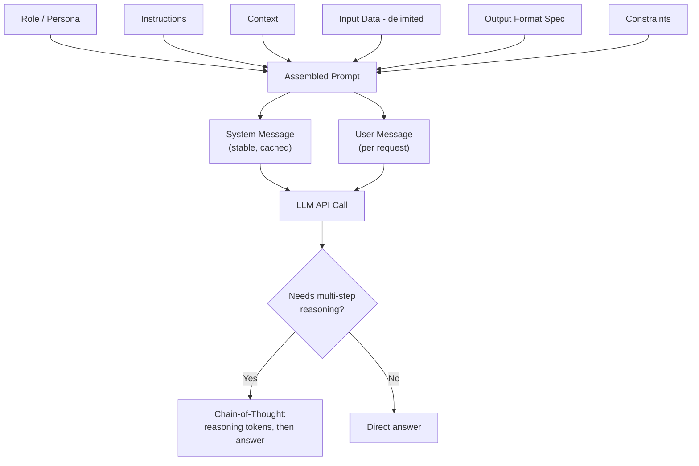

# Prompt Engineering

## Definition

Prompt engineering is the practice of deliberately structuring and iterating on the text sent to
a language model — its role, instructions, context, examples, output format, and constraints — to
reliably get the behavior you want, since a prompt is the only input channel into a model with no
settings panel or side configuration to fall back on. It covers everything from basic prompt
anatomy through techniques like few-shot prompting and chain-of-thought.

## Detailed Explanation

Everything you want a model to know, do, avoid, or sound like has to be expressed as text inside
the prompt itself. Two people asking for "a summary of this article" can get wildly different
quality results — not because one model is smarter, but because one prompt gave almost no
structure while the other clearly separated role, task, input, and expected output shape.
Unstructured prompts produce inconsistent, hard-to-parse answers; structured ones produce
consistent, machine-usable ones, which is the entire point once a program is calling the model
instead of a human reading the reply.

A well-formed prompt breaks down into named, purposeful parts: **role/persona** (who the model
should act as), **instructions** (the actual task), **context** (background the model needs),
**input data** (the content to operate on, wrapped in clear delimiters like triple quotes or
XML-like tags so it can't be confused with instructions), **output format** (exactly what shape
the answer must take), and **constraints** (hard "never do X" rules). Most production systems
split this into a **system prompt** — stable across a whole conversation or every request, holding
role, tone, rules, and format — and a **user prompt** carrying the specific request and data for
this one call. This split matters for reusability (the system prompt is written once and reused
across thousands of calls), for precedence (models are trained to weight system-level text more
heavily than user text), and for caching (a static system prompt can be cached rather than
re-processed on every call). This learned precedence is a soft behavioral hierarchy, not a hard
architectural guarantee, which is exactly why [prompt injection](./Guardrails.md) remains possible
even with a well-written system prompt.

Two techniques sit directly on top of this base anatomy. **Zero-shot vs. few-shot** prompting is
about how many worked examples you give before the real task: zero-shot gives just the
instruction, few-shot adds a handful of input/output demonstrations. Demonstrations are usually
easier for a model to match precisely than descriptions are, because "upbeat" or "concise" is
subjective while an example pins down tone, length, and edge-case handling all at once — this is
an instance of **in-context learning**: nothing is trained or retained between calls, the model is
pattern-matching against the examples in this one context window. Example quality and diversity
matter more than count, and the benefit plateaus quickly, often after 3-8 well-chosen examples;
past that point, more examples mostly add token cost, not accuracy — always test zero-shot first
before paying for examples you don't need.

**Chain-of-thought (CoT)** prompting asks the model to generate its intermediate reasoning steps
before the final answer. Because a model predicts each new token conditioned on everything
generated so far — including its own prior output — forcing it to write "Step 1: compute X" makes
that correct intermediate result exist as real tokens the next prediction can condition on, rather
than requiring the whole multi-step computation to be compressed into a single forward pass. CoT
can be invoked with a simple instruction like "think step by step" (zero-shot CoT) or demonstrated
via worked examples showing both the reasoning and the answer (few-shot CoT, generally more
reliable because it pins down the specific depth and style of reasoning wanted). It is not free:
reasoning tokens are generated and billed like any other output, so a CoT response often costs
several times more and takes measurably longer than a direct answer — reserve it for genuinely
multi-step tasks (math, planning, multi-clause logic), not simple lookups or classifications. It's
also worth being honest that a model's stated reasoning is a plausible narrative correlated with
the final answer, not a verified, truthful trace of its actual internal computation.

Advanced prompt engineering treats prompts as versioned software artifacts: tested against a fixed
eval set before changes ship, delimited unambiguously to separate instructions from data, and kept
as short as reliably possible — a clearer prompt is usually also a shorter one, not a trade-off
between the two.

## Diagram

## Examples

- A customer-support system prompt encoding brand voice, a strict escalation list, and the exact
  JSON shape a reply must take, with the customer's message wrapped in delimiters so it can't be
  mistaken for an instruction.
- A few-shot classification prompt showing three labeled example reviews before asking the model
  to classify a fourth, locking in the exact output labels and casing wanted.
- A compliance-checking prompt that asks the model to evaluate five conditions one at a time,
  stating whether each is satisfied, before producing a final auditable yes/no determination.

## Advantages

- Requires no retraining or fine-tuning — behavior changes are just changes to a text string,
  deployable instantly.
- Splitting system and user prompts enables reuse, prompt caching, and a consistent behavioral
  baseline across an entire application.
- Few-shot examples convert a fuzzy stylistic request into a concrete, demonstrable pattern the
  model can match precisely.
- Chain-of-thought measurably improves accuracy on multi-step arithmetic, logic, and planning
  tasks by letting each reasoning step condition on a correct prior step.

## Limitations

- Prompt instructions are a soft, learned precedence, not a hard security boundary — they can
  still be overridden by adversarial or ambiguous input (see prompt injection).
- Few-shot examples cost tokens on every single call and provide diminishing returns past a
  handful of well-chosen ones.
- Chain-of-thought adds real latency and cost, and its displayed reasoning isn't a guaranteed
  truthful account of the model's internal computation.
- Prompt behavior can shift across model versions or providers, making prompts a maintenance
  surface that needs regression testing, not a "write once" artifact.
- No amount of prompt engineering can supply facts the model was never trained on or given at
  inference time — that gap is what [RAG](./RAG.md) and [function calling](./Function-Calling.md)
  exist to close.

## Related Concepts

- [Function Calling](./Function-Calling.md)
- [Structured Output](./Structured-Output.md)
- [RAG](./RAG.md)
- [Guardrails](./Guardrails.md)
- [Context Window](./Context-Window.md)
- [Prompt Anatomy (Week 2)](../Week-02/Topics/01-Prompt-Anatomy.md)
- [Zero-Shot vs Few-Shot (Week 2)](../Week-02/Topics/02-Zero-Shot-Vs-Few-Shot.md)
- [Chain-Of-Thought (Week 2)](../Week-02/Topics/03-Chain-Of-Thought.md)

## Interview Questions

**1. Why do most production systems split a system prompt from a user prompt?**
- The system prompt holds stable, reusable behavior (role, tone, rules, format) reused across
  every call; the user prompt carries per-request data.
- Models are trained to weight system-level instructions more heavily than user text.
- A static system prompt can be cached, avoiding re-processing (and re-paying for) it every call.

**2. When would you prefer few-shot prompting over a purely descriptive zero-shot instruction?**
- When the desired output has a specific format, tone, or convention that's easier to demonstrate
  than describe precisely.
- Demonstrations pin down edge-case handling, casing, and structure in a way a description leaves
  ambiguous.
- Should be balanced against token cost — always test zero-shot first, since it's often sufficient.

**3. Why does chain-of-thought prompting improve accuracy on multi-step problems mechanically?**
- Each new token is generated conditioned on all previous tokens, including the model's own prior
  output.
- Writing an intermediate step makes that correct sub-result exist as real tokens for the next
  prediction to build on.
- Without it, the model must compress the entire multi-step computation into a single forward
  pass, which is more error-prone.

**4. Is a model's displayed chain-of-thought a reliable account of how it actually reasoned?**
- No — it's a plausible, generated narrative that correlates with better answers.
- It is not a verified audit log of the model's actual internal computation.
- This matters for any use case treating the reasoning trace as an explanation to trust fully.

**5. Why are system prompts not considered a hard security boundary?**
- The precedence given to system-level text over user text is a learned training behavior, not an
  architectural guarantee.
- Sufficiently adversarial or ambiguous input can still cause a model to deviate from system
  instructions.
- This is why prompt injection defenses require more than just writing a strong system prompt.
