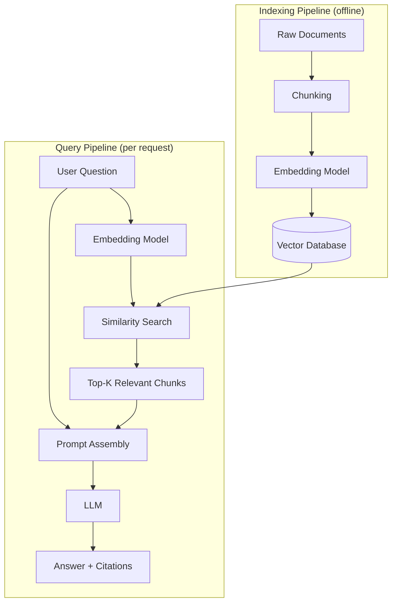

# RAG

## Definition

Retrieval-Augmented Generation (RAG) is a pattern for answering questions with an LLM by first
retrieving relevant text from an external knowledge store and inserting it into the prompt, so
the model answers from real, current, retrievable evidence instead of relying only on what it
memorized during training. It's the standard fix for a frozen, generic model needing to answer
questions about private, recent, or fast-changing information.

## Detailed Explanation

An LLM's knowledge is frozen at its training cutoff and contains nothing about your company's
internal documents, because that data was never public in the first place. Fine-tuning could
theoretically bake new facts into the weights, but it's slow, expensive to repeat every time a
document changes, and empirically better at teaching style than at reliably storing and recalling
specific facts. RAG sidesteps both problems by keeping knowledge outside the model, in a store
that's cheap to update, and showing the model the relevant slice of it at answer time.

A RAG system is really two pipelines running on very different schedules. The **indexing
pipeline** runs offline, ahead of any user question: documents are split into chunks, each chunk
is embedded into a vector, and the vectors (plus the original text and metadata) are stored in a
[vector database](./Vector-Database.md). This can be re-run whenever documents change — once a
day, once an hour, on every upload — without a user waiting on it. The **query pipeline** runs
online, once per question: the user's question is embedded with the same model used for the
chunks, the vector store is searched for the most similar chunks, those chunks are assembled into
a prompt alongside the question, and the LLM generates an answer grounded in that material.

Separating these two pipelines is what makes RAG practical at scale — embedding and indexing a
million documents is slow and expensive, but it happens once (or incrementally), while every
individual query only costs one embedding call plus a similarity search, which stays fast even as
the corpus grows.

It matters to be precise about what RAG actually buys you. RAG substantially reduces
[hallucination](./Hallucination.md) on questions the corpus actually covers, because the model has
real material to work from instead of guessing. It does not eliminate hallucination: the model can
still misread retrieved text, blend it with something from pretraining, or answer confidently even
when retrieval came back empty or irrelevant. That's why grounded prompting, an explicit "say you
don't know" instruction, and citations are treated as a required part of the pattern rather than a
nice-to-have layered on top later.

RAG is one point on a spectrum of ways to give a model access to knowledge it wasn't trained on —
alongside fine-tuning and simply stuffing documents into a long [context window](./Context-Window.md).
It's usually the right default because it updates in minutes, costs little beyond embedding and
storage, and is highly traceable (it can show you exactly which chunk backed an answer). Long
context windows can work for a small, static set of documents but bill more tokens on every single
call. Fine-tuning is better suited to teaching tone, format, and narrow behaviors than to keeping
a large, changing set of facts current. In production, RAG and fine-tuning are frequently combined
rather than treated as alternatives: fine-tune the model to *behave* like a domain expert, and let
RAG supply the *facts* that keep it accurate as documents change.

## Diagram

## Examples

- An internal "ask our handbook" bot that retrieves the relevant HR policy paragraph before
  answering a leave-balance question, instead of guessing from generic training knowledge.
- A customer-support assistant that retrieves the specific help-center article and past resolved
  tickets matching a user's issue, so its answer reflects the product's actual current behavior.
- A legal research tool that retrieves the specific clauses of a contract before summarizing what
  it says, rather than answering from a generic sense of what contracts "usually" say.

## Advantages

- Updates in minutes by re-indexing a changed document — no retraining required.
- Cheap relative to fine-tuning: an embedding call and vector storage, not a training run.
- Highly traceable — retrieved chunks can be shown to the user as evidence for an answer.
- Meaningfully reduces hallucination on in-domain questions by grounding the model in real text.
- Works with any off-the-shelf LLM — no need to control or retrain the base model.

## Limitations

- Doesn't eliminate hallucination — the model can still misread context or answer despite weak
  retrieval.
- Answer quality is capped by retrieval quality: a missed or wrong chunk produces a wrong or
  incomplete answer no matter how good the generator is.
- Adds real system complexity — an indexing pipeline, a vector store, and a query pipeline to
  build, monitor, and keep in sync with source documents.
- Stuffing in too many retrieved chunks dilutes the signal, adds cost and latency, and can push
  the actually relevant chunk out of the model's effective attention.
- Not well suited to teaching a model a new *style*, *tone*, or *reasoning pattern* — that's
  fine-tuning's job, not retrieval's.

## Related Concepts

- [Vector Database](./Vector-Database.md)
- [Hybrid Search](./Hybrid-Search.md)
- [Reranking](./Reranking.md)
- [Embeddings](./Embeddings.md)
- [Hallucination](./Hallucination.md)
- [Context Window](./Context-Window.md)
- [Why RAG (Week 3)](../Week-03/Topics/01-Why-RAG.md)
- [Grounded Generation and Citations (Week 3)](../Week-03/Topics/11-Grounded-Generation-And-Citations.md)

## Interview Questions

**1. What problem does RAG solve that fine-tuning doesn't solve well?**
- LLMs are frozen after training and have no access to private or recently changed data.
- Fine-tuning is slow, expensive to repeat, and unreliable at storing precise, updatable facts.
- RAG keeps facts in an external, cheaply updatable store and shows them to the model per query.

**2. Does RAG eliminate hallucination? Why or why not?**
- No — it substantially reduces it on in-domain questions but doesn't guarantee it away.
- The model can still misread retrieved context or blend it with prior training knowledge.
- It can also answer confidently even when retrieval returned nothing useful, absent explicit
  grounding instructions and confidence gating.

**3. Why does a RAG system have two separate pipelines instead of one?**
- Indexing (chunk, embed, store) is slow and expensive but only needs to run once per document,
  offline.
- Query-time work (embed the question, search, generate) must be fast because a user is waiting.
- Separating them means indexing cost doesn't sit on the user-facing latency path.

**4. When would you choose a long context window over RAG, and when would you choose RAG?**
- Long context suits a small, static, fully-known set of documents that fits in the window.
- RAG suits large, frequently changing, or per-user-scoped document sets.
- Long context bills more tokens on every call; RAG bills more only during indexing and one
  retrieval per query.

**5. Is RAG and fine-tuning an either/or choice in production systems?**
- No — they solve different problems: fine-tuning shapes behavior/style, RAG supplies facts.
- Production systems commonly fine-tune for domain tone and format while using RAG to keep
  factual answers current as documents change.
