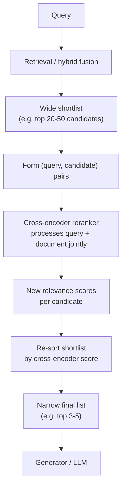

# Reranking

## Definition

Reranking is a deliberately slower, more accurate second retrieval pass, applied only to the small
shortlist that a faster first-stage retriever already produced (typically its top 20-100
candidates), using a **cross-encoder** model that scores the query and each candidate document
jointly rather than by comparing independently pre-computed vectors. It exists to push the single
best chunk reliably to position 1 before it's shown to the generator.

## Detailed Explanation

First-stage retrieval — whether keyword, semantic, or [hybrid](./Hybrid-Search.md) — is built for
speed: it has to search across potentially millions of documents in milliseconds, which forces it
to use representations computed independently of each other, since a document's embedding can't
know what the query will be ahead of time. Hybrid fusion solves recall — getting the right
document *somewhere* into a shortlist — but "somewhere in the top 20" isn't good enough when only
the top three to five chunks are actually passed to the language model. If the truly best chunk
sits at position 8, it may never make the cut, or it may make the cut but get diluted among worse
chunks and effectively ignored.

The key architectural distinction is **bi-encoder vs. cross-encoder**. A bi-encoder — what a
first-stage dense retriever uses — embeds the query and each document *separately*, into fixed
vectors, independent of each other; similarity is then a cheap vector-math comparison between two
pre-computed vectors. This is what makes bi-encoders fast enough to search millions of documents:
document embeddings are computed once, offline, and reused for every future query. A
cross-encoder — what a reranker uses — feeds the query and a single candidate document into the
model *together*, as one combined input, and outputs a single relevance score for that specific
pair. Because the model can attend across the query and document jointly, noticing that a specific
word in the query directly matches a specific phrase in the document in context, it produces
substantially more accurate relevance judgments — but it must be run fresh for every single
query-document pair, with no precomputation possible, and costs roughly one full model forward
pass per candidate document per query.

That cost is exactly why reranking is always a *second* pass over a *pre-filtered* shortlist, never
a replacement for first-stage retrieval — running a cross-encoder over an entire corpus for every
query would be computationally infeasible at any meaningful scale. Bi-encoders trade accuracy for
speed by compressing all of a document's meaning into a single fixed-size vector computed without
knowledge of future queries; cross-encoders skip that compression entirely by processing the
specific pairing of query and document through the model's attention layers together, which
consistently and reproducibly outperforms bi-encoder similarity on ranking quality across
information-retrieval benchmarks and industry practice.

In practice, teams get a reranker into production one of two ways: a **hosted API** like Cohere
Rerank, which takes a query and a list of candidates and returns them re-ordered with relevance
scores, requiring no infrastructure to manage but sending document text to a third party and
billing per request; or a **self-hosted open-weight model** like the BGE reranker family
(`bge-reranker-base/large/v2-m3`), run on your own hardware for no per-request fee but requiring
you to operate model-serving infrastructure. Both are cross-encoders under the hood — the
difference is entirely deployment, not the underlying technique. Hosted APIs tend to be cheaper at
low-to-moderate query volume and faster to adopt; self-hosting can become cheaper at high volume
and is often required outright by data-residency or privacy constraints. A common middle path is
prototyping with a hosted API to validate that reranking measurably helps before investing in
self-hosted infrastructure — and keeping the reranker behind a swappable interface either way, so
the provider choice stays a reversible decision.

## Diagram

## Examples

- Retrieving the top 50 candidates from hybrid search for a support query, then reranking them
  with a cross-encoder so the single most relevant policy paragraph lands at position 1 before
  being shown to the generator.
- Calling Cohere Rerank's API with a query and 50 candidate documents to get back a re-ordered
  top-5 for a RAG pipeline with no self-hosted infrastructure.
- Running a self-hosted `bge-reranker-large` model inside a private VPC to re-score search
  results for a healthcare application that can't send document text to a third-party API.

## Advantages

- Cross-encoders substantially outperform bi-encoder similarity on ranking quality, because they
  attend jointly across the query and document instead of comparing independent vectors.
- Directly fixes the "retrieved-but-buried" failure pattern, where the best chunk is present in
  the shortlist but ranked too low to survive being narrowed down for the generator.
- Both hosted-API and self-hosted deployment options exist, so teams can match reranking to their
  volume, latency, and privacy constraints.
- Keeping the reranker behind a clean interface makes switching providers (or A/B testing them) a
  small change rather than a pipeline rewrite.

## Limitations

- Cannot rescue a document that first-stage retrieval never put into the shortlist at all — it
  only reorders what's already there.
- Adds real latency and compute cost per query: reranking 50 candidates means 50 model forward
  passes at query time, not one vector lookup.
- Cannot be run over an entire corpus — it's computationally infeasible at that scale, which is
  why it's always a second pass, never a replacement for first-stage retrieval.
- A higher reranker score says nothing about whether the generator will actually use the reordered
  chunk correctly — reranking improves retrieval ordering, not generation quality.
- Reranking doesn't always improve results by default — its impact should be measured on your
  own data, not assumed.

## Related Concepts

- [Hybrid Search](./Hybrid-Search.md)
- [RAG](./RAG.md)
- [Vector Database](./Vector-Database.md)
- [Embeddings](./Embeddings.md)
- [Reranking: Cross-Encoders (Week 4)](../Week-04/Topics/06-Reranking-Cross-Encoder.md)
- [Cohere Rerank & BGE Reranker (Week 4)](../Week-04/Topics/07-Cohere-Rerank-BGE-Reranker.md)

## Interview Questions

**1. What is the core architectural difference between a bi-encoder and a cross-encoder?**
- A bi-encoder embeds the query and document independently into separate, precomputable vectors.
- A cross-encoder feeds the query and document into the model together and outputs one joint
  relevance score for that specific pair.
- Bi-encoders scale to millions of documents; cross-encoders are far more accurate but too
  expensive to run at that scale.

**2. Why is reranking always applied to a shortlist rather than the entire corpus?**
- Cross-encoders can't precompute document representations — they must run per query-document
  pair, at query time.
- Running one forward pass per document across millions of documents per query is computationally
  infeasible.
- Reranking is a second pass over a pre-filtered candidate set produced by a faster first-stage
  retriever.

**3. What specific retrieval failure does reranking address that hybrid search alone doesn't fix?**
- Hybrid fusion is good at recall — getting the right document somewhere into the shortlist.
- It's not as precise at ordering, so the best chunk can be buried at, say, position 8.
- Reranking re-scores the shortlist to push the actually-best chunk to position 1 before it's
  passed to the generator.

**4. What's the trade-off between a hosted reranking API and a self-hosted open-weight reranker?**
- Hosted APIs (e.g., Cohere Rerank) need no infrastructure and are often cheaper at low volume, but
  send document text to a third party and bill per request.
- Self-hosted models (e.g., BGE reranker) keep data in-house and can be cheaper at high volume, but
  require operating model-serving infrastructure.
- Data-residency or compliance requirements can make self-hosting mandatory regardless of cost.

**5. Can a reranker compensate for a poor first-stage retriever?**
- No — a reranker can only reorder candidates that are already in the shortlist.
- If the truly relevant document was never retrieved in the first stage, no reranker can recover it.
- This is why first-stage recall and reranking precision are treated as two separate things to
  measure and improve.
