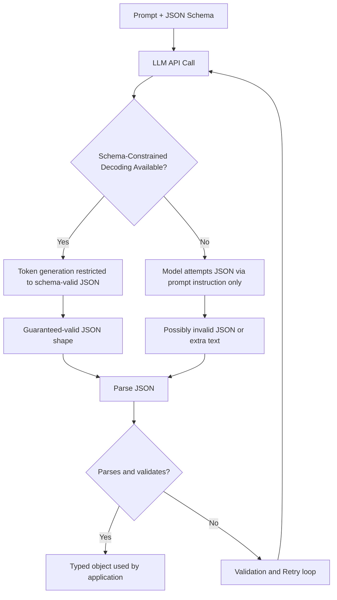

# Structured Output

## Definition

Structured output is the practice of constraining a language model's response to a fixed, machine-readable format — almost always JSON — instead of free-flowing prose, so a program can parse it directly without fragile string-matching. A JSON Schema (or an equivalent typed model, such as a Pydantic class) is the contract that specifies exactly which fields exist, what type each one is, and which are required.

## Detailed Explanation

Ask a model "tell me about this order" in plain prose and you get an answer shaped differently every time — sometimes a sentence, sometimes a list, sometimes with commentary bolted on. Structured output closes that gap by giving the model an explicit shape to fill: `{"order_id": string, "total": number, "overdue": boolean}` in, a real JSON object matching that shape out.

There are two distinct mechanisms behind "structured output," and conflating them is the single most common mistake:

1. **Prompt-based JSON requests.** You describe the desired shape in the prompt, maybe with an example, and ask the model to comply. Nothing prevents it from adding a stray sentence before the JSON, using the wrong field name, or emitting syntactically broken JSON — this needs defensive parsing and validation afterward.
2. **Schema-constrained (guided) decoding.** The API restricts, at the token level, which tokens are even eligible at each generation step, based on the schema's grammar. After `{"order_id":` only a valid string-opening token is legal. This makes schema-valid *shape* a structural guarantee, not a hope.

Neither mechanism guarantees the *content* is correct. A syntactically perfect JSON object can still contain a hallucinated total or a fabricated customer name — schema validity and factual correctness are two entirely separate guarantees, and confusing them is how bad data ends up looking trustworthy.

In Python, [Pydantic](../Week-02/Topics/07-Pydantic.md) is the standard way to define that shape once, as a typed class, and reuse it both to generate the schema sent to the model and to parse/validate the model's response back into a real object. Libraries like [Instructor](../Week-02/Topics/08-Instructor-Library.md) wrap this further: you ask for a `response_model=Order` directly and get back a validated `Order` instance, with automatic retry when validation fails (see [Validation and Retry](../Week-02/Topics/09-Validation-And-Retry.md)). Structured output is also the direct conceptual ancestor of [Function-Calling](./Function-Calling.md): a tool call is, structurally, just a schema-constrained JSON object naming a function and its arguments.

Schema design itself is a real engineering skill, not a mechanical translation step. A schema that's too permissive (every field a generic optional string) doesn't constrain the model enough to get consistent, usable data back. A schema that's too rigid (deep nesting, many required fields, narrow enums that don't cover real-world edge cases) tends to fail validation often, or — worse, when only prompt-based JSON is available — push the model to invent a value just to satisfy a field it has no real basis for. Good schemas mark fields nullable when the model may legitimately not know something, rather than forcing a guess dressed up as data.

## Diagram

## Examples

- A support-ticket triage system emits `{"category": "billing", "priority": "high", "summary": "..."}` so a ticketing system can route it automatically, instead of a paragraph a human has to re-read and re-key.
- An invoice-extraction tool defines a schema with `vendor`, `invoice_date`, `line_items` (a list of nested objects), and `total`, so extracted data flows straight into accounting software.
- A Pydantic model `class Customer(BaseModel): name: str; email: str; tier: Literal["free","pro","enterprise"]` both generates the schema sent to the model and validates its response.
- A resume-parsing tool defines a schema for candidate name, work history entries, and skills, so extracted data can flow directly into an applicant-tracking system without manual re-entry.

## Advantages

- Removes an entire class of fragile parsing code (regex, keyword search) needed to extract facts from free text.
- Schema-constrained decoding gives a structural guarantee of valid shape, not merely a probabilistic one.
- Composable: one step's validated output can be the next step's input in a multi-step pipeline, with each hand-off checked.
- The same schema-design skill transfers directly to designing tool/function-call argument schemas.

## Limitations

- Valid shape does not mean valid content — a well-typed field can still hold a hallucinated value ([Hallucination](./Hallucination.md)).
- Overly rigid schemas (many required fields, deep nesting, strict enums that don't cover real cases) can push a model to invent values just to satisfy a field it has no real information for.
- Not every provider/model supports true schema-constrained decoding; the prompt-only fallback is not guaranteed and still needs validation.
- Adds engineering overhead (schema design, validation code) that a quick prototype might skip — appropriately, for low-stakes throwaway use.

## Related Concepts

- [Function-Calling](./Function-Calling.md)
- [Guardrails](./Guardrails.md)
- [Hallucination](./Hallucination.md)
- [LLM](./LLM.md)
- [Prompt-Engineering](./Prompt-Engineering.md)
- [Structured Output & JSON Schema (Week 2)](../Week-02/Topics/06-Structured-Output-JSON-Schema.md)
- [Pydantic (Week 2)](../Week-02/Topics/07-Pydantic.md)
- [Instructor Library (Week 2)](../Week-02/Topics/08-Instructor-Library.md)
- [Validation and Retry (Week 2)](../Week-02/Topics/09-Validation-And-Retry.md)

## Interview Questions

**1. What's the difference between asking a model to "please return JSON" in the prompt versus using schema-constrained (guided) decoding?**
- Prompt-based JSON is a request the model tries to honor; it can still add stray text or emit invalid JSON.
- Schema-constrained decoding restricts which tokens are eligible at each generation step, so the output structurally cannot violate the schema's shape.
- The former needs defensive parsing and validation; the latter guarantees shape but still needs content validation.

**2. Does passing schema validation mean the data is factually correct?**
- No — schema validation checks type and shape only, never real-world truthfulness.
- A perfectly valid JSON object can still contain a fabricated or hallucinated value.
- Business-logic and grounding validation are separate, additional layers needed on top of schema validation.

**3. Why is it often better to mark a field as optional/nullable rather than required, if the model may not always have that information?**
- Forcing a required field the model has no real basis for tends to make it invent a plausible-looking but fabricated value to satisfy the schema.
- Nullable fields let the model honestly signal "I don't know" instead of guessing.
- This keeps downstream code from silently trusting a fabricated value that happens to be well-typed.

**4. How does structured output relate to function/tool calling?**
- A tool call is structurally a special case of structured output: a schema-constrained JSON object naming a function and its arguments.
- The same schema-design discipline (clear types, sensible required/optional fields, enums for closed sets) applies to both.
- Structured output is usually taught first because it's the simpler, non-agentic case of the same underlying mechanism.

**5. Why can't schema validation alone catch a hallucinated but well-formed value?**
- Schema validation only inspects type, presence, and constraints like ranges or enums — it has no access to ground truth.
- A hallucinated price of `19.99` for a product that actually costs `24.99` is syntactically indistinguishable from a correct value.
- Catching this requires a separate grounding or business-logic check against a trusted source, not stronger schema rules.
