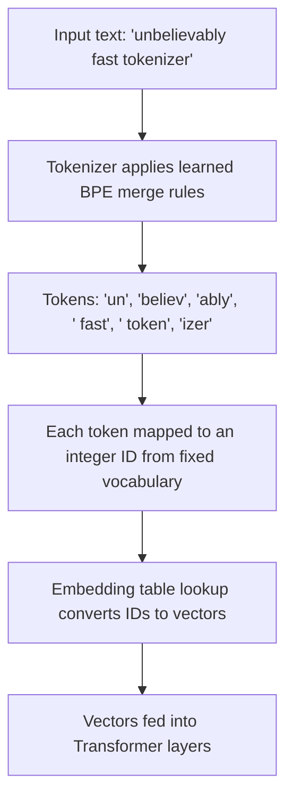

# Tokens

## Definition

A **token** is the basic unit of text a language model actually reads and generates — not a character, and usually not a whole word either, but a chunk somewhere in between (a word, part of a word, a punctuation mark, or a piece of whitespace). Before any text reaches a model's neural network, a **tokenizer** splits it into a sequence of these chunks and maps each one to an integer ID from a fixed vocabulary.

## Detailed Explanation

Modern LLMs use **subword tokenization**, most commonly a variant of **Byte-Pair Encoding (BPE)** or a similar algorithm (e.g. SentencePiece, WordPiece). These algorithms are built by scanning a huge training corpus and repeatedly merging the most frequently co-occurring pairs of characters/subwords into single tokens, until a fixed vocabulary size (commonly 50,000–200,000 entries) is reached.

Subword tokenization is a deliberate middle ground between two bad extremes:

- **Character-level tokenization** keeps the vocabulary tiny but makes sequences very long (slow, expensive, and it forces the model to reconstruct words from scratch every time).
- **Word-level tokenization** keeps sequences short but requires a huge vocabulary and completely breaks on any word not seen during training (a "new" word becomes an unrecognized `<UNK>` token, discarding all its meaning).

Subword tokenization solves both problems: common words ("the", "and") typically become a single token, while rare or unfamiliar words get split into familiar pieces (e.g. "tokenization" might become "token" + "ization"). This means the model can represent virtually any input — including typos, made-up words, and non-English text — by falling back to smaller, known fragments, without ever hitting a true "unknown" wall.

Once text is split into tokens, each token ID is looked up in an **embedding table**, turning it into a numeric vector the Transformer can actually process (see **Embeddings**). Every measure of an LLM's capacity and cost — context window size, latency, price per request — is expressed in tokens, not words or characters, which is why token counting matters well beyond a technical curiosity.

A rough rule of thumb for English text: **1 token ≈ 4 characters ≈ ¾ of a word**, so 100 tokens is roughly 75 words. This ratio is not fixed — it varies noticeably by language (many non-English and non-Latin-script languages tokenize far less efficiently, needing more tokens for the same amount of meaning) and by content type (code, dense technical jargon, and rare proper nouns tend to fragment into more tokens than everyday prose).

Beyond ordinary text, tokenizers also reserve a handful of **special tokens** that never come from user text: a beginning-of-sequence marker, an end-of-sequence/stop token the model emits to signal "I'm done generating," and often role or formatting markers used to delimit system, user, and assistant turns in a chat template. These aren't cosmetic — the end-of-sequence token is literally what tells the decoding loop to stop, and malformed or missing special tokens are a common source of a model running on past where it should have stopped, or failing to respect a chat template's structure.

Every model family ships its own tokenizer, trained on its own data with its own vocabulary size and merge rules, and vocabularies are not interchangeable between models. This is why the same sentence can produce a different token count (and therefore a different cost and context-window footprint) on GPT-4 versus Claude versus Llama — each has learned a different set of subword merges from a different training corpus, so token boundaries fall in different places even for identical input text.

## Diagram

## Examples

- `"ChatGPT is helpful"` might tokenize as `["Chat", "G", "PT", " is", " helpful"]` — 5 tokens for 3 words, because "ChatGPT" isn't a single common vocabulary entry.
- `"the cat sat"` might tokenize as 3 tokens (`"the"`, `" cat"`, `" sat"`) — common short words often map one-to-one.
- A model billed at "$3 per million input tokens" charges based on the tokenized length of the prompt, not its character or word count — a 500-word prompt with unusual technical terms can cost more tokens than a 600-word prompt in plain English (see **Cost Per Token** in Week 1).
- Arithmetic like `"57 * 84"` can trip up a model partly because digits are tokenized in inconsistent chunks (e.g. "57" as one token in some contexts, "5" and "7" separately in others), disrupting the character-level structure a model would need to do reliable place-value math.
- The same English paragraph fed to two different providers' tokenizers can produce noticeably different token counts, because each model family trains its own vocabulary — this is why token-based pricing comparisons between providers can't be done on raw word counts alone.

## Advantages

- Handles any input, including misspellings, rare words, and non-English text, without ever hitting a true "unknown word" dead end.
- Keeps vocabulary size manageable while keeping typical sequences reasonably short.
- Common words and subwords are shared across languages and domains, letting the model transfer patterns learned in one context to another.
- Tokenization is deterministic and reversible — the exact same input always produces the exact same token sequence, and detokenization reconstructs the original text.

## Limitations

- Token count doesn't map cleanly to word count or character count, which makes it hard to eyeball costs or context usage without actually running the tokenizer.
- Non-English languages (especially non-Latin scripts) often require noticeably more tokens per unit of meaning than English, effectively making them more expensive and using up more of the context window for the same content.
- Splitting numbers and code inconsistently into subword chunks is a real contributor to LLMs struggling with precise arithmetic and some structured formats.
- Tokenization is invisible to end users by default, so people are frequently surprised when a "short" prompt turns out to consume far more of the context window or budget than expected.

## Related Concepts

- [LLM](./LLM.md)
- [Context Window](./Context-Window.md)
- [Embeddings](./Embeddings.md)
- [Transformer](./Transformer.md)
- [Tokens and Tokenization (Week 1)](../Week-01/Topics/02-Tokens-And-Tokenization.md)
- [Cost Per Token (Week 1)](../Week-01/Topics/03-Cost-Per-Token.md)

## Interview Questions

**1. Why do LLMs use subword tokenization instead of word-level or character-level tokenization?**
- Word-level needs a huge vocabulary and breaks on unseen words (`<UNK>` loses information).
- Character-level keeps the vocabulary tiny but produces very long sequences, which is slower and more expensive.
- Subword tokenization (BPE and similar) balances both: common words stay whole, rare words decompose into familiar pieces, so no true "unknown" case exists.

**2. How is a BPE (Byte-Pair Encoding) vocabulary built?**
- Start from individual characters/bytes as the base vocabulary.
- Repeatedly find and merge the most frequent adjacent pair of tokens in the training corpus into a new single token.
- Stop once a target vocabulary size is reached; the resulting merge rules define the tokenizer.

**3. Why does token count matter for cost and context window usage?**
- Providers bill per token (input and output), not per word or character.
- The context window's fixed limit is defined in tokens, so token-inefficient text (e.g. some non-English languages, dense code) uses up "space" faster.
- Estimating tokens roughly (about 4 characters per token in English) helps predict cost and whether content will fit.

**4. Why might an LLM struggle with arithmetic or exact character counting?**
- Numbers and rare strings can be split into inconsistent subword chunks depending on context, obscuring place value.
- The model reasons over token embeddings, not raw characters, so tasks needing exact character-level structure are a poor fit for its native representation.
- This is a tokenization-level limitation distinct from the model's general reasoning ability.

**5. Does every language tokenize with equal efficiency?**
- No — tokenizers are typically trained on corpora dominated by English/Latin-script text.
- Other languages and scripts often require more tokens to express the same meaning.
- This has real cost and context-window consequences for non-English use cases.
