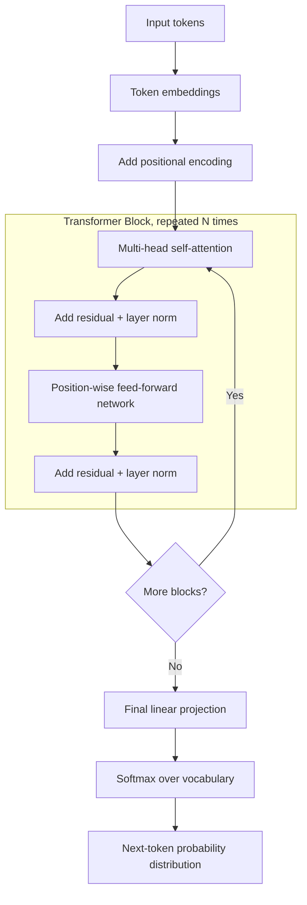

# Transformer

## Definition

The **Transformer** is the neural network architecture, introduced in the 2017 paper "Attention Is All You Need," that underlies essentially every modern LLM (GPT, Claude, Gemini, Llama, and others). It replaced recurrent (RNN/LSTM) architectures for sequence modeling by relying entirely on **self-attention** to relate tokens to one another, rather than processing a sequence step by step.

Like **Attention**, this is not a dedicated Week 1 topic in this curriculum, but it is the architectural backbone behind the "Transformer layers" step described in **Language Models** (Week 1) and is foundational to nearly every other concept in this knowledge base.

## Detailed Explanation

The original Transformer paper described an **encoder-decoder** architecture built for machine translation: an encoder reads the full source sentence and builds a contextual representation of it, and a decoder generates the target sentence token by token, attending both to its own previously generated tokens and to the encoder's output (via cross-attention). Since then, three broad families have emerged, each keeping only the parts relevant to their task:

- **Encoder-only** (e.g. BERT) — processes the whole input bidirectionally (every token can attend to every other token, including ones after it) and produces rich contextual representations. Well suited to understanding tasks like classification, sentence similarity, and named-entity recognition, but not built for open-ended text generation.
- **Decoder-only** (e.g. GPT, Claude, Llama) — the architecture behind virtually all modern conversational LLMs. Uses **causal (masked) self-attention**, where each token can only attend to itself and earlier tokens, matching the autoregressive next-token-prediction training objective and generation process.
- **Encoder-decoder** (e.g. T5, the original translation Transformer) — keeps both halves, useful for tasks that transform one sequence into a distinctly different one (translation, summarization) where the decoder benefits from cross-attending to a separately encoded input.

Regardless of family, a Transformer is built from a stack of identical blocks, each containing the same core sub-components:

1. **Positional encoding** — added to token embeddings before the first block, since self-attention itself has no built-in sense of token order (see **Attention**). The original paper used fixed sinusoidal functions of position; many modern models use learned or relative schemes like **RoPE (Rotary Position Embedding)**, which also make it easier to extend context length after training.
2. **Multi-head self-attention** — lets each token gather information from other tokens (all tokens for encoders, only prior tokens for decoders), across several parallel "heads" capturing different relationship types.
3. **Residual ("skip") connections** — the input to a sub-layer is added back to that sub-layer's output (`output = x + Sublayer(x)`), giving gradients a direct path back through many stacked layers during training and making very deep networks trainable at all.
4. **Layer normalization** — normalizes activations within each layer to stabilize and speed up training; applied around each sub-layer (either before it, "pre-norm," or after it, "post-norm," depending on the specific model design).
5. **Position-wise feed-forward network** — a small two-layer neural network (typically expanding to a larger hidden dimension and then projecting back down) applied independently and identically to every token's representation, giving the model additional capacity to transform each token's features after attention has mixed in context.

These blocks are stacked N times (modern large models commonly use tens to over a hundred layers), with each layer building progressively richer, more abstract representations on top of the last. The final layer's output is passed through a linear projection and a softmax to produce a probability distribution over the entire vocabulary — the next-token prediction that drives generation in decoder-only models.

Training a decoder-only Transformer LLM means running this whole stack once per token during pre-training, comparing its predicted next-token distribution to the actual next token in the training corpus, and adjusting all the weights (attention projections, feed-forward weights, layer norm parameters) via backpropagation to reduce that prediction error, repeated across trillions of tokens.

The base context-length limit of a Transformer is tied directly to its architecture, not just a configuration knob: naive self-attention's compute and memory scale roughly quadratically with sequence length (see **Attention**), and the positional encoding scheme has to actually support the lengths being used. This is why extending an existing model to a longer context is a real engineering and research problem, not a simple settings change — it has driven techniques like sparse/local attention patterns (only attending to a subset of nearby or selected tokens instead of the full sequence) and relative positional schemes like RoPE that extrapolate more gracefully beyond their original training length.

The choice of activation function and normalization placement inside the feed-forward and residual sub-layers has also evolved since the original 2017 paper — modern large models commonly use variants like GELU or SwiGLU activations in the feed-forward network and "pre-norm" (applying layer normalization before a sub-layer rather than after) for more stable training at very large depths. These are implementation refinements rather than changes to the core attention-plus-feed-forward-plus-residual recipe, which has remained remarkably stable since it was introduced.

## Diagram

## Examples

- **GPT-3/4, Claude, Llama, Gemini** — decoder-only Transformers, trained with causal self-attention for autoregressive text generation.
- **BERT** — an encoder-only Transformer, trained with masked-language-modeling (predict a randomly hidden word using both left and right context) rather than next-token prediction, widely used for classification and embedding tasks rather than open-ended generation.
- **T5** — an encoder-decoder Transformer that frames every NLP task (translation, summarization, classification) as "text in, text out," using the full original architecture.
- A 32-layer decoder-only model processing the prompt "The capital of France is" — each layer's self-attention and feed-forward sub-layers progressively refine the representation of the final token until the output layer assigns "Paris" the highest next-token probability.

## Advantages

- **Parallel training** — unlike RNNs, all tokens in a training sequence can be processed simultaneously (with causal masking for decoders), dramatically speeding up training on GPUs/TPUs.
- **Scales predictably** — larger Transformers trained on more data reliably produce better results along well-studied scaling laws, which drove the strategy of simply making models and datasets bigger through the late 2010s and 2020s.
- **Long-range dependency handling** — self-attention gives direct access between any two tokens, avoiding the long-distance "forgetting" that limited RNNs.
- **Architectural flexibility** — the same core block (attention + feed-forward + residuals + norm) has been adapted into encoder-only, decoder-only, and encoder-decoder variants for very different task shapes.

## Limitations

- **Quadratic attention cost** — naive self-attention's compute and memory scale roughly with the square of sequence length, a direct architectural constraint on context window size and inference cost (see **Context-Window**).
- **Large resource requirements** — training and running large Transformers demands substantial compute, memory, and energy, concentrating frontier model development among well-resourced organizations.
- **No inherent symbolic reasoning or exact computation** — the architecture is a pattern-matching, next-token-prediction machine; it isn't natively built for guaranteed-correct arithmetic, logic, or algorithm execution (workarounds like tool use/function calling address this from outside the architecture).
- **Interpretability remains hard** — despite attention weights being visualizable, understanding *why* a large stack of these blocks produces a specific output remains an open research problem.
- **Fixed architecture per deployment** — the number of layers, heads, and hidden dimensions is fixed at training time; adapting to longer contexts or new capabilities generally requires retraining or architectural extensions, not just configuration changes.

## Related Concepts

- [Attention](./Attention.md)
- [LLM](./LLM.md)
- [Embeddings](./Embeddings.md)
- [Context Window](./Context-Window.md)
- [Tokens](./Tokens.md)
- [Language Models (Week 1) — closest related topic](../Week-01/Topics/01-Language-Models.md)

## Interview Questions

**1. What are the core sub-components of a single Transformer block?**
- Multi-head self-attention, followed by a residual connection and layer normalization.
- A position-wise feed-forward network, followed by another residual connection and layer normalization.
- These blocks are stacked N times to build the full model.

**2. Why are residual connections and layer normalization necessary in deep Transformers?**
- Residual connections give gradients a direct path back through many stacked layers, making very deep networks trainable without vanishing gradients.
- Layer normalization stabilizes the scale of activations flowing between sub-layers, improving training speed and stability.
- Without both, stacking dozens or hundreds of layers as modern LLMs do would be far less trainable.

**3. What's the difference between encoder-only, decoder-only, and encoder-decoder Transformers, and when is each used?**
- Encoder-only (BERT): bidirectional attention, good for understanding/classification tasks, not built for open-ended generation.
- Decoder-only (GPT, Claude, Llama): causal masked attention, matches autoregressive next-token generation — the dominant architecture for modern conversational LLMs.
- Encoder-decoder (T5, original translation Transformer): separate encoder and decoder with cross-attention, suited to sequence-to-sequence transformation tasks like translation.

**4. Why does a Transformer need explicit positional encoding?**
- Self-attention computes relationships based on content similarity only, with no inherent sense of token order (it's permutation-invariant).
- Without positional information, "the dog bit the man" and "the man bit the dog" would be indistinguishable to the attention mechanism.
- Positional encoding (sinusoidal, learned, or relative schemes like RoPE) is added to token embeddings to inject order information.

**5. What made Transformers replace RNNs/LSTMs as the dominant sequence-modeling architecture?**
- Full parallelization during training, since self-attention doesn't require sequential step-by-step processing like RNNs do.
- Direct, single-step access between any two tokens regardless of distance, avoiding RNNs' long-range dependency/forgetting problems.
- Empirically favorable scaling behavior — bigger Transformers trained on more data reliably kept improving, which drove the shift toward ever-larger models.

**6. Why is extending a Transformer's context window a genuine architectural challenge rather than a simple setting change?**
- Self-attention's compute and memory grow roughly quadratically with sequence length, so longer contexts are disproportionately expensive without architectural changes.
- The positional encoding scheme used at training time must actually support the longer lengths being requested.
- Real solutions involve techniques like sparse/local attention patterns and relative positional schemes (e.g. RoPE) designed to extrapolate beyond their original training length.
