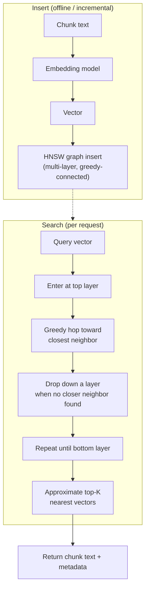

# Vector Database

## Definition

A vector database is a system purpose-built to store large numbers of embedding vectors and
search them for approximate nearest neighbors extremely fast, alongside the practical database
features — persistence, metadata filtering, updates, replication — that a raw nearest-neighbor
algorithm doesn't provide on its own. It's the storage and search layer that makes
[RAG](./RAG.md) and other embedding-based retrieval usable at real scale.

## Detailed Explanation

Once a corpus reaches millions of chunk embeddings, comparing a query vector against every single
stored vector one at a time (brute-force / exact nearest-neighbor search) is roughly `O(N)` per
query — fine for a few thousand vectors, unusable under real-time latency requirements at scale.
**Approximate Nearest Neighbor (ANN)** algorithms trade a small, usually negligible amount of
accuracy for a massive speed improvement, turning search from close to linear time into something
close to logarithmic time. A vector database's core job is implementing an ANN index efficiently
and wrapping it with the operational features a production system needs.

The dominant ANN algorithm in modern vector databases is **HNSW (Hierarchical Navigable Small
World)**: a multi-layer graph where each vector is a node connected to a small number of its
nearest neighbors. Higher layers hold sparser, longer-range connections for fast coarse
navigation; the bottom layer holds every vector, densely connected to its true nearest neighbors.
A search starts at the top layer, greedily hops toward whichever neighbor is closest to the query,
and drops down a layer whenever no closer neighbor is found — repeating until it reaches the
bottom layer and returns the best candidates found. Because it's approximate, HNSW doesn't
guarantee the mathematically true nearest neighbors, only neighbors very close to them with high
probability — a trade-off that's almost always worth it, since missing the 6th-best chunk out of
a 5-result `top_k` rarely changes the final answer, while waiting seconds for an exact scan across
millions of vectors would make the system unusable. Other ANN families exist — IVF (clusters
vectors, searches only nearby clusters), Product Quantization (compresses vectors to save memory),
LSH (hashes similar vectors into shared buckets) — but HNSW has become the dominant default
because it offers a strong recall/speed trade-off without requiring a corpus-specific training
step.

Choosing *which* vector database to run is a separate, very practical decision from choosing the
underlying index algorithm, because vector search never happens in isolation from the rest of an
application's data and infrastructure needs. **Qdrant** is a dedicated, Rust-based vector engine
built for production-scale throughput, rich payload filtering combined tightly with vector search,
and memory-saving quantization — at the cost of being a new system to deploy and operate. **Chroma**
is a lightweight, often embedded store that minimizes setup friction, making it the default choice
for prototyping and small apps, though it doesn't carry the same operational feature depth.
**Pgvector** adds a vector column and index type directly to an existing PostgreSQL database,
which means vector inserts and searches can share transactions, backups, and access control with
the rest of an application's relational data — and lets you write one SQL query that joins a
vector search with an arbitrary relational filter (like row-level tenant isolation) with no need
to keep two systems in sync. None of these is universally "best" — the right choice depends on
scale, whether Postgres is already core infrastructure, and how much new operational surface area
a team can absorb.

## Diagram

## Examples

- Storing embeddings of every paragraph of a company's documentation in Qdrant, with metadata
  tags for `department` and `last_updated`, so retrieval can filter by team while searching by
  meaning.
- Prototyping a "chat with your PDF" tool locally using Chroma, with no separate server to deploy.
- Adding a `vector(1536)` column to an existing Postgres table via pgvector so product search can
  combine a semantic similarity score with a normal SQL `WHERE in_stock = true` filter in one
  query.

## Advantages

- ANN search (HNSW and similar) keeps query latency low even as a corpus grows into the millions
  of vectors, which brute-force search cannot do.
- Purpose-built systems add persistence, metadata filtering, replication, and update/delete
  support on top of the raw search algorithm.
- Tunable recall/speed trade-off (`efSearch`, `M` in HNSW) lets teams dial accuracy against
  latency without rebuilding the index.
- Multiple mature options (Qdrant, Chroma, pgvector, and others) fit different scale and
  integration needs, so teams aren't locked into one operational model.

## Limitations

- ANN search is approximate by design — it does not guarantee the mathematically exact nearest
  neighbors, only a high-probability approximation.
- HNSW graphs are typically held in memory, so memory cost scales with vector count times
  dimensionality times the connectivity parameter `M`.
- A vector database alone only retrieves by embedding similarity — it has no notion of exact
  token matching, which is why it's commonly paired with [hybrid search](./Hybrid-Search.md).
- Choosing the wrong system for your stage (e.g., a heavyweight production engine for a
  500-document prototype) adds operational overhead with no corresponding benefit.
- Index parameters that worked well at one corpus size or dimensionality may need retuning after
  a significant change in either.

## Related Concepts

- [RAG](./RAG.md)
- [Embeddings](./Embeddings.md)
- [Hybrid Search](./Hybrid-Search.md)
- [Reranking](./Reranking.md)
- [Vector Databases and HNSW (Week 3)](../Week-03/Topics/07-Vector-Databases-HNSW.md)
- [Qdrant, Chroma, and Pgvector (Week 3)](../Week-03/Topics/08-Qdrant-Chroma-Pgvector.md)

## Interview Questions

**1. Why can't you just brute-force compare a query vector against every stored vector at scale?**
- Brute-force comparison is roughly `O(N)` per query — fine for a few thousand vectors.
- At millions of vectors this is far too slow for real-time, user-facing latency requirements.
- ANN algorithms trade a small accuracy loss for search closer to logarithmic time.

**2. Explain, at a high level, how HNSW finds nearest neighbors.**
- Vectors are organized into a multi-layer graph, each node connected to its approximate nearest
  neighbors.
- Higher layers are sparse with long-range connections for coarse navigation; the bottom layer is
  dense with every vector.
- Search greedily hops toward the closest neighbor at each layer, dropping down a layer whenever
  no closer neighbor is found, until it reaches the bottom.

**3. What does it mean that HNSW is "approximate," and why is that an acceptable trade-off?**
- It does not guarantee finding the true mathematical nearest neighbors, only a high-probability
  approximation.
- In RAG, missing the 6th-best chunk out of a small `top_k` rarely changes the final answer.
- The alternative — exact brute-force search — would make large-scale real-time search
  unusably slow.

**4. What's the practical difference between choosing Qdrant, Chroma, or pgvector?**
- Qdrant: dedicated, production-scale engine with rich filtering and quantization, but a new
  system to operate.
- Chroma: lightweight, fast to set up, best for prototyping and small-to-medium datasets.
- Pgvector: adds vector search to an existing Postgres database, gaining shared transactions and
  relational joins at the cost of some vector-specific features.

**5. Is a vector database just an ANN index? What else does it typically provide?**
- No — production vector databases add persistence, replication, and update/delete support.
- They add metadata filtering combined with vector search, often as a first-class feature.
- These operational features are what a bare research-library ANN implementation doesn't provide.
