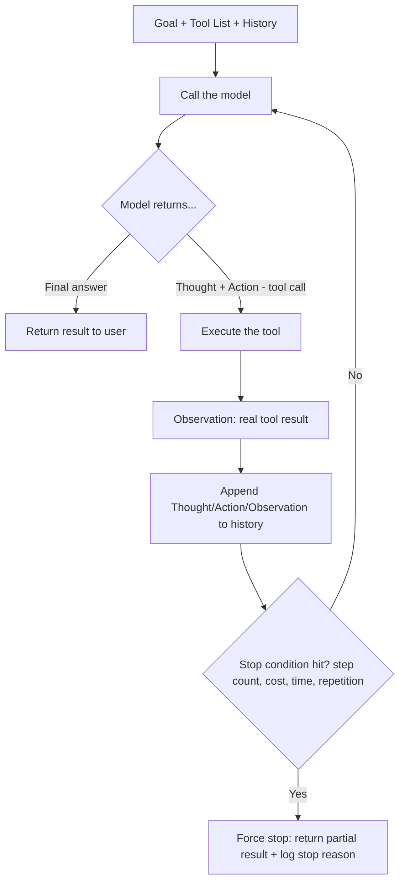

# AI Agents Interview Notes

The agent loop, ReAct, tool design, memory, and the workflow-vs-agent decision — the concepts interviewers use to check you understand agents as an architecture pattern, not a buzzword.

## Questions & Answers

### Q1. What is an AI agent, precisely — and what disqualifies something from being one?
**Expected answer:**
- An agent is a system in which the model decides, at run time, the number and order of steps needed to complete a task, based on the results of previous steps — rather than following a sequence fixed in advance by the engineer.
- Merely calling an LLM, or even having an LLM call a single tool once, does not make something an agent if the sequence of steps was predetermined by the developer — that's just an LLM-powered feature inside a fixed workflow.
- The defining property is the **loop with runtime decision-making**: the model observes a real result and then decides what to do next, and that decision genuinely could not have been hard-coded in advance because it depends on information only available after a previous step executes.

### Q2. Describe the mechanics of the agent loop.
**Expected answer:**
- Structurally, it's a loop: call the model with the goal, available tools, and history so far; if the model returns a final answer, stop; if it returns a tool call, execute that tool, append the result to the history, and loop again.
- There is no hidden state carried between iterations by the model itself — the growing transcript (history of thoughts, actions, and observations) *is* the agent's entire working memory, since each model call is otherwise stateless.
- This is also why cost and latency scale with the number of steps and the size of the accumulated history — every loop iteration resends the entire growing transcript, since the model has no memory between separate API calls.

### Q3. What is ReAct, and why does interleaving reasoning with action help?
**Expected answer:**
- **ReAct (Reason + Act)** gives the agent loop's "thinking" step a concrete, explicit shape: the model states a **Thought** (its reasoning about what to do next) before every **Action** (a tool call), then reads the **Observation** (the tool's real result) before reasoning again.
- This interleaving improves action quality similarly to chain-of-thought prompting (reasoning explicitly before committing to an action tends to produce better-chosen actions than jumping straight to an action), and it lets the model adapt its plan mid-task as real results come in, rather than committing to a rigid upfront plan that can't react to surprises.
- A major practical side benefit: the Thought/Action/Observation trail creates a natural, human-readable audit log, which is invaluable for debugging why an agent took a particular sequence of actions.

### Q4. What makes tool design the biggest lever for agent reliability, and what are the rules of good tool design?
**Expected answer:**
- The model's only interface to a tool is its **name, natural-language description, and argument schema** — it never sees the tool's actual implementation/source code. Ambiguous, overlapping, or poorly described tools cause real, recurring selection and argument-formatting errors, regardless of how capable the underlying model is.
- Rules of good tool design: **one tool, one clearly scoped job** (avoid tools that do several unrelated things depending on a flag); descriptions that explain **when** to use the tool, not just what it does; **strict, typed argument schemas** (so malformed calls fail fast and predictably rather than executing with wrong data); **compact, structured results** (not a giant wall of raw text the model has to re-parse); and **informative error messages**, since an error becomes the next Observation the model has to reason over — a vague error just causes the model to retry blindly.
- Improving tool design is often a higher-leverage fix for a struggling agent than switching to a more capable underlying model.

### Q5. Why does an agent need explicit stop conditions and budgets, and what should be enforced?
**Expected answer:**
- A model has no innate, reliable sense of its own non-convergence — it can loop indefinitely (repeating the same failed action, or making incremental "progress" that never actually completes) without external constraints forcing it to stop.
- Standard layered stop conditions enforced in code (not just requested via prompt): a **maximum step count**, a **cost/token budget ceiling**, a **wall-clock timeout**, and **repetition detection** (the same action being taken again with no new information gained).
- Best practice is to inject **soft warnings** before hitting hard limits (e.g., "you have 2 steps left, wrap up now") so the agent can produce a graceful partial answer rather than being abruptly cut off, and to always log the stop reason — a high rate of non-"reached final answer" stops is a signal of a design problem (bad tools, unclear goal, or a task poorly scoped for an agent), not just bad luck on a given run.

### Q6. What's the difference between short-term and long-term agent memory?
**Expected answer:**
- **Short-term memory** manages a single task's growing transcript so it stays within the context window during one run — typically via truncation (dropping oldest turns) or rolling summarization (compressing older turns while keeping recent ones verbatim).
- **Long-term memory** persists durable, atomic facts *outside* any single run, in an external store, so they can be retrieved and reused across entirely separate future tasks/sessions — this uses the same embed-store-retrieve mechanism as RAG (see the RAG interview notes), just applied to the agent's own accumulated experience/facts rather than external documents.
- Both require active curation: summarization is inherently lossy (information can be dropped that turns out to matter later), and stored long-term memories can go stale or contradict newer information, requiring conflict resolution and pruning policies rather than write-once-read-forever storage.

### Q7. How do you decide whether a task calls for a fixed workflow or a genuine agent?
**Expected answer:**
- The test: can every step be enumerated in advance for every expected input, including known edge cases (conditional branches are fine — a fixed pipeline can branch and still be a workflow)? If yes, build a **workflow** — it's faster, cheaper, more predictable, and dramatically easier to test and debug than an agent loop.
- Reach for an **agent** only when the correct next step genuinely cannot be known until a previous step's real-world result is observed — and even then, scope the agent loop as narrowly as possible (e.g., embed a small agent for just the unpredictable sub-step, keeping the rest of the pipeline a fixed workflow), rather than making an entire system agentic by default.
- When genuinely unsure, the rigorous approach is to *measure*: run a properly budgeted agent and a fixed workflow against the same shared input set, grade both identically, and segment results by task difficulty — the useful answer is almost always a hybrid architecture, not a single universal winner between the two.

### Q8. What's the difference between a single upfront plan and reactive step-by-step replanning in agent design?
**Expected answer:**
- **Upfront (plan-then-execute)** — the model produces a full multi-step plan before executing anything, then the plan's steps are executed (with limited or no revision) — more predictable and easier to review before committing resources, but brittle if an early step's real result invalidates a later planned step.
- **Reactive (interleaved, ReAct-style)** — the model decides only the next single action at each point, incorporating every new observation before deciding the next step — more adaptive to surprises, but harder to predict/audit ahead of time and can be less globally coherent for tasks with genuinely long-range structure.
- Many production systems combine both: an upfront rough plan for structure/expectations, with reactive replanning allowed at the step level when an observation contradicts the plan's assumptions.

### Q9. When are multi-agent systems (multiple cooperating LLM agents) actually useful, versus one agent with more tools?
**Expected answer:**
- Multi-agent designs tend to help when a task naturally decomposes into genuinely distinct roles/specializations (e.g., a "researcher" agent, a "writer" agent, a "critic/reviewer" agent), where separating concerns produces cleaner, more focused prompts and context for each role than one agent juggling every responsibility and every tool at once.
- They also help when parallelism is valuable — multiple agents can work on independent sub-tasks concurrently, then a coordinating step merges results.
- The tradeoff is real added complexity: more orchestration logic, more failure surfaces (miscommunication between agents, compounding errors across handoffs), and higher cost/latency — multi-agent architectures should be adopted because a single well-tooled agent genuinely can't do the job well, not by default, since a single agent with a well-designed toolset is simpler to build, debug, and reason about.

### Q10. How should an agent handle a tool call that fails or returns an unexpected result?
**Expected answer:**
- The error/unexpected result should be returned to the model as a normal Observation (with a clear, specific message describing what went wrong), rather than the surrounding system silently failing or crashing the whole loop — this gives the model a genuine chance to adapt (retry with corrected arguments, try a different tool, or report the failure honestly to the user).
- Good system design still enforces limits on this: a maximum retry count per tool call and overall step budget, so a persistently failing tool doesn't just cause the model to retry indefinitely (tying back to stop conditions).
- Distinguishing **recoverable** failures (bad arguments the model can fix and retry) from **unrecoverable** ones (the tool/service is genuinely down, or the requested action is fundamentally not possible) matters — for unrecoverable failures, the agent should be guided (via tool descriptions/system prompt) toward reporting the failure clearly rather than looping on retries that can never succeed.

### Q11. How do you evaluate whether an agent is actually working well?
**Expected answer:**
- **Task success rate** on a representative, held-out set of realistic tasks (including edge cases) — did the agent actually accomplish the goal, evaluated by a rule, an LLM judge, or human review depending on how checkable the outcome is.
- **Efficiency metrics** — number of steps/tool calls taken, cost, and latency per task, since two agents with equal success rates aren't equal if one takes 3x the steps/cost to get there.
- **Stop-reason distribution** — tracking how often the agent reaches a genuine final answer versus hitting a stop condition (step/cost/time limit or repetition detection), since a high rate of forced stops signals an underlying design problem.
- **Tool-call error rate** — how often the model calls tools with invalid arguments or picks the wrong tool, which points directly back at tool design quality rather than the agent's overall reasoning.
- As with RAG, segmenting results by task difficulty/type is important — an aggregate success rate can mask an agent that handles simple cases well but fails badly on harder, more realistic ones.

### Q12. What are the most common agent failure modes you should be able to name in an interview?
**Expected answer:**
- **Infinite/near-infinite looping** — repeating the same or similar action without making real progress, absent enforced stop conditions and repetition detection.
- **Tool misuse** — calling the wrong tool for the situation, or calling the right tool with malformed/hallucinated arguments, usually traceable to ambiguous tool descriptions or overlapping tool responsibilities.
- **Context/memory overflow** — the transcript grows too large for the context window over a long task, causing truncation that drops information the agent still needed, if short-term memory management isn't handled deliberately.
- **Premature or overconfident final answers** — the agent stops and reports success/completion without having actually verified the task was done correctly, especially when there's no explicit verification step built into the loop or tool results.
- **Compounding errors in multi-step tasks** — an early mistake (misread a tool result, misunderstood the goal) propagates forward uncorrected through every subsequent step, since the agent has no automatic mechanism to "notice" and revisit an earlier flawed decision unless the design explicitly includes a review/verification step.

## Visual: The Agent Loop (ReAct)

