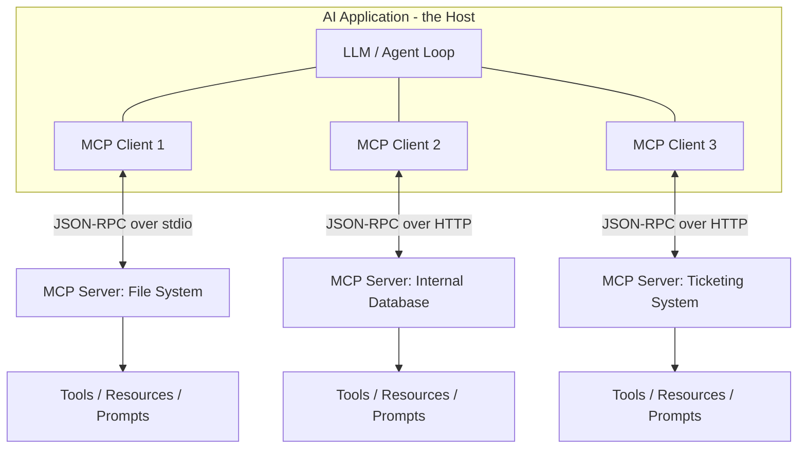

# MCP Interview Notes

The Model Context Protocol (MCP) is a standard for connecting AI applications to external tools, data, and systems. It isn't covered by this course's seven weeks, but interviewers increasingly expect familiarity with it as the standard layer underneath modern tool-using AI systems.

## Questions & Answers

### Q1. What is MCP, and what problem does it exist to solve?
**Expected answer:**
- **MCP (Model Context Protocol)** is an open standard/protocol that defines a consistent way for AI applications (hosts) to connect to external tools, data sources, and systems (servers), so that any MCP-compatible host can use any MCP-compatible server without custom, one-off integration code for each pairing.
- Before a shared standard, every AI application that wanted to connect to, say, a database, a file system, a ticketing tool, and a search engine, would need a bespoke integration for each combination of application and system — an "N applications × M tools" integration explosion.
- MCP addresses this the same way a universal connector (e.g., USB, or HTTP itself) addresses hardware/network integration explosion: build the integration once, against the standard, and it works with every compliant counterpart on the other side — a tool provider builds one MCP server, and it becomes usable by every MCP-compatible AI application, not just one.

### Q2. Describe the host/client/server architecture of MCP.
**Expected answer:**
- **Host** — the AI application the end user actually interacts with (e.g., an IDE assistant, a chat application, an agent framework) — it's responsible for managing the overall session, the LLM calls, and coordinating one or more connections to servers.
- **Client** — a component living inside the host that manages a single, dedicated 1:1 connection to one MCP server, handling the protocol-level communication (requests, responses, notifications) for that specific connection.
- **Server** — a lightweight program that exposes a specific set of capabilities (tools, resources, prompts) over the MCP protocol, backed by whatever underlying system it wraps (a database, a file system, a SaaS API, a local application) — one server per integrated system, generally.
- A single host can maintain multiple client connections simultaneously (one per server), letting one AI application draw on many different external systems side by side through a uniform protocol, rather than a bespoke integration per system.

### Q3. How does MCP relate to tool calling / function calling?
**Expected answer:**
- Tool calling/function calling is the *model-level* capability — an LLM's trained ability to output a structured request to invoke a described function, given a name, description, and schema, as part of a single model call.
- MCP is a layer *above* that: a standardized way to discover, describe, and expose those callable tools (along with other capabilities like resources and prompts) across many different external systems, so the *host application* doesn't need custom, hand-written glue code per external system to obtain the tool schema and to actually execute the call.
- In other words: function calling is what lets the model request "call search(query)"; MCP is what lets the host application know that a `search` tool exists in the first place, what its schema is, and how to actually route the call to the right backend system to execute it — MCP standardizes the wiring around function calling, it doesn't replace or change the model's own function-calling mechanism.

### Q4. What can an MCP server actually expose, beyond just "tools"?
**Expected answer:**
- **Tools** — callable functions the model can invoke (with defined arguments and return values), analogous to standard function/tool calling — e.g., "run this SQL query," "create this ticket."
- **Resources** — addressable pieces of data/context the host can read and provide to the model (e.g., a file's contents, a database record, a document) — more like a "read" primitive than a callable action, useful for grounding the model in specific data without necessarily invoking a side-effecting action.
- **Prompts** — predefined, reusable prompt templates a server can expose, so common interaction patterns for using that server's capabilities can be shared and reused across different hosts rather than reinvented per application.
- This three-part model (tools, resources, prompts) is broader than plain function calling alone — it standardizes not just "actions the model can take" but also "context the model can be given" and "interaction patterns the server author considers well-designed" for its own capabilities.

### Q5. What transport mechanisms does MCP support, and why does that matter?
**Expected answer:**
- MCP communication is built on **JSON-RPC** style messages, transported over one of a small number of supported channels — commonly **stdio** (standard input/output, used when the server runs as a local subprocess on the same machine as the host) and **HTTP-based transports** (used when the server runs remotely, as a networked service).
- The stdio transport is well suited to local integrations (e.g., a server that reads files on your own machine) with minimal setup — no networking/auth infrastructure needed, since it's just a local process pipe.
- The remote/HTTP-based transport is needed when the server is a hosted service reachable over a network (e.g., a company's internal system exposed as an MCP server for multiple users/hosts to connect to), which then also needs to account for authentication and network security concerns that a local stdio server doesn't.

### Q6. How is MCP different from a plain REST API or a proprietary "plugin" system?
**Expected answer:**
- A plain REST API is designed for general-purpose programmatic access — it wasn't necessarily designed with the specific needs of an LLM-driven client in mind (self-describing capabilities discoverable at connect time, schemas structured for a model to reason over, a uniform way to expose "tools vs. data vs. prompt templates").
- Proprietary plugin systems (each AI product defining its own bespoke way for third parties to add tools) solve the same underlying problem but in a vendor-specific way — a plugin built for one company's assistant product doesn't work with a different vendor's assistant without being rebuilt against that vendor's specific plugin interface.
- MCP's value is specifically being an **open, vendor-neutral standard** for this — a server built once against the MCP spec can, in principle, be used by any MCP-compliant host, regardless of which company built that host, the same way a website doesn't need to be rebuilt separately for every different web browser.

### Q7. What security considerations come up with MCP, especially with third-party servers?
**Expected answer:**
- **Trust boundary/permissions** — an MCP server, once connected, can potentially expose powerful capabilities (reading files, executing actions, hitting internal systems); hosts need clear user-facing consent/permission models before allowing a server's tools to be used, especially for side-effecting or sensitive actions.
- **Indirect prompt injection via tool/resource content** — data returned from an MCP server (a file's contents, a search result, a resource) is still just text fed into the model's context, and if that content contains embedded malicious instructions, the model can be manipulated the same way as with any other indirect prompt injection vector (see the Prompt Engineering interview notes) — MCP doesn't inherently sanitize or neutralize this risk.
- **Third-party server trust** — since anyone can build and publish an MCP server, connecting to an unfamiliar or unaudited server is functionally similar to installing an unaudited plugin/dependency — it can have unintended or malicious behavior, so the same supply-chain-style caution (vetting sources, scoping permissions, reviewing what a server actually does) applies.
- Overall, MCP standardizes *how* tools connect, but does not by itself solve trust, authorization, or prompt-injection problems — those still need to be addressed by the host application and by careful, security-conscious usage.

### Q8. How does MCP relate to AI agents specifically?
**Expected answer:**
- An agent (see the Agents interview notes) needs tools to act on the world as part of its think-act-observe loop — MCP is a practical, standardized way for an agent's host application to acquire a broad, extensible set of tools/resources without hand-building custom integration code for every external system the agent might need to touch.
- Because MCP servers are modular and independently built, an agent host can mix and match capabilities from many different MCP servers (a file system server, a database server, a ticketing system server) as its available "tool list" for the agent loop, and new capabilities can be added by simply connecting another compliant server, without changing the agent's core loop logic.
- MCP doesn't change the agent loop's fundamental mechanics (think → act → observe, stop conditions, memory) at all — it only changes and standardizes *where the tools available to that loop come from* and how they're described/discovered.

### Q9. How does a host actually discover what capabilities an MCP server offers?
**Expected answer:**
- When a client connects to a server, an initial handshake/initialization step occurs where the client and server exchange protocol version and capability information, so both sides agree on what features (tools, resources, prompts, and specific protocol features) are supported in that session.
- The client can then query the server for its available tools (names, descriptions, argument schemas), resources, and prompts — this list is typically fetched dynamically at connection time rather than hard-coded into the host, meaning a server can add, remove, or change its offered capabilities and a connecting host will discover the current set without needing a code change on the host side.
- Some servers also support notifying already-connected clients if their available capabilities change mid-session, so a long-lived connection doesn't need to be torn down and reconnected just to pick up newly added tools.

### Q10. Why does MCP include a protocol version/capability negotiation step, and why does that matter practically?
**Expected answer:**
- Like any evolving standard, MCP itself changes over time (new features, refined message formats) — negotiation lets a host and server agree on a mutually supported protocol version and feature set at connection time, rather than assuming both sides implement an identical, always-current version of the spec.
- This matters practically because it lets the ecosystem evolve without a single "flag day" where every host and every server must upgrade simultaneously — an older host can still connect to a newer server (and vice versa) as long as they can agree on a shared, mutually understood subset of functionality.
- For anyone building against MCP, this means: don't assume every server supports every possible feature — check/negotiate capabilities, and design for graceful degradation when a connected server doesn't support some optional feature.

### Q11. Give a concrete real-world example of what MCP enables that would otherwise require custom integration work.
**Expected answer:**
- Example: a company wants its AI coding assistant to be able to read from its internal issue tracker, query its internal analytics database, and search its internal documentation wiki. Without a shared standard, this would mean writing three separate, bespoke integrations, each tightly coupled to that specific AI assistant's own plugin/tool interface.
- With MCP, the company (or a vendor) builds one MCP server per system (issue tracker, database, wiki) once, following the shared spec — and any MCP-compatible AI application (the coding assistant today, potentially a different AI tool the company adopts later) can connect to and use all three without rebuilding the integrations from scratch.
- This is the core practical payoff of a shared protocol: integration work is done once per system, not once per (system × AI application) combination, mirroring the value proposition of any successful open protocol/standard.

## Visual: MCP Host/Client/Server Architecture

