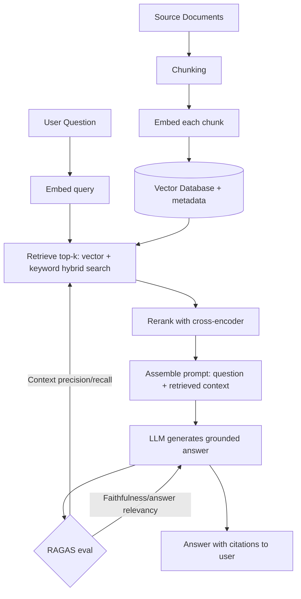

# RAG Theory Interview Notes

Retrieval-Augmented Generation end to end: why it exists, where it fails, and how to evaluate it — spanning chunking, hybrid search, reranking, grounded generation, and RAGAS metrics.

## Questions & Answers

### Q1. What problem does RAG solve, and why not just rely on the model's own knowledge?
**Expected answer:**
- LLMs have three structural limitations RAG directly addresses: a **frozen knowledge cutoff** (no awareness of anything after training), **no access to private/proprietary data** (a company's internal documents were never part of training), and a tendency to **hallucinate** confidently when they lack real information on a topic.
- **Retrieval-Augmented Generation (RAG)** addresses all three by retrieving relevant, up-to-date, or private documents at request time and inserting them into the model's context window, so the model generates its answer grounded in real, current, retrievable text rather than solely on frozen parametric memory.
- The alternative — fine-tuning the model on your private data — is far more expensive, harder to keep current (requires retraining as data changes), and doesn't reliably teach the model new facts as well as it teaches it style/behavior; RAG is generally the more practical, cheaper, and more up-to-date-able solution for knowledge-grounding.

### Q2. Walk through the full RAG pipeline end to end.
**Expected answer:**
1. **Ingestion** — source documents are collected, cleaned, and split into chunks.
2. **Embedding** — each chunk is converted into a vector embedding and stored in a vector database (often alongside metadata).
3. **Query time: query embedding** — the user's question is embedded using the same embedding model.
4. **Retrieval** — the query embedding is compared against stored chunk embeddings (often combined with keyword/hybrid search) to retrieve the top-k most relevant chunks.
5. **(Optional) Reranking** — a more precise (often cross-encoder) model re-scores and reorders the retrieved candidates to push the truly most relevant chunks to the top.
6. **Prompt assembly** — the retrieved chunks are inserted into the prompt alongside the user's question and instructions to answer using only that context.
7. **Generation** — the LLM produces an answer grounded in the retrieved context.
8. **(Optional) Citation/verification** — the answer references which chunks it drew from, and/or the answer is checked for faithfulness to the retrieved context.

### Q3. What are the main chunking strategies, and what's the tradeoff in chunk size?
**Expected answer:**
- **Fixed-size chunking** — splits text into chunks of a set token/character length, often with some overlap between consecutive chunks (so a fact split across a chunk boundary still appears fully in at least one chunk). Simple and predictable, but can crudely cut through a sentence or idea.
- **Semantic/structure-aware chunking** — splits along natural boundaries (paragraphs, sections, headings, sentence groups) so each chunk is a coherent unit of meaning, sometimes using an embedding-based method to detect topic shifts.
- **Chunk size tradeoff**: smaller chunks give more precise retrieval (less irrelevant text mixed in with the relevant part) but risk losing surrounding context needed to fully understand a fact; larger chunks preserve more context but dilute relevance (a large chunk might be retrieved because of one relevant sentence buried among mostly irrelevant text) and consume more of the context window per retrieved item.
- Overlap between chunks (commonly 10-20% of chunk size) helps mitigate information being awkwardly split right at a chunk boundary.

### Q4. What are the main failure modes on the retrieval side of RAG?
**Expected answer:**
- **Missing the right chunk entirely** — the correct information exists in the corpus, but wasn't in the top-k retrieved results, often because of a semantic gap between how the question is phrased and how the source document phrases the same fact.
- **Irrelevant/noisy chunks retrieved** — chunks that are superficially similar (same topic) but don't actually answer the question, diluting the context the generator has to work with.
- **Chunking boundary problems** — the answer exists but is split awkwardly across two chunks, with neither chunk alone containing the complete fact.
- **Vocabulary mismatch** — user queries use different terminology than the source documents (e.g., "cost" vs. "pricing"), which pure semantic search sometimes handles well but can still miss, especially for exact terms/codes — this is a major reason hybrid search exists.
- These are diagnosed using retrieval-specific metrics like **context precision** (are retrieved chunks actually relevant) and **context recall** (was all the needed information retrieved at all) — see the RAGAS question below.

### Q5. What are the main failure modes on the generation side of RAG, given good retrieval?
**Expected answer:**
- **Ignoring the retrieved context** — the model answers from its own parametric memory instead of the provided context, even when the context contradicts or should override that memory.
- **Hallucinating beyond the context** — the model adds specific-sounding details (numbers, names, claims) that aren't actually present in the retrieved chunks, even while nominally "using" the context.
- **Partial use of context** — the model answers using only some of the relevant retrieved information, missing other equally relevant retrieved chunks (especially with many retrieved chunks or a long context, related to the "lost in the middle" effect).
- **Over-literal or under-synthesized answers** — either copying retrieved text too rigidly without actually answering the specific question asked, or over-synthesizing/paraphrasing to the point of drifting from what the source actually said.
- These are measured with **faithfulness** (is the answer actually supported by the retrieved context) and **answer relevancy** (does the answer actually address the question) — see the RAGAS question below.

### Q6. What is hybrid search, and why is it commonly used instead of pure vector search in production RAG?
**Expected answer:**
- Hybrid search combines **dense/vector (semantic) search** with **sparse/keyword search** (classically BM25) in the same retrieval step, then merges and re-scores the combined candidate set (commonly via reciprocal rank fusion or a learned combination).
- Vector search excels at conceptual/semantic matches (finding relevant text that uses different words for the same idea) but can underperform on exact terms — product codes, names, acronyms, numbers, precise technical terms — where keyword search is naturally strong.
- In practice, hybrid search consistently outperforms either method alone across most real-world corpora and query types, which is why it's the default recommendation for production RAG rather than an optional add-on.

### Q7. What is reranking, and why add it as a separate stage after initial retrieval?
**Expected answer:**
- Reranking takes the top-N candidates from an initial, fast retrieval pass (vector and/or keyword search) and re-scores them using a more computationally expensive but more accurate relevance model — typically a **cross-encoder**, which jointly processes the query and each candidate document together (rather than comparing pre-computed independent embeddings), allowing much finer-grained relevance judgments.
- It's added as a second stage rather than used for the whole corpus because cross-encoders are too slow to run against every document in a large corpus — the pattern is "fast, approximate retrieval to narrow down candidates, then slow, accurate reranking on just those candidates" (retrieve top-50, rerank down to top-5, for example).
- This consistently improves the quality of the final chunks that actually reach the generation step, directly addressing the "retrieved something topically related but not actually the best answer" failure mode.

### Q8. What does "grounded generation" mean, and how do citations fit in?
**Expected answer:**
- Grounded generation means instructing (and, ideally, verifying) that the model's answer is actually derived from and supported by the retrieved context provided, rather than from its own unconstrained parametric knowledge.
- Practically achieved via: explicit prompt instructions ("answer only using the provided context; say you don't know if the answer isn't present"), and often requiring the model to cite which specific retrieved chunk/source supports each claim in its answer.
- Citations serve two purposes: they let a human user verify the answer against the actual source, and they make it easier to programmatically check faithfulness (does the cited source actually support the claim being attributed to it) rather than relying purely on trusting the model's own honesty.

### Q9. What are the core RAGAS metrics, and what does each one actually measure?
**Expected answer:**
- **Faithfulness** — does the generated answer's content actually follow from/is supported by the retrieved context, or does it include claims not grounded in that context (i.e., hallucination despite having context)? Typically computed by breaking the answer into individual claims and checking each against the retrieved context, often using an LLM-as-judge.
- **Answer relevancy** — does the generated answer actually address the question that was asked, regardless of whether it's grounded correctly? An answer can be perfectly faithful to the context yet fail to actually answer the question asked.
- **Context precision** — of the chunks that were retrieved, how many were actually relevant/useful for answering the question (measures retrieval noise).
- **Context recall** — of all the information actually needed to fully answer the question, how much of it was present somewhere in the retrieved chunks (measures whether retrieval missed anything important).
- The key insight for an interview: these four metrics separate retrieval quality (context precision/recall) from generation quality (faithfulness/answer relevancy) — a low overall score could stem from either half of the pipeline, and RAGAS is designed specifically to help pinpoint which one is actually broken.

### Q10. If a RAG system gives a wrong answer, how do you determine whether it's a retrieval problem or a generation problem?
**Expected answer:**
- Inspect what was actually retrieved for that query: if the correct information was never present in the retrieved chunks at all, it's a **retrieval failure** (low context recall) — the fix lies in improving chunking, embedding model, hybrid search, or reranking.
- If the correct information *was* present in the retrieved chunks but the model still gave a wrong or unsupported answer, it's a **generation failure** (low faithfulness or answer relevancy) — the fix lies in prompt instructions, using a stronger/more instruction-following model, or reducing the amount of irrelevant context diluting the good context.
- This is exactly why RAGAS-style metrics that separate retrieval from generation quality matter operationally — without that separation, "the RAG system gave a wrong answer" is not actionable; teams would be guessing which half of the pipeline to fix.

### Q11. What is query rewriting/expansion, and what is HyDE?
**Expected answer:**
- **Query rewriting/expansion** — transforming or expanding the user's raw query before retrieval, to better match how the answer is likely phrased in the source corpus (e.g., expanding an ambiguous or terse query into a more complete, explicit form, or generating multiple paraphrased versions of the query and retrieving with all of them).
- **HyDE (Hypothetical Document Embeddings)** — instead of embedding the user's raw question directly, an LLM first generates a *hypothetical answer* to the question, and that hypothetical answer's embedding is used for retrieval instead of (or alongside) the question's own embedding. The intuition: a plausible answer's phrasing tends to be closer, in embedding space, to how the real answer is written in the corpus than the question's phrasing is — questions and answers often use different vocabulary/structure even when topically identical.
- Both techniques address the same underlying issue: the literal query text isn't always the best possible retrieval key for finding the text that actually answers it.

### Q12. What is multi-hop or agentic RAG, and when is it needed over standard single-pass RAG?
**Expected answer:**
- Standard RAG does one retrieval pass, then one generation pass — this works well when a single relevant chunk (or small set of chunks) fully answers the question.
- **Multi-hop RAG** is needed when answering the question genuinely requires combining information found across multiple, separately-retrievable pieces of information, where the need for the second piece isn't obvious until the first piece has been read (e.g., "who was the CEO of the company that acquired X in 2019" requires first finding who acquired X, then looking up that company's CEO).
- **Agentic RAG** wraps retrieval as a callable tool inside an agent loop (see the Agents interview notes), letting the model decide, iteratively, whether it has enough information yet or needs to issue another retrieval query based on what it's learned so far — trading higher latency/cost for the ability to handle these genuinely multi-step, unpredictable information needs that a single fixed retrieval pass cannot.

### Q13. How do you evaluate an end-to-end RAG system, beyond just RAGAS metrics?
**Expected answer:**
- **Automated metrics** (RAGAS-style: faithfulness, answer relevancy, context precision/recall) give fast, scalable, repeatable signal, and are good for catching regressions during iteration.
- **Human evaluation** on a representative sample remains important for catching issues automated metrics miss (subtle tone problems, domain-specific correctness that a generic LLM judge can't reliably assess, edge cases).
- **Golden/reference datasets** — a curated set of realistic questions with known correct answers and known relevant source documents lets you measure both retrieval and generation quality against ground truth, not just internal consistency.
- **Segment results by query type/difficulty** rather than trusting one aggregate score — a RAG system might do well on simple factual lookups but poorly on comparative or multi-hop questions, and an aggregate score would mask that.

### Q14. When is RAG not enough, and fine-tuning (or a combination) is the better call?
**Expected answer:**
- RAG is excellent for injecting **facts and current/private information**, but it doesn't change the model's underlying behavior, style, reasoning approach, or domain-specific "instincts" — it only changes what information is available in context.
- **Fine-tuning** is better suited for teaching the model a specific output format/style consistently, domain-specific reasoning patterns, or behavior that's needed on essentially every request (so it shouldn't have to be re-explained via prompt/context every time).
- In practice, many production systems combine both: fine-tuning (or careful system-prompt design) shapes *how* the model behaves and reasons, while RAG supplies *what* current/specific facts it reasons over — treating them as complementary rather than competing solutions, rather than picking one as a universal answer.

## Visual: RAG Pipeline

