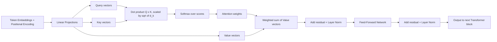
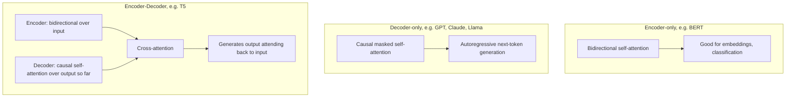

# Transformer Theory Interview Notes

Attention, positional encoding, and encoder/decoder architecture — the internals interviewers probe once they know you understand LLMs at a conceptual level and want to check the underlying mechanism.

## Questions & Answers

### Q1. What problem does the Transformer architecture solve that RNNs/LSTMs struggled with?
**Expected answer:**
- RNNs/LSTMs process sequences one token at a time, carrying a hidden state forward — this makes them inherently sequential (can't parallelize across the sequence during training) and prone to losing information from far back in long sequences, even with gating mechanisms designed to help (vanishing gradients over long distances).
- The Transformer replaces recurrence with **self-attention**, which lets every token directly look at every other token in the sequence in a single step, regardless of distance — no information has to "travel" step by step through a chain of hidden states.
- This gives two major wins: much better handling of long-range dependencies, and full parallelization across the sequence during training (all positions processed simultaneously), which is what made training on today's massive datasets/models computationally feasible.

### Q2. Explain self-attention in plain terms.
**Expected answer:**
- Self-attention lets each token in a sequence build a representation of itself that's informed by every other token, weighted by how relevant each other token is to it.
- Concretely: for each token, the model computes a score against every other token indicating "how much should I pay attention to that token when updating my own representation," turns those scores into weights (via softmax, so they sum to 1), and produces a new vector for the token as a weighted sum of all tokens' information, using those weights.
- Example: in "the animal didn't cross the street because it was too tired," self-attention lets the representation of "it" incorporate strong weight from "animal" — resolving what "it" refers to using context, something a fixed-window model would struggle with at longer distances.

### Q3. What are Query, Key, and Value in attention, and what role does each play?
**Expected answer:**
- Each token's embedding is projected (via three separate learned weight matrices) into three vectors: **Query (Q)**, **Key (K)**, and **Value (V)**.
- **Query** represents "what this token is looking for" from other tokens.
- **Key** represents "what this token offers/advertises" to other tokens looking for something.
- **Value** is the actual content/information that gets passed along once a token decides how much attention to pay.
- Mechanically: a token's Query is compared (dot product) against every other token's Key to get relevance scores; those scores (after softmax) weight each token's Value, and the weighted sum of Values becomes the updated representation. The analogy often used: it's like a search engine where Query is your search terms, Keys are document titles/tags being matched against, and Values are the actual document content retrieved.

### Q4. Why multi-head attention instead of a single attention mechanism?
**Expected answer:**
- A single attention computation can only really capture one "type" of relationship pattern well at a time, because it's one shared set of Q/K/V projections.
- **Multi-head attention** runs several attention computations in parallel, each with its own separately learned Q/K/V projection matrices ("heads"), so different heads can specialize in different kinds of relationships — e.g., one head might track syntactic dependency (subject-verb agreement), another might track coreference (pronoun resolution), another might track local word order.
- The outputs of all heads are concatenated and linearly projected back down to the model's working dimension, combining multiple "perspectives" on the same sequence into one richer representation.

### Q5. Why do Transformers need positional encoding at all?
**Expected answer:**
- Self-attention itself is **permutation-invariant** — it treats the input as a set of tokens, computing relevance based purely on content, with no inherent notion of order (unlike an RNN, which naturally processes tokens in sequence).
- Without extra information, "the dog bit the man" and "the man bit the dog" would look identical to a pure attention mechanism, since both contain the same tokens.
- **Positional encoding** injects information about each token's position into its embedding before attention is applied, so the model can distinguish order and distance. Two common approaches: fixed **sinusoidal** functions (deterministic, no extra learned parameters, generalizes reasonably to longer sequences than seen in training) and **learned** positional embeddings (a trainable vector per position, more flexible but doesn't naturally generalize past the max length trained on). Modern large models increasingly use relative positional schemes (e.g., RoPE) that encode relative distance between tokens rather than absolute position.

### Q6. What's the difference between encoder-only, decoder-only, and encoder-decoder architectures?
**Expected answer:**
- **Encoder-only** (e.g., BERT) — every token can attend to every other token in both directions (bidirectional attention); good for understanding tasks (classification, embeddings, extraction) but not natively built for open-ended generation.
- **Decoder-only** (e.g., GPT, Claude, Llama) — each token can only attend to itself and earlier tokens (causal/masked attention), which is exactly what's needed for autoregressive next-token generation; this is the dominant architecture for modern conversational LLMs.
- **Encoder-decoder** (e.g., original Transformer, T5) — an encoder processes the full input bidirectionally into a contextual representation, then a decoder generates output tokens autoregressively while also attending back to the encoder's output (cross-attention); well-suited to tasks with a clear separate input and output, like translation or summarization.
- Most current general-purpose chat LLMs are decoder-only because a single unified architecture handles understanding and generation both, simply by feeding the whole conversation as one sequence.

### Q7. What is causal (masked) attention, and why do decoder models need it?
**Expected answer:**
- Causal masking prevents a token's attention computation from looking at any token that comes after it in the sequence — each position can only attend to itself and earlier positions.
- This is essential for autoregressive generation: at inference time, future tokens genuinely don't exist yet (they haven't been generated), so the model must be trained under the same constraint, or it would learn to "cheat" by peeking at answers it won't have access to at generation time.
- Implemented by adding a mask (effectively negative infinity for disallowed positions) to the raw attention scores before the softmax, so those positions get zero weight.

### Q8. What do the feed-forward layers in a Transformer block do, if attention already mixes information across tokens?
**Expected answer:**
- Self-attention mixes information *across* token positions, but it's a fairly simple linear-ish operation per position after that mixing.
- The **feed-forward network (FFN)** — a small multi-layer perceptron applied independently to each token's representation (same weights reused per position) — adds per-token, non-linear transformation capacity, letting the model learn more complex feature transformations of each token's (now context-mixed) representation.
- A useful mental model: attention decides "which other tokens' information should influence me," and the feed-forward layer decides "what do I do with that combined information now that I have it." Both are needed — most of a Transformer's parameters actually live in these feed-forward layers, not in attention itself.

### Q9. Why do Transformer blocks use residual connections and layer normalization?
**Expected answer:**
- **Residual (skip) connections** add a layer's input directly to its output, so the layer only needs to learn the *change/residual* rather than the whole transformation from scratch. This makes gradients flow much more easily through very deep stacks of layers (mitigating vanishing gradients) and generally makes deep networks trainable at all.
- **Layer normalization** rescales/recenters activations (typically per token, across the feature dimension) to keep values in a stable numeric range as they flow through many stacked layers, preventing training instability (values exploding or shrinking to near-zero across dozens of layers).
- Together, these two are what make it practical to stack dozens of Transformer blocks and still train the network successfully.

### Q10. Why is self-attention's compute cost described as O(n²), and why does that matter for long context windows?
**Expected answer:**
- Self-attention computes a relevance score between every pair of tokens in the sequence — for a sequence of length n, that's n × n pairwise comparisons, so both compute and memory for the attention step scale quadratically with sequence length.
- This is exactly why very long context windows are expensive: doubling the input length roughly quadruples the attention computation (though in practice, optimized implementations and architectural tricks reduce the real-world overhead somewhat).
- It's an active research area (sparse attention, sliding-window attention, linear-attention approximations, FlashAttention-style memory-efficient implementations) specifically to make long-context models more practical, since naive full quadratic attention becomes the dominant cost at very long sequence lengths.

### Q11. What is cross-attention, and how does it differ from self-attention?
**Expected answer:**
- **Self-attention** — Query, Key, and Value all come from the *same* sequence (tokens attending to other tokens within the same input).
- **Cross-attention** — the Query comes from one sequence (typically the decoder's current generation state), while the Key and Value come from a *different* sequence (typically the encoder's output) — used in encoder-decoder architectures so the decoder can "look back" at the full input while generating each output token.
- Example: in a translation model, cross-attention lets each token being generated in the target language attend directly to the relevant tokens in the source language sentence, rather than relying solely on a single compressed summary of the input.

### Q12. Why is the attention score divided by √(d_k) before the softmax?
**Expected answer:**
- The raw dot product between Query and Key vectors grows in magnitude as the dimensionality (d_k) of those vectors increases, simply because you're summing more terms.
- Without scaling, large dot products push the softmax into regions where it produces extremely peaked (near one-hot) distributions, which makes gradients tiny and training unstable.
- Dividing by √(d_k) keeps the scores in a numerically well-behaved range regardless of dimensionality, so the softmax produces a smoother, more trainable distribution — this is literally why it's called "scaled dot-product attention."

### Q13. What is the KV cache, and why does it matter for inference speed?
**Expected answer:**
- During autoregressive generation, computing attention for a new token requires the Key and Value vectors of every previous token in the sequence — without caching, you'd recompute these from scratch for the entire prior sequence at every single new token, which is wasteful since they don't change once computed.
- The **KV cache** stores each previous token's Key and Value vectors after they're first computed, so generating each new token only requires computing that new token's own Q/K/V and reusing the cached K/V from before — turning an otherwise quadratic-per-step cost into a much cheaper linear append.
- This is a major reason inference memory usage grows with context length (the cache itself has to be stored for every token in play), and it's why techniques like multi-query/grouped-query attention (sharing Key/Value projections across heads) were developed — to shrink KV cache memory without materially hurting quality.

### Q14. At a high level, what are attention heads actually learning, and can we interpret them?
**Expected answer:**
- Interpretability research has found that different heads often specialize in identifiable patterns — some attend mostly to the immediately preceding token, some track syntactic relationships (subject-verb agreement), some handle coreference (linking pronouns to their referents), and some attend broadly across long ranges.
- This isn't hand-designed — it emerges purely from training on the next-token prediction objective, and which heads learn which patterns can vary between training runs and models.
- Caveat worth mentioning: interpretability findings are partial and an active research area — attention weights showing "what a head looks at" don't fully explain *why* the model produces a given output, and attention patterns alone are not a complete or fully reliable explanation of model behavior.

## Visual: Self-Attention Data Flow

## Visual: Encoder vs Decoder vs Encoder-Decoder

