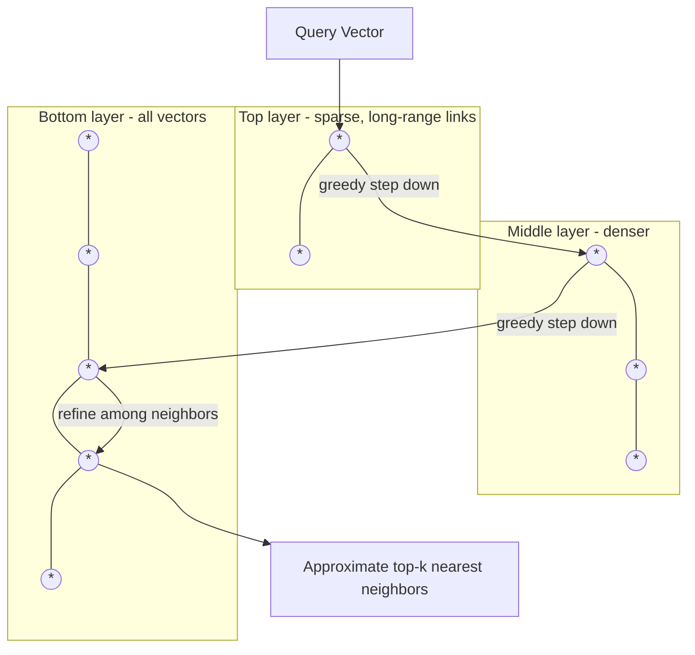

# Vector Database Interview Notes

Indexing strategies, the recall/latency tradeoff, and how to pick the right vector database for a given system — the operational layer that sits underneath embeddings-based search.

## Questions & Answers

### Q1. What is a vector database, and why can't you just use a regular SQL database for this?
**Expected answer:**
- A vector database is a data store purpose-built to store high-dimensional embedding vectors and efficiently find the vectors most similar to a given query vector (nearest-neighbor search), typically at massive scale (millions to billions of vectors).
- A regular SQL/relational database is optimized for exact-match lookups and range queries over structured columns via B-tree-style indexes — it has no native, efficient way to answer "which of these million vectors is closest to this query vector," which requires comparing the query against many (or all) stored vectors using a distance/similarity metric.
- Some relational databases now bolt on vector search via extensions (e.g., pgvector for PostgreSQL), blurring this line — the real distinction is whether the underlying engine has a genuine approximate-nearest-neighbor index optimized for high-dimensional similarity search, not just whether it's labeled a "vector database."

### Q2. What's the difference between exact nearest-neighbor search and approximate nearest-neighbor (ANN) search?
**Expected answer:**
- **Exact nearest-neighbor search** compares the query vector against every single stored vector and guarantees finding the true top-k most similar results — accurate but computationally expensive, since cost scales linearly (or worse) with the number of stored vectors, making it impractical at large scale for low-latency use cases.
- **Approximate nearest-neighbor (ANN) search** uses specialized index structures to find results that are very likely (but not mathematically guaranteed) to be the true nearest neighbors, in exchange for dramatically better speed and scalability.
- Nearly every production vector database defaults to ANN, because the recall loss (occasionally missing the true single-best match) is an acceptable tradeoff for the orders-of-magnitude latency and scalability improvement at real-world data volumes.

### Q3. Explain how HNSW works at a conceptual level.
**Expected answer:**
- **HNSW (Hierarchical Navigable Small World)** is a graph-based ANN indexing algorithm. Vectors are organized into a multi-layer graph where each vector is a node, and nodes are connected to their approximate nearest neighbors.
- The top layers are sparse, containing only a small subset of nodes with long-range connections, allowing large "jumps" across the vector space; lower layers get progressively denser, with each layer containing more nodes and more localized connections, down to the bottom layer, which contains every vector.
- A search starts at the top (sparse) layer, greedily navigating toward the region closest to the query vector, then drops down a layer and continues refining the search in progressively denser layers, until it reaches the bottom layer and returns a small set of well-refined candidate nearest neighbors.
- This layered structure is what gives HNSW its strong speed/accuracy tradeoff — it avoids comparing the query against every vector by using the sparse upper layers to quickly narrow down the right neighborhood before doing detailed comparison in the dense lower layers.

### Q4. What other indexing approaches exist besides HNSW, and how do they compare?
**Expected answer:**
- **IVF (Inverted File Index)** — clusters vectors into a fixed number of partitions (via k-means or similar) in advance; at query time, only the closest few partitions (not the whole dataset) are searched, trading some recall for a large speed gain. Often combined with HNSW is used for higher recall at similar speed, while IVF-based approaches can offer a better memory footprint at large scale.
- **Product Quantization (PQ)** — compresses each vector into a much smaller, approximate representation (splitting the vector into sub-vectors and quantizing each to a small codebook), dramatically reducing memory usage at the cost of some accuracy; often combined with IVF (IVF-PQ) for very large-scale, memory-constrained deployments.
- **Flat/brute-force index** — no approximation at all, just exact linear scan; used only for small datasets or as a ground-truth baseline to measure ANN recall against.
- The general tradeoff across all of these: index build time, memory footprint, search speed, and recall accuracy trade off against each other — no single index type wins on all four dimensions simultaneously.

### Q5. What is the difference between pre-filtering and post-filtering when combining metadata filters with vector search?
**Expected answer:**
- **Metadata filtering** means restricting vector search results to only those matching additional structured conditions (e.g., "similar to this query AND category = 'electronics' AND date > 2024-01-01").
- **Pre-filtering** applies the metadata filter first, then runs (or restricts) the vector search only over the already-filtered subset — this guarantees correctness (you never miss a valid match) but can be slow if the filter doesn't align well with the ANN index's structure, sometimes forcing a much more expensive search over the filtered subset.
- **Post-filtering** runs the vector search first to get top-k candidates, then discards any that don't match the metadata filter — fast, but risks returning fewer results than requested (or none) if too many of the true top-k matches get filtered out afterward, especially with restrictive filters.
- Modern vector databases increasingly implement "filtered ANN search" that integrates the metadata constraint directly into the graph traversal, avoiding the worst failure modes of both naive approaches — this is a genuine differentiator to evaluate when choosing a vector database for a filter-heavy use case.

### Q6. What parameters control the recall/latency tradeoff in an HNSW-style index, and how do you tune them?
**Expected answer:**
- **`ef_construction`** — controls how thoroughly the graph is built at index time (how many candidate neighbors are considered when inserting each new vector); higher values produce a higher-quality graph (better recall) at the cost of slower index building.
- **`ef_search`** — controls how many candidates are explored at query time; higher values improve recall (more likely to find the true nearest neighbors) at the cost of higher query latency.
- **`M`** — the maximum number of connections per node in the graph; higher M generally improves recall and search speed but increases memory usage and index build time.
- Tuning in practice: start from a provider's recommended defaults, then empirically measure recall (against a ground-truth exact-search sample) versus p95/p99 latency on your actual data and query patterns, and adjust `ef_search` (the easiest to tune without a full index rebuild) first before touching build-time parameters.

### Q7. What criteria matter when choosing a vector database for a real project (e.g., Pinecone, Weaviate, Milvus, Qdrant, pgvector, Chroma)?
**Expected answer:**
- **Managed vs. self-hosted** — Pinecone is fully managed (less ops burden, ongoing cost); Milvus/Qdrant/Weaviate/Chroma can be self-hosted (more control, more operational responsibility) or used via their managed cloud offerings.
- **Scale** — expected number of vectors and query throughput; some solutions are optimized for billions of vectors with distributed sharding (Milvus), others are simpler and better suited for small-to-medium scale (Chroma, pgvector).
- **Existing infrastructure fit** — if the team already runs PostgreSQL, pgvector avoids introducing an entirely new system, at the cost of generally lower performance ceiling than purpose-built vector databases at very large scale.
- **Filtering/hybrid search support** — how well metadata filtering and keyword+vector hybrid search are supported natively, since most real production retrieval systems need both, not vector search alone.
- **Ecosystem/integration** — support in the RAG/agent frameworks the team is already using (LangChain, LlamaIndex, etc.), client library quality, and operational tooling (monitoring, backups).
- There's rarely a universally "best" choice — the right answer depends on scale, team ops capacity, existing stack, and whether managed convenience or self-hosted control/cost matters more for the specific project.

### Q8. What are the scaling considerations (sharding, replication) for a vector database at large scale?
**Expected answer:**
- **Sharding** splits the vector index across multiple machines/partitions (e.g., by hash or by category) so no single machine needs to hold the entire index in memory — necessary once the dataset exceeds what fits comfortably on one node, especially since ANN indexes are often memory-resident for speed.
- **Replication** keeps multiple copies of the index (or shards) across different machines for both fault tolerance (surviving node failure) and read throughput scaling (spreading query load across replicas).
- Sharded ANN search introduces a complication: a query typically needs to be run against every shard and results merged/re-ranked, since the true top-k results could be split across multiple shards — this adds coordination overhead compared to a single-node index.
- Most managed vector database providers handle this transparently, but it's a real cost/architecture consideration when self-hosting at scale.

### Q9. Do vector databases support hybrid search, and why does that matter?
**Expected answer:**
- Most modern vector databases (and increasingly, most production RAG systems) support **hybrid search** — combining dense vector (semantic) search with sparse/keyword search (like BM25) in a single query, then merging/re-ranking the combined results.
- It matters because pure vector search can miss cases where an exact keyword match is actually what's needed (a specific product SKU, an error code, an exact legal term) — embeddings capture semantic similarity but can blur past exact lexical matches that matter.
- Implementation approaches vary: some databases run both searches internally and merge scores natively (e.g., via reciprocal rank fusion); others expect the application layer to run both searches separately and combine results itself. Evaluating a vector database's hybrid search maturity is a real differentiator, not just a checkbox feature.

### Q10. Why can updating/inserting vectors into an ANN index be more costly than it sounds, and how do databases handle it?
**Expected answer:**
- Unlike a simple key-value store, an ANN graph-based index (like HNSW) has structural relationships between existing entries — inserting a new vector may require finding its correct neighbors and updating graph connections, and deleting a vector can leave "holes" that degrade search quality if not handled carefully.
- Some index types (especially IVF-PQ style) are more efficiently built in a single batch pass and are more expensive to update incrementally, making them better suited to relatively static datasets that are rebuilt periodically rather than updated vector-by-vector in real time.
- Production vector databases handle this in different ways: some support genuinely efficient incremental inserts/deletes (HNSW-based systems generally do reasonably well here), others use soft-deletes plus periodic background re-indexing/compaction. If your use case has a high rate of updates/deletes (not just inserts), this needs to be explicitly evaluated rather than assumed.

### Q11. What's the storage/cost tradeoff of embedding dimensionality at the database level?
**Expected answer:**
- Every stored vector consumes memory/disk proportional to its dimensionality (e.g., a 1536-dimension float32 vector takes roughly 6KB just for the raw numbers, before index overhead) — at a scale of tens of millions of vectors, dimensionality directly and significantly drives infrastructure cost.
- ANN indexes typically need to be held largely in memory for fast search, so higher dimensionality also raises the RAM requirements of the serving infrastructure, not just disk storage.
- This is why techniques like reduced-dimension embeddings (e.g., Matryoshka-style truncation) and vector compression (product quantization, scalar quantization, binary quantization) are actively used in production — they trade a controlled, measured amount of recall for meaningfully lower memory/cost at scale.

### Q12. When would you NOT use a vector database at all?
**Expected answer:**
- When the dataset is small enough that a simple in-memory brute-force similarity search (or even a basic library-level exact search) is fast enough — introducing a dedicated vector database adds operational complexity that isn't justified below a certain scale.
- When the retrieval need is purely exact/structured (looking up a record by ID, filtering by exact category/date range) — a regular database with standard indexes is simpler and more appropriate; vector search solves a specifically semantic/fuzzy matching problem.
- When the application's data changes so rapidly, or needs to be so strongly consistent/transactional, that maintaining a separate specialized index adds more synchronization risk/complexity than the semantic search capability is worth for that use case.

## Visual: HNSW Layered Graph Search

