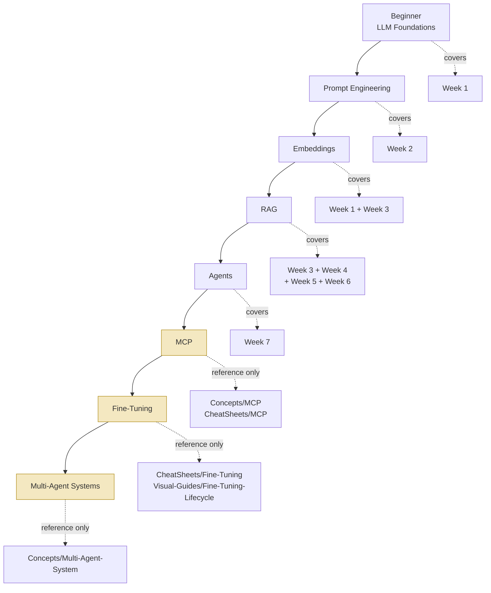

# Learning Path

This page shows one recommended progression through the material — from "what is a language
model" all the way to multi-agent systems. It is intentionally **broader than the 7-week
curriculum**: the 7 weeks (`Week-01` … `Week-07`) cover Beginner through Agents in full,
standalone depth, but three later stages — **MCP, Fine-Tuning, and Multi-Agent Systems** — are
not separate weeks here. They're covered as reference material in `Concepts/` and `CheatSheets/`
(and, for MCP, a dedicated `Visual-Guides/MCP-Architecture` page and `Interview-Notes/MCP-Theory`)
so you have somewhere to go after finishing Week 7, even though no week-by-week topic set exists
for them yet.

## The Path

Stages shaded above (MCP, Fine-Tuning, Multi-Agent Systems) are the ones that go beyond the
8-week curriculum — treat them as "read the reference pages when you need them," not "wait for
a week that covers them."

## Estimated Hours Per Stage

| Stage | Estimated Hours | Curriculum Coverage |
|---|---|---|
| Beginner (LLM Foundations) | ~2 hours | Week 1 (full week) |
| Prompt Engineering | ~4 hours | Week 2 (full week) |
| Embeddings | ~1–2 hours *(on top of Week 1/3 reading)* | Week 1 Topics 05–06, Week 3 Topics 02–04 |
| RAG (retrieval → debugging → error analysis → evals) | ~14–17 hours | Weeks 3, 4, 5, 6 |
| Agents (loops, failure modes, evals & security) | ~4.5–5 hours | Weeks 7 & 8 |
| MCP | ~30–45 minutes | Reference only — no dedicated week |
| Fine-Tuning | ~30–45 minutes | Reference only — no dedicated week |
| Multi-Agent Systems | ~20–30 minutes | Reference only — no dedicated week |

Totals are reading-time estimates for the curated material, not hands-on build time — this site
is documentation, not a set of exercises (see the project [README](/README) for that scope note).

## Stage-by-Stage Notes

### 1. Beginner — LLM Foundations (~2 hours)

Start with [Week 1](/Week-01/README): what a language model actually is (next-token prediction, not
lookup), how tokens work and why they drive cost, what a context window is and why it isn't
"memory," and why hallucination isn't a bug but an expected property of the architecture. Every
later stage assumes this vocabulary. The [LLM](/Concepts/LLM), [Tokens](/Concepts/Tokens), and
[Hallucination](/Concepts/Hallucination) Concepts pages are good quick-reference companions.

### 2. Prompt Engineering (~4 hours)

Move to [Week 2](/Week-02/README): prompt anatomy, zero-shot/few-shot/chain-of-thought, forcing model
output into structured JSON (JSON Schema, Pydantic, Instructor), tool/function calling, and
guardrails against prompt injection. This is the first week with real application code shape —
prompt in, structured data out. Cross-reference
[CheatSheets/Prompt-Engineering](/CheatSheets/Prompt-Engineering) and
[Concepts/Structured-Output](/Concepts/Structured-Output).

### 3. Embeddings (~1–2 additional hours)

Embeddings are introduced in [Week 1](/Week-01/README) (Topics 05–06: word embeddings, static vs
contextual) and deepened in [Week 3](/Week-03/README) (Topics 02–04: dense retrieval, bi-encoder vs
cross-encoder, embedding model choice). Read [Concepts/Embeddings](/Concepts/Embeddings) and
[Visual-Guides/How-Embeddings-Work](/Visual-Guides/How-Embeddings-Work) as the connective tissue
between the two weeks.

### 4. RAG (~14–17 hours across four weeks)

This is the largest stage, spanning four tightly-linked weeks:

- [Week 3](/Week-03/README) builds the pipeline itself — chunking, vector databases, similarity
  search, grounded generation.
- [Week 4](/Week-04/README) teaches you to debug it — separating retrieval failures from generation
  failures, hybrid search, reranking, and retrieval metrics.
- [Week 5](/Week-05/README) teaches error analysis on the traces your RAG app produces.
- [Week 6](/Week-06/README) teaches you to measure whether a fix actually helped, including the RAGAS
  metric family built specifically for RAG pipelines.

Start at [Concepts/RAG](/Concepts/RAG) and [Visual-Guides/How-RAG-Works](/Visual-Guides/How-RAG-Works)
for the big picture before diving into the four weeks.

### 5. Agents (~4.5–5 hours across two weeks)

The agents curriculum spans two tightly coupled weeks:

- [Week 7](/Week-07/README) covers the agent loop, ReAct, tool design, stop conditions/budgets,
  workflows-vs-agents, and agent memory. It builds directly on Week 2 (tool calling) and Week 6
  (evaluating whether an agent's steps actually succeeded). See
  [Concepts/Agent-Loop](/Concepts/Agent-Loop) and
  [Visual-Guides/AI-Agent-Lifecycle](/Visual-Guides/AI-Agent-Lifecycle).
- [Week 8](/Week-08/README) covers agent failure modes, trajectory evaluation, tool-choice accuracy,
  the outcome-vs-trajectory gap, tail cost (p99), direct and indirect prompt injection defenses,
  tool sandboxing, least privilege, output validation, and the OWASP LLM Top 10.

### 6. MCP — beyond the 8 weeks (~30–45 min, reference only)

The Model Context Protocol standardizes how an agent connects to external tools and data
sources. There's no dedicated week for it here — read
[Concepts/MCP](/Concepts/MCP),
[CheatSheets/MCP](/CheatSheets/MCP),
[Visual-Guides/MCP-Architecture](/Visual-Guides/MCP-Architecture), and
[Interview-Notes/MCP-Theory](/Interview-Notes/MCP-Theory) once you're comfortable with Week 7's
tool-design ideas — MCP is best understood as "tool design, standardized."

### 7. Fine-Tuning — beyond the 8 weeks (~30–45 min, reference only)

Fine-tuning is referenced throughout Week 3 (as the alternative to RAG) but never gets its own
week. Read [CheatSheets/Fine-Tuning](/CheatSheets/Fine-Tuning) and
[Visual-Guides/Fine-Tuning-Lifecycle](/Visual-Guides/Fine-Tuning-Lifecycle), and compare against
RAG directly at [RAG vs Fine-Tuning](/Visual-Guides/Comparisons/RAG-Vs-Fine-Tuning).

### 8. Multi-Agent Systems — beyond the 8 weeks (~20–30 min, reference only)

The natural extension of Week 7's single-agent loop to multiple cooperating agents. There's no
standalone week; read [Concepts/Multi-Agent-System](/Concepts/Multi-Agent-System) as a capstone
once Weeks 7 and 8 feel solid.

## See Also

- [Course Roadmap](/COURSE-ROADMAP) — the linear week-by-week program this path draws from.
- [Search Index](/SEARCH-INDEX) — a full site map if you'd rather browse than follow a path.
- [AI Glossary](/AI-GLOSSARY) — term-level lookups for anything unfamiliar along the way.
