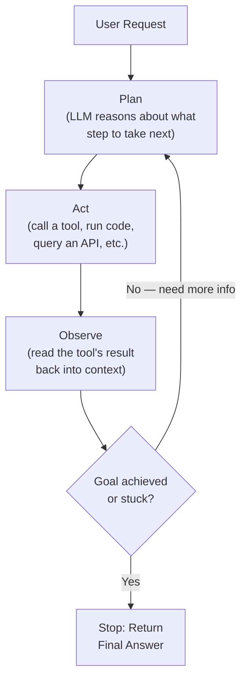
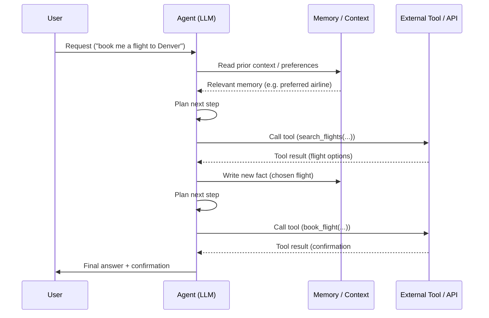
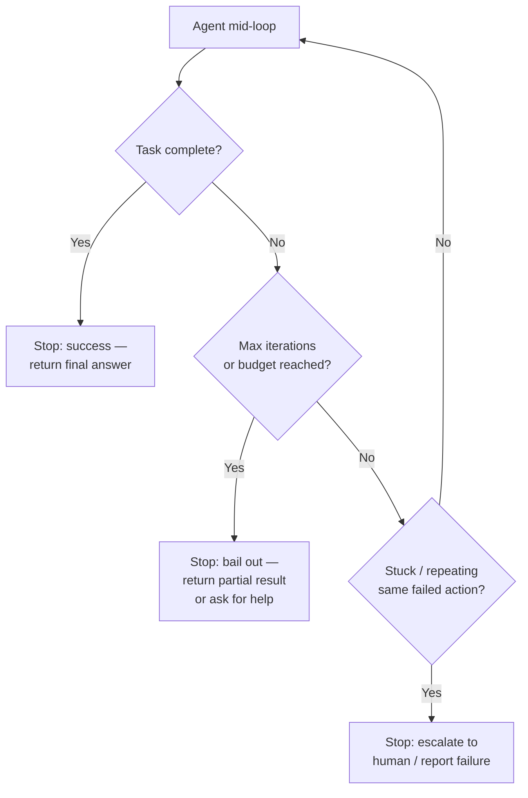

# AI Agent Lifecycle

An AI agent differs from a simple prompt-response LLM call in one key way: it runs a **loop**,
repeatedly deciding what to do next, taking an action (often calling a tool), observing the
result, and deciding again — until it judges the task complete or hits a stopping condition.
The diagrams below trace that loop from the initial user request through to completion.

## 1. The Core Plan → Act → Observe Loop

**What this shows:** the agent doesn't produce one response and stop — it cycles through
planning, acting, and observing as many times as needed, using each observation to inform the
next planning step. This loop is what lets an agent handle multi-step tasks a single LLM call
can't ("find the file, read it, summarize it, then email the summary" requires several
plan/act/observe cycles).

## 2. Where Tool Calls and Memory Fit In

**What this shows:** at each iteration the agent may read from memory (past conversation,
stored preferences, prior task state) before deciding what to do, call an external tool to take
real-world action or fetch real-world data, and write new information back to memory so later
steps (or future sessions) can use it. Tool calls are how an agent affects or observes anything
outside its own context window.

## 3. The Stopping Conditions

**What this shows:** a well-built agent doesn't loop forever — it needs explicit exit
conditions. Success is the happy path, but production agents also need hard iteration/budget
limits and stuck-detection so a confused agent doesn't burn tokens or take repeated harmful
actions indefinitely.

## Key Insight

The defining feature of an agent is the loop, not any single LLM call — plan, act, observe,
repeat, with memory carried across iterations and explicit stopping conditions so the loop
terminates reliably. Everything that makes agents useful (multi-step tasks, tool use, adapting
to unexpected results) and everything that makes them risky (runaway loops, compounding
errors) traces back to this same loop structure.
