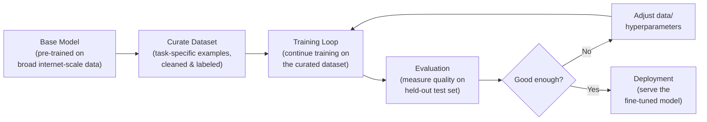
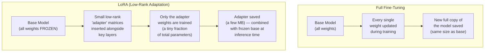
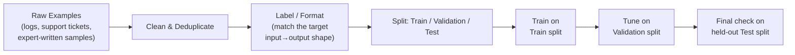
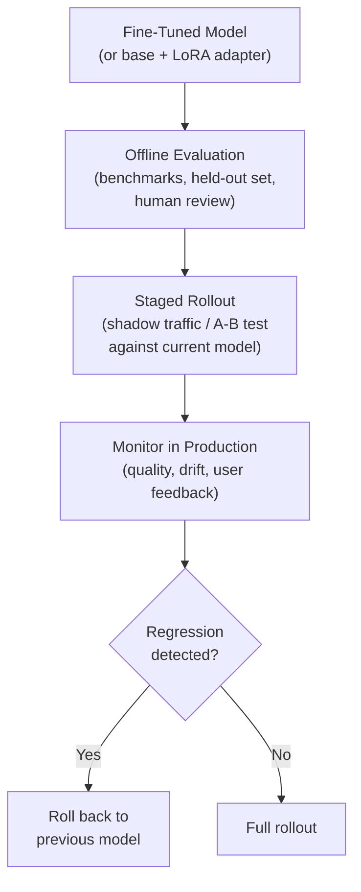

# Fine-Tuning Lifecycle

Fine-tuning takes a general-purpose base model and specializes it for a particular task, domain,
or style by continuing training on a curated, task-specific dataset. It's a fundamentally
different lever from RAG (see the comparison guide for that): instead of retrieving fresh
knowledge at answer time, fine-tuning changes the model's own weights. The diagrams below trace
the lifecycle from base model to deployed, specialized model.

## 1. The End-to-End Lifecycle

**What this shows:** fine-tuning is iterative, not one-shot — a training run is evaluated
against held-out examples, and if quality isn't sufficient, the dataset or training
configuration is adjusted and training runs again. Only once evaluation clears the bar does the
model move to deployment.

## 2. Full Fine-Tuning vs. Parameter-Efficient Fine-Tuning (LoRA)

**What this shows:** full fine-tuning updates every weight in the model, producing a complete
new copy — accurate but expensive in compute, memory, and storage. LoRA instead freezes the
base model entirely and trains small additional low-rank matrices injected into the network;
because only those adapter weights are trained and saved, LoRA fine-tuning is dramatically
cheaper and produces tiny, swappable adapter files instead of a full duplicate model.

## 3. Where Data Quality Enters the Loop

**What this shows:** the training loop itself is often the easy part — most of the practical
effort and most of the risk (bias, leakage, poor generalization) lives in how the dataset is
curated and split. A model is only as good as the examples it's fine-tuned on, and a held-out
test split that never touches training is what makes the final evaluation trustworthy.

## 4. From Training Run to Production

**What this shows:** deployment isn't a single flip of a switch — a fine-tuned model typically
goes through staged rollout and ongoing monitoring so a regression (quality drop, unexpected
behavior on real traffic) can be caught and rolled back before it affects all users.

## Key Insight

Fine-tuning is a cycle, not a one-time event: curate data, train, evaluate, adjust, and only
then deploy — with monitoring continuing after launch. LoRA and other parameter-efficient
techniques don't change *that* cycle, only *how expensive* the training step inside it is,
which is why they've made fine-tuning practical for far more teams and use cases than full
fine-tuning ever was.
