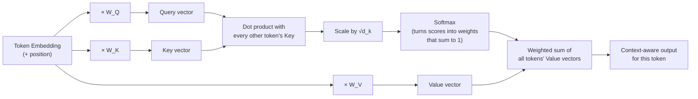
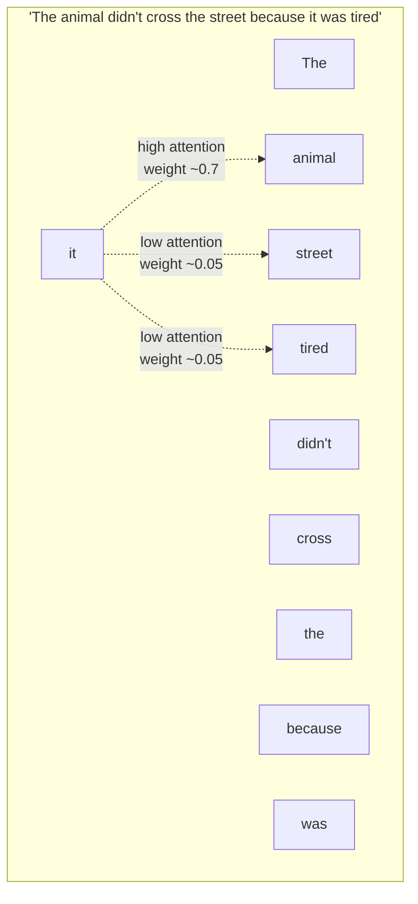
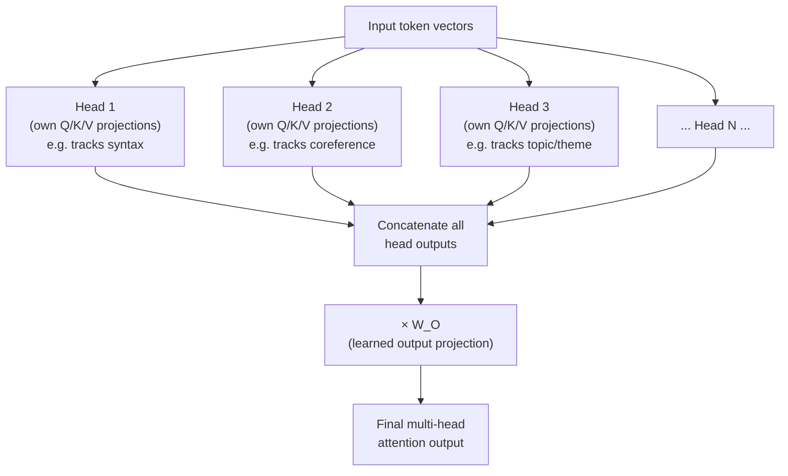

# How Attention Works

Self-attention is the mechanism that lets a transformer decide, for every token, *which other
tokens matter most* when building its contextual meaning. It does this using three learned
projections of each token's vector — a **Query**, a **Key**, and a **Value** — and a similarity
score between queries and keys that determines how much of each value gets blended in. The
diagrams below break down that mechanism step by step, then show how it's run many times in
parallel ("multi-head" attention).

## 1. The Q/K/V Flow for a Single Token

**What this shows:** every token produces three vectors from the same input using three
different learned weight matrices (`W_Q`, `W_K`, `W_V`). Its Query is compared against every
token's Key to produce a similarity score; those scores are scaled, passed through softmax to
become weights, and used to blend every token's Value into this token's new output. Intuitively:
"Query = what am I looking for, Key = what do I contain, Value = what do I actually contribute
if picked."

## 2. Attention Scores Across a Whole Sentence

**What this shows:** when computing the contextual meaning of the word "it", attention assigns
a much higher weight to "animal" than to "street" — resolving the pronoun's referent. This is
the core payoff of attention: it lets the model dynamically route information from the
*relevant* tokens regardless of how far apart they sit in the sequence, something fixed-window
or purely sequential models struggle with.

## 3. Multi-Head Attention: Running It in Parallel

**What this shows:** rather than computing attention once, the model splits the embedding into
several smaller "heads" and runs the whole Q/K/V process independently in each — each head is
free to specialize in a different kind of relationship (syntax, coreference, long-range topic
association, etc.). The heads' outputs are concatenated and projected back to the original
dimension, giving the model several simultaneous "views" of the same sequence instead of one.

## Key Insight

Attention replaces fixed rules for "what to look at" with a learned, per-token, per-context
weighting scheme — every token dynamically decides how much of every other token to absorb.
Multi-head attention multiplies this further by giving the model several independent
relationship-tracking subspaces at once, which is a large part of why transformers capture
long-range dependencies and subtle relationships that earlier architectures missed.
