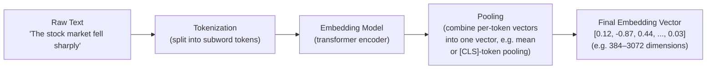
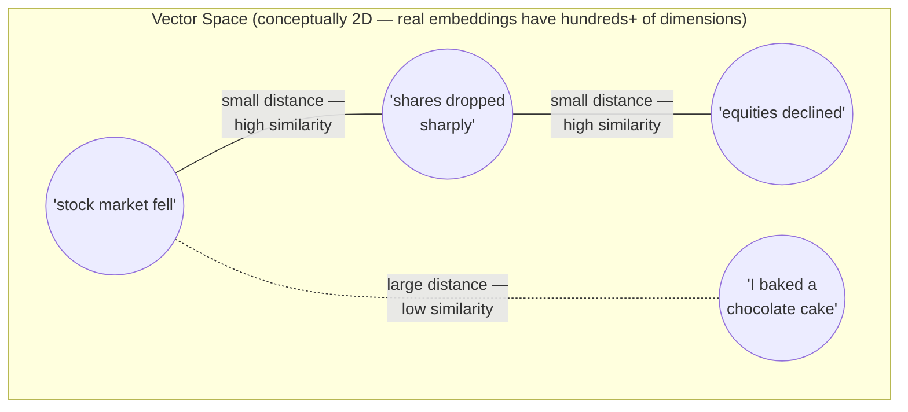
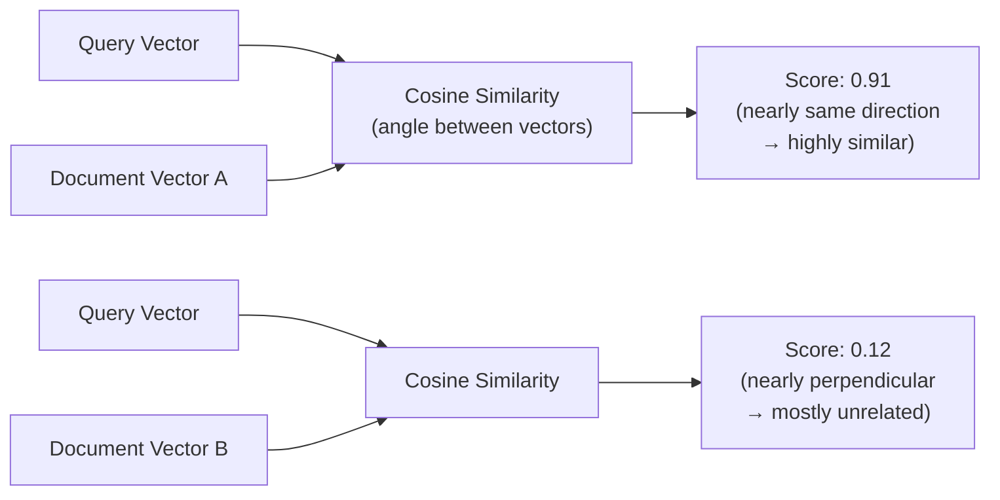

# How Embeddings Work

An embedding is a way of turning text into a list of numbers (a vector) such that texts with
similar *meaning* end up with similar vectors — mathematically close together in a
high-dimensional space. This single idea underlies semantic search, RAG retrieval,
recommendation systems, and clustering. The diagrams below show the pipeline that produces an
embedding and how "closeness" in that vector space maps back to semantic similarity.

## 1. The Text-to-Vector Pipeline

**What this shows:** an embedding model (usually a transformer encoder trained specifically for
this purpose) converts tokenized text into one fixed-length vector, regardless of whether the
input was five words or five hundred. That fixed-length vector is what gets stored, compared,
and searched over — the original text is reduced to a single point in vector space.

## 2. Semantic Similarity as Geometric Proximity

**What this shows:** sentences that mean roughly the same thing ("stock market fell", "shares
dropped sharply", "equities declined") land close together in vector space even though they
share almost no exact words, while an unrelated sentence ("I baked a chocolate cake") lands far
away. This is the entire point of embeddings: they capture *meaning*, not just surface word
overlap, which is what makes semantic search possible (searching by meaning rather than
keyword matching).

## 3. Comparing Vectors: Cosine Similarity

**What this shows:** similarity between two embeddings is typically measured as the cosine of
the angle between them (or equivalently, dot product on normalized vectors) — a score near `1`
means the vectors point in almost the same direction (very similar meaning), while a score near
`0` means they're close to perpendicular (unrelated). This scalar score is what powers "top-k
nearest neighbor" search in a vector database.

## Key Insight

Embeddings turn the fuzzy, human notion of "these two pieces of text mean similar things" into
a concrete, computable geometric property — distance (or angle) between points in a
vector space. Every downstream capability — semantic search, RAG retrieval, deduplication,
clustering, recommendation — is really just "find the nearest points in this space," which is
why the quality of the embedding model itself is often the single biggest lever on retrieval
quality in a RAG system.
