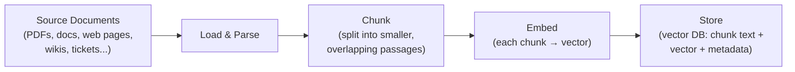
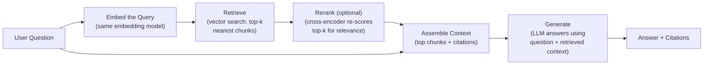
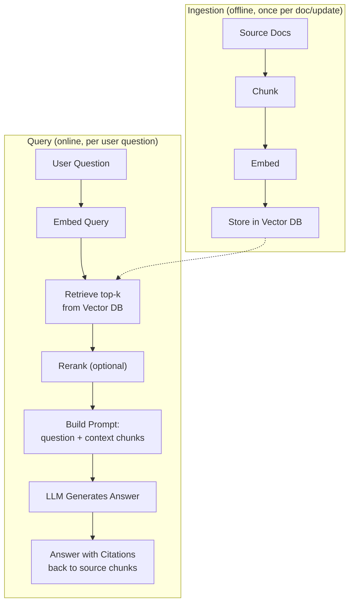
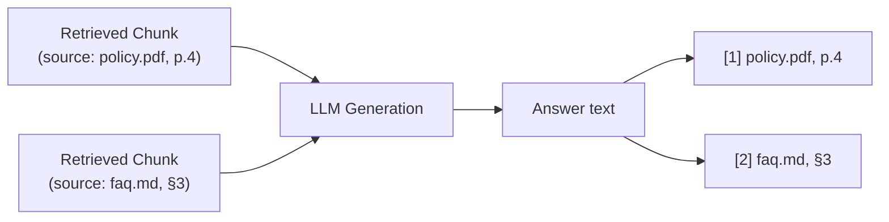

# How RAG Works

Retrieval-Augmented Generation (RAG) grounds an LLM's answers in a specific set of documents
instead of relying only on what the model memorized during training. It splits into two
distinct phases that happen at very different times: an **ingestion** phase (done once, or
whenever documents change) that prepares a searchable knowledge base, and a **query** phase
(done every time a user asks a question) that retrieves relevant material and feeds it to the
LLM as context. The diagrams below cover both phases and how they connect.

## 1. Ingestion Phase: Building the Knowledge Base

**What this shows:** documents are loaded, split into manageable chunks (small enough to be
semantically focused, usually with some overlap so context isn't lost at chunk boundaries),
converted to embedding vectors, and stored in a vector database alongside their original text
and metadata (source, page, timestamp, etc.). This phase runs offline / in the background —
never in the critical path of a user's question.

## 2. Query Phase: Answering a Question

**What this shows:** the user's question is embedded with the *same* model used during
ingestion, used to retrieve the top-k most similar chunks from the vector database, optionally
reranked by a more precise (but slower) cross-encoder model to push the truly best chunks to
the top, then assembled into a prompt alongside the original question. The LLM generates its
answer grounded in that retrieved context rather than from memory alone.

## 3. The Full Pipeline, End to End

**What this shows:** the two phases meet at exactly one point — the vector database populated
during ingestion is what gets searched during every query. This separation is why RAG scales
well: adding new documents only requires re-running ingestion on the new material, not
retraining or fine-tuning the model itself.

## 4. Why Citations Matter

**What this shows:** because each chunk retains its source metadata all the way through
retrieval, the final answer can point back to exactly which document (and often which
page/section) supports each claim — letting a user verify the answer instead of trusting it
blindly, and giving the system a defense against hallucination by making unsupported claims
visibly missing a citation.

## Key Insight

RAG's core trick is separating "what the model knows" from "what the model can look up" —
retrieval supplies fresh, specific, verifiable knowledge at answer time, while the LLM supplies
fluent reasoning and language generation over whatever it's handed. This is fundamentally
different from fine-tuning (which bakes knowledge into model weights): RAG's knowledge base can
be updated instantly by re-ingesting documents, with no retraining required.
