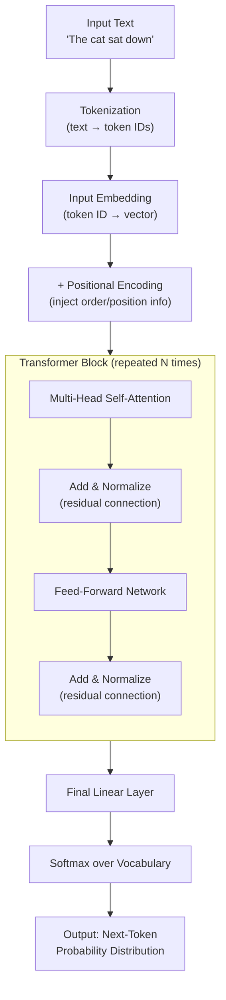
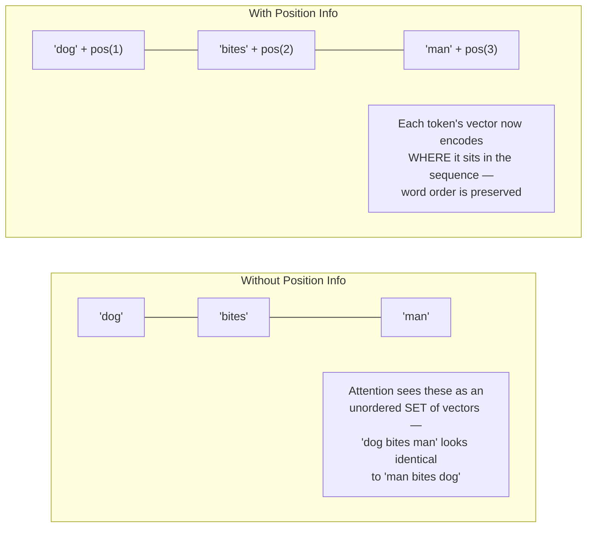
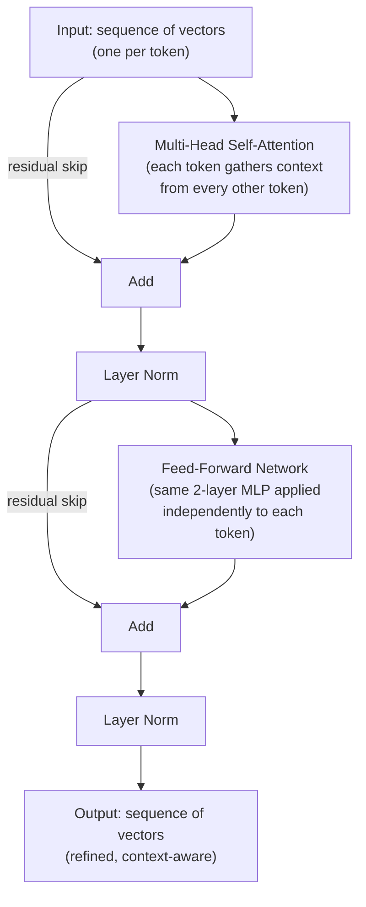
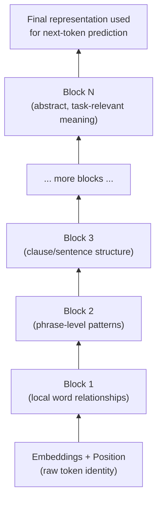

# How Transformers Work

The transformer is the architecture behind essentially every modern LLM (GPT, Claude, Llama,
Gemini). Instead of processing text one word at a time in sequence (like older RNNs), a
transformer looks at an entire sequence of tokens at once and lets every token "attend to"
every other token in parallel. That single design choice — parallel, attention-driven
processing instead of sequential, memory-driven processing — is what made today's large-scale
language models trainable and scalable. The diagrams below walk through the architecture from
raw input to final output.

## 1. The End-to-End Architecture

**What this shows:** the full pass of a token sequence through a transformer — embed, add
position information, pass through a stack of identical blocks (attention + feed-forward, each
wrapped in a residual "add & normalize" step), then project to a probability over the entire
vocabulary for the next token. Everything inside the `Transformer Block` is repeated N times
(e.g. 32, 96+ layers in large models), each layer refining the representation further.

## 2. Why Positional Encoding Is Needed

**What this shows:** self-attention on its own has no built-in sense of order — it treats
input as a set, not a sequence. Positional encoding (fixed sinusoidal patterns in the original
paper, or learned/rotary variants in modern models) is added to each token embedding so the
model can tell "dog bites man" apart from "man bites dog".

## 3. One Transformer Block, Zoomed In

**What this shows:** inside a single block, attention mixes information *across* tokens (each
token gathers relevant context from the rest of the sequence), while the feed-forward network
processes *each token independently*, adding non-linear transformation capacity. The residual
("skip") connections and layer normalization around both sub-layers are what make it possible
to stack dozens of these blocks without training becoming unstable.

## 4. Stacking Blocks Deepens Understanding

**What this shows:** no single layer "understands" language — meaning emerges from stacking
many identical blocks, where each layer builds a progressively more abstract representation on
top of the last. Early layers tend to capture surface patterns (syntax, local word
relationships); deeper layers capture more abstract, task-relevant structure.

## Key Insight

A transformer has no memory and no recurrence — every token sees every other token
simultaneously through attention, and depth (stacked blocks) rather than sequence-by-sequence
recurrence is what builds up understanding. This parallelism is exactly what makes transformers
efficient to train on modern hardware (GPUs/TPUs), which is the practical reason they replaced
RNNs and LSTMs as the default architecture for language modeling.
