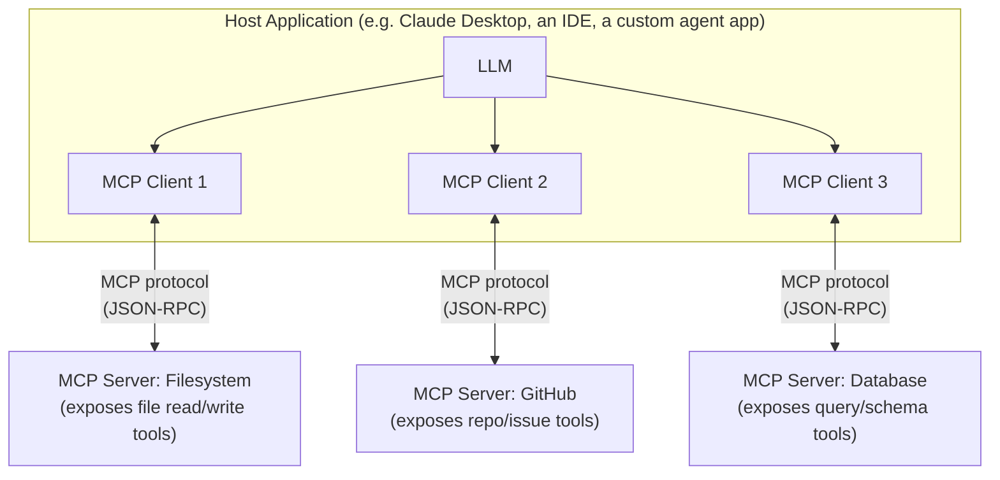
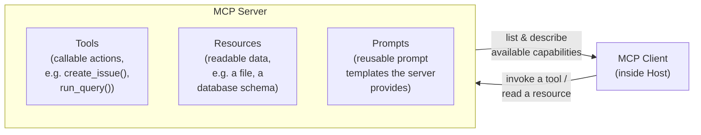
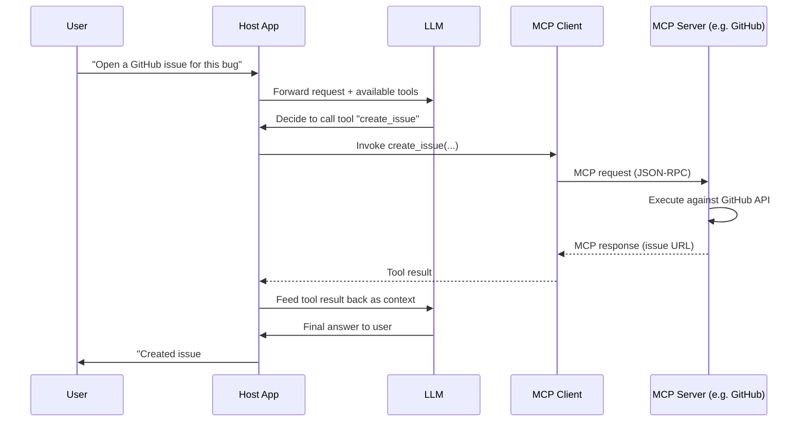

# MCP Architecture

The Model Context Protocol (MCP) is a standardized way for an AI application to connect to
external tools, data sources, and systems without writing a custom integration for every
single one. It defines three roles — **host**, **client**, and **server** — and a common
protocol between them, so any MCP-compatible host can use any MCP-compatible server with no
bespoke glue code. The diagrams below show how those pieces fit together.

## 1. The Host / Client / Server Architecture

**What this shows:** the **host** is the application the user interacts with; it maintains one
**client** connection per **server** it wants to talk to. Each **server** is a separate process
(local or remote) that exposes a specific set of capabilities — one server per integration
(filesystem, GitHub, a database, Slack, etc.) — over the same standardized protocol, so the
host's LLM can call any of them through a uniform interface regardless of what's on the other
side.

## 2. What a Server Exposes to the Host

**What this shows:** an MCP server can expose three kinds of capabilities — **tools** (actions
the LLM can invoke, with defined input/output schemas), **resources** (data the host can read,
like a file's contents or a database schema), and **prompts** (reusable prompt templates the
server author has designed for its own domain). The host discovers what's available by asking
the server to list and describe its capabilities, then the LLM decides when to use them.

## 3. A Full Request Flow

**What this shows:** the LLM itself never talks to the server directly — it decides *that* a
tool should be called and *with what arguments*; the host's MCP client handles the actual
protocol exchange with the server, then the result flows back through the client to the LLM as
new context, exactly like any other tool-call result.

## Key Insight

MCP's value is standardization: without it, every AI application needs custom, one-off code to
talk to every external system (its own auth, its own schema, its own quirks). With it, any
host can plug into any server through the same protocol — tools, resources, and prompts are
described in a uniform way, so integrations become interchangeable, reusable building blocks
instead of bespoke glue code duplicated across every application.
