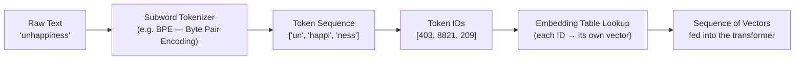
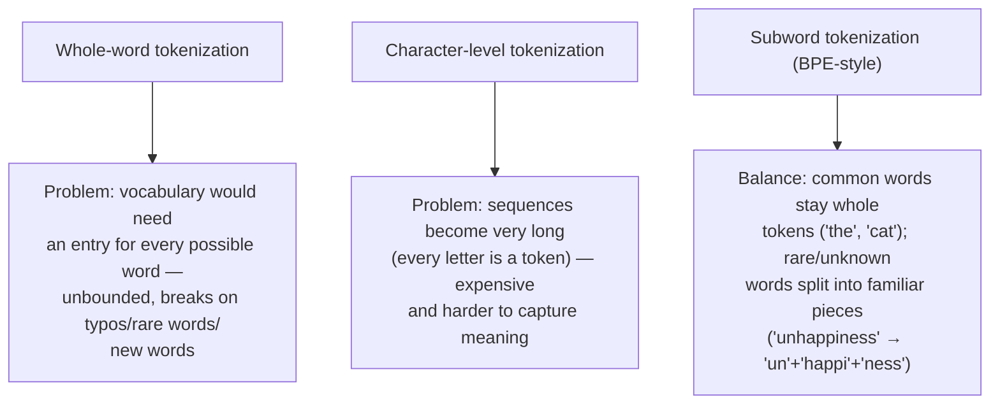
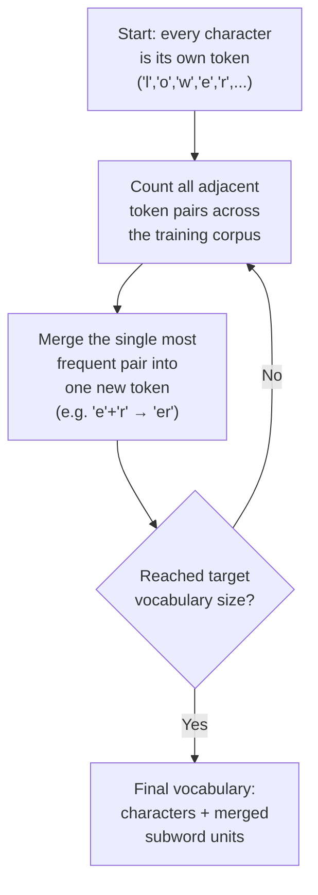
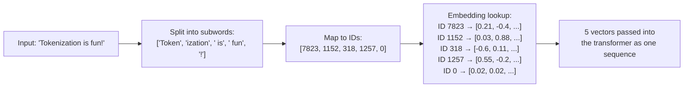

# Tokenization Flow

Before an LLM can process any text, it has to convert that text into numbers. Tokenization is
the first step of that conversion: splitting raw text into a sequence of **subword tokens**
(not whole words, not single characters, but a learned middle ground), mapping each token to a
fixed integer ID, and using that ID to look up the token's embedding vector. The diagrams below
walk through this process with a small worked example.

## 1. The Full Pipeline

**What this shows:** text never goes directly into the model — it's first broken into subword
pieces from a fixed, pre-trained vocabulary, each piece is mapped to an integer ID (its index
in that vocabulary), and each ID is used to look up a learned embedding vector from a big
embedding table. The model's actual input is the final sequence of vectors, not the text
itself.

## 2. Why Subwords (Not Whole Words, Not Characters)

**What this shows:** subword tokenization is a compromise that keeps common words as single
tokens (efficient) while still being able to represent any rare, misspelled, or unseen word by
breaking it into smaller known pieces (robust) — it never needs an "unknown word" fallback the
way whole-word vocabularies do.

## 3. How BPE Builds Its Vocabulary (Training Time)

**What this shows:** Byte Pair Encoding (BPE) — the algorithm behind most modern tokenizers —
builds its vocabulary by repeatedly merging the most frequent adjacent pair of symbols in a
large training corpus, starting from individual characters and growing upward until it reaches
a target vocabulary size (commonly tens of thousands of tokens). This is a one-time training
process done before the language model itself is ever trained.

## 4. Worked Mini Example

**What this shows:** even a short, everyday sentence rarely maps one-to-one with words —
"Tokenization" itself commonly splits into pieces like `Token` + `ization` because the whole
word is less frequent in training data than its parts. Punctuation and leading spaces are often
their own tokens too. This is also why LLM pricing and context limits are measured in *tokens*,
not words — a word count and a token count for the same text are rarely equal.

## Key Insight

Tokenization is the boundary between human-readable text and the numeric world the model
actually operates in — every later step (embeddings, attention, generation) operates purely on
token IDs and their vectors, never on raw characters. Subword tokenization (BPE and its
relatives) is the specific compromise that keeps vocabularies bounded and efficient while still
being able to represent any input text, known word or not.
