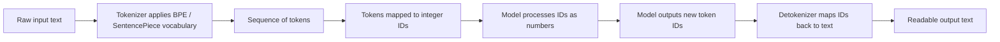
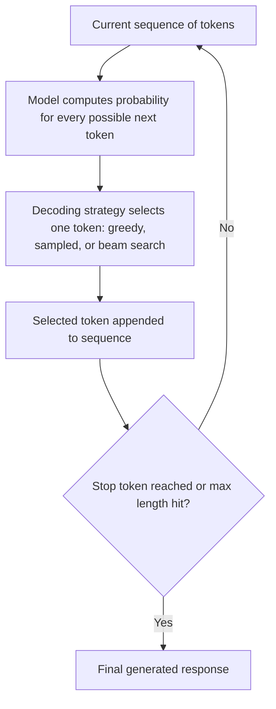
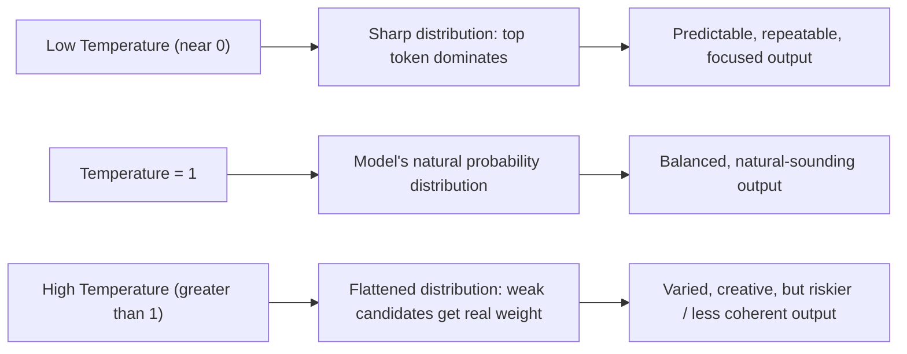
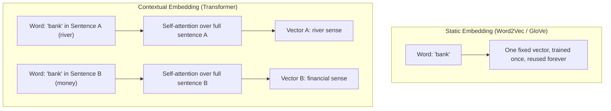
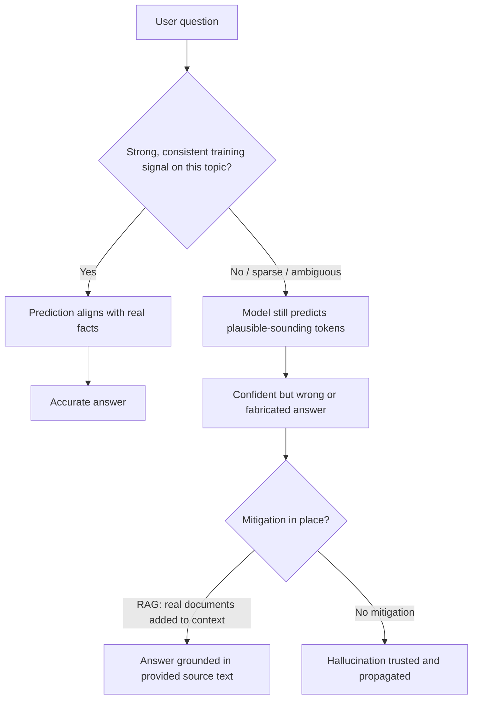

# Week 1 — Diagrams and Workflows

A small set of Mermaid diagrams covering the key workflows and mechanisms from this week, each with a short caption. Use these for a quick visual refresher rather than re-reading full topic pages.

## 1. The Tokenization Pipeline

**Caption:** Every request to a language model passes through this pipeline twice — once to encode your prompt into tokens, and once to decode the model's output tokens back into readable text. Cost, context limits, and even some model quirks (weak arithmetic, uneven multilingual performance) all trace back to this pipeline.

## 2. The Next-Token Generation Loop

**Caption:** This loop is the entire mechanism behind text generation — repeated one token at a time. Everything else this week (temperature, top-p, greedy vs. sampled, hallucination) is really just a detail of what happens inside the "decoding strategy" box.

## 3. Temperature's Effect on Output Diversity

**Caption:** The same underlying probabilities can produce very different-feeling output purely by adjusting temperature — no change to the model's actual knowledge is involved, only how boldly it's willing to pick from its own ranked guesses.

## 4. Static vs. Contextual Embedding Lifecycle

**Caption:** Static embeddings hand out the same "dictionary card" every time a word appears; contextual embeddings recompute a fresh, sentence-specific vector every time, which is how modern models resolve ambiguous words like "bank."

## 5. How Hallucination Happens vs. How It's Mitigated

**Caption:** Hallucination isn't a random glitch — it's the predictable result of asking a pattern-matching system for facts it has weak or no signal on. Retrieval-Augmented Generation (RAG) and independent verification are the two most effective everyday mitigations.
