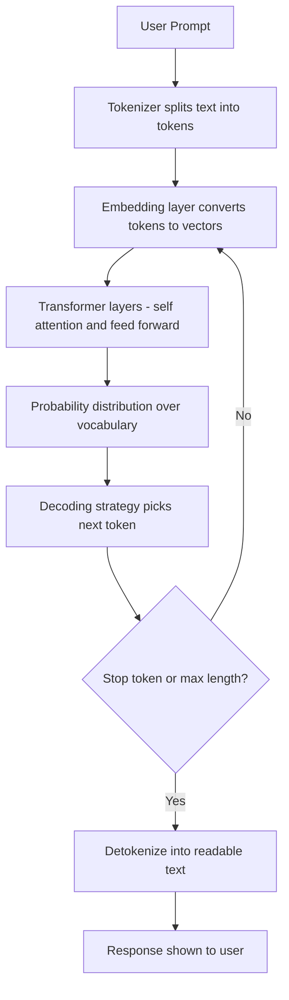

# Language Models

## 1. Introduction

A language model is a program trained to predict what word (or word-fragment) comes next in a piece of text. That single skill — predicting the next chunk of text, over and over — is the entire mechanism behind ChatGPT, Claude, Gemini, and every other modern AI chat tool.

There is no separate "reasoning module," no built-in encyclopedia, and no database of facts being queried. Everything the model does — answering questions, writing code, summarizing documents, holding a conversation — comes from repeatedly guessing the most probable next piece of text given everything written so far.

This topic is the foundation for the entire week. Every other concept (tokens, context windows, sampling, hallucination) only makes sense once you understand this core idea.

## 2. Why This Topic Exists

Before you can use AI tools responsibly, you need an accurate mental model of what they are. Most confusion, misplaced trust, and frustration with AI tools comes from treating them like:

- A search engine (it isn't — it doesn't look things up by default).
- A database (it isn't — it has no guaranteed lookup of stored facts).
- A reasoning engine that "understands" like a human (it doesn't have beliefs or awareness — it has learned statistical patterns).

Understanding "it's a next-word predictor" immediately explains a huge number of real behaviors: why it can be confidently wrong, why it's better at common topics than obscure ones, why longer prompts give better answers, and why it sometimes contradicts itself.

## 3. Core Concept

### Beginner

A language model reads some text (your prompt) and then predicts the single most likely next word. It adds that word to the text, then predicts the next one, and repeats — one word (technically one **token**) at a time — until it decides the answer is complete.

Think of it like the autocomplete on your phone keyboard, but enormously more powerful, trained on a huge slice of the internet, books, and code, and able to keep going for paragraphs while staying coherent and on-topic.

### Intermediate

Formally, a language model estimates a probability distribution over the next token given all previous tokens:

```
P(next_token | all_previous_tokens)
```

It does this using a neural network (almost always a **Transformer** architecture today) with billions of internal numbers ("parameters") tuned during training so that the predicted probabilities match real patterns of human-written text.

Training happens in stages:

1. **Pre-training** — the model reads huge amounts of text and learns to predict the next token, purely by pattern-matching across trillions of examples.
2. **Fine-tuning / instruction-tuning** — the model is further trained on examples of good question-answer behavior so it learns to act like a helpful assistant rather than just "complete random internet text."
3. **Alignment (e.g. RLHF)** — human feedback is used to nudge the model toward answers people rate as helpful, honest, and harmless.

### Advanced

Under the hood, a Transformer-based language model turns each token into a vector (a list of numbers — see **Word Embeddings**), passes those vectors through many stacked layers of **self-attention** and **feed-forward** networks, and produces a final probability score for every possible next token in its vocabulary (often 50,000–200,000 possible tokens).

Key properties worth knowing at this level:

- The model has no persistent memory between separate conversations — it only "knows" what's inside the current context window (see **Context Window**).
- It is **stateless and deterministic given the same inputs and settings** — randomness in output comes from a deliberate sampling step (see **Temperature and Sampling**), not from the model "changing its mind."
- Model "knowledge" is frozen at the point training data was collected — it doesn't know about events after its training cutoff unless that information is added back into the prompt (e.g. via search tools or retrieval).

## 4. Deep Explanation

A language model's entire skill is compressed into its **parameters** — numbers learned during training. When you send a prompt, the model doesn't "think" the way a person does; it runs a fixed mathematical computation:

1. Convert your text into tokens.
2. Convert each token into a vector using an embedding table.
3. Pass the sequence of vectors through the network's layers, where self-attention lets every token "look at" every other token to build contextual meaning.
4. Produce a probability distribution over the entire vocabulary for "what comes next."
5. Pick a token (see decoding strategies), append it, and repeat the whole process for the next token.

Because this process repeats one token at a time, generating a long answer means running the entire network again and again — this is why longer responses take longer and cost more (see **Cost Per Token**).

Crucially, "predicting the next token" and "knowing the truth" are different skills. The model learned that certain word sequences are statistically likely to follow other sequences — it did not learn a verified fact database. Most of the time, "statistically likely" and "factually correct" line up, because most text on a topic tends to be accurate. But they can diverge, which is the root cause of hallucination (see **Hallucination**).

## 5. Step-by-Step Flow

1. **User input** — you type a prompt.
2. **Tokenization** — the prompt is split into tokens the model understands.
3. **Embedding** — each token becomes a numeric vector.
4. **Contextualizing** — the Transformer's attention layers mix information across all tokens so the meaning of each token reflects its context.
5. **Next-token prediction** — the model outputs a probability for every possible next token.
6. **Sampling/decoding** — a strategy (greedy, temperature, top-p, etc.) picks the actual next token.
7. **Loop** — the new token is appended to the sequence, and steps 3–6 repeat.
8. **Stop condition** — generation halts when the model produces a special "end of response" token or hits a length limit.
9. **Detokenization** — tokens are converted back into readable text and shown to the user.

## 6. Architecture Explanation



## 7. Visual Analogy

Imagine an extremely well-read friend playing a word-guessing game: you show them a sentence with the ending covered up, and they guess the next word based on everything they've ever read. Now imagine they play this game continuously — guessing one word, revealing it, then guessing the next — until they've written a whole essay.

They never "look up" facts mid-game; they're relying entirely on pattern memory from everything they've read before. That's a language model: an extremely well-read guesser, guessing one token at a time, never consulting a book while it writes.

## 8. Real Industry Example

Every major AI assistant — ChatGPT (OpenAI's GPT family), Claude (Anthropic), Gemini (Google), and LLaMA-based tools (Meta) — is built on this same next-token-prediction foundation. Companies differentiate through:

- Training data quality and scale.
- Model architecture tweaks (size, attention variants, efficiency tricks).
- Fine-tuning and alignment techniques (how "helpful and safe" the assistant behavior is).
- Additional tools bolted on top, like web search or code execution, which feed *extra* verified text into the context window rather than changing the fundamental prediction mechanism.

For example, when ChatGPT "searches the web," it isn't changing how the underlying model works — it's fetching search results and inserting them into the prompt so the model's next-token predictions are grounded in fresh, real text.

## 9. Common Misconceptions

- **"It understands like a human does."** It recognizes and reproduces patterns in language; it does not have beliefs, consciousness, or genuine understanding in the human sense.
- **"It looks things up when it answers."** By default, no — unless a tool (search, retrieval, plugins) is explicitly connected, it only uses patterns learned during training plus whatever is in the current prompt.
- **"It remembers our past conversations."** Not unless the product explicitly saves and re-injects that history — the model itself has no built-in long-term memory across sessions.
- **"Bigger model always means better answers."** Model size matters, but training data quality, fine-tuning, and prompt quality often matter just as much.

## 10. Best Practices

- Treat every answer as a *plausible draft*, not a verified fact, especially for dates, statistics, citations, and niche topics.
- Give the model relevant facts directly in your prompt when accuracy matters — it reasons better over information you provide than information it must recall from training.
- Ask for reasoning steps or sources when precision counts, and independently verify anything important.
- Remember the model's knowledge has a training cutoff — for very recent events, rely on tools that fetch live information.

## 11. Summary

A language model is fundamentally a next-token predictor: a neural network, usually a Transformer, trained to guess the most probable next chunk of text given everything before it. Generation is an iterative loop — predict, pick, append, repeat — until a stop condition is reached. This single mechanism, scaled up with huge data and parameter counts and refined through instruction-tuning and alignment, produces the fluent, helpful-seeming behavior of tools like ChatGPT and Claude. Understanding this mechanism explains both the power and the limitations (like hallucination) of these systems.

## 12. Key Takeaways

- A language model predicts the next token, repeatedly, to generate text — that's the whole trick.
- It uses learned statistical patterns, not a fact database or live search, by default.
- Generation is an iterative, one-token-at-a-time loop through tokenization, embedding, attention, and decoding.
- Training happens in stages: pre-training, instruction-tuning, and alignment (e.g. RLHF).
- "Sounding right" and "being right" are different things to the model — this is the root of hallucination.
- Model knowledge is frozen at a training cutoff unless external tools supply fresh information.
