# Tokens and Tokenization

## 1. Introduction

A **token** is the basic unit of text that a language model reads and generates. It is not always a whole word — it's often a piece of a word, a whole word, a punctuation mark, or even a single character, depending on how common that chunk is in the model's training data.

**Tokenization** is the process of converting raw text into these tokens before the model can process it, and converting tokens back into readable text afterward. Every single thing a language model does — reading your prompt, "thinking," writing its answer — happens in tokens, not words or sentences.

## 2. Why This Topic Exists

Tokens matter for three very practical reasons:

- **Cost** — nearly every commercial AI API charges per token, not per word or per request. Understanding tokens is understanding your bill (see **Cost Per Token**).
- **Limits** — every model has a maximum number of tokens it can handle at once (the context window). Long documents can silently get cut off.
- **Behavior** — some odd model behaviors (poor performance on rare words, spelling-related tasks, non-English languages, or numbers) trace directly back to how tokenization splits text.

## 3. Core Concept

### Beginner

Imagine chopping a sentence into puzzle pieces before feeding it to the model. Each piece is a token. Common words like "the," "is," and "cat" are usually a single token. Longer or rarer words like "unbelievable" might be chopped into pieces like `un`, `believ`, `able`.

As a rough rule of thumb for English text:

> **1 token ≈ 4 characters ≈ ¾ of a word.**
> So 100 tokens ≈ 75 words, and 1,000 words ≈ roughly 1,300 tokens.

### Intermediate

Modern tokenizers use an algorithm called **Byte-Pair Encoding (BPE)** or similar subword methods (e.g. SentencePiece, WordPiece). These algorithms are built by scanning a huge amount of text and merging the most frequently paired characters/subwords together into single tokens, over and over, until a fixed vocabulary size is reached (commonly 30,000–200,000 tokens).

This means:

- Frequent words ("the," "and," "model") = 1 token.
- Less frequent words = split into 2–4 tokens.
- Rare words, typos, or made-up words = split into many small pieces, sometimes down to individual characters.
- Numbers are often split in unintuitive ways (e.g. "2024" might be one token, but "20249999" could be split into several odd chunks) — this is part of why LLMs are historically weak at arithmetic.

### Advanced

Tokenization is vocabulary- and model-specific — GPT models, Claude models, and LLaMA models each use different tokenizers with different vocabularies, so the *same* sentence can use a different number of tokens across different model families. This is why cost and context-window comparisons across providers are never perfectly apples-to-apples.

Other advanced details:

- Tokenizers typically operate on **bytes**, not Unicode characters directly, which lets them handle any language or emoji without an "unknown token" problem.
- Non-English languages, especially non-Latin scripts (e.g. Hindi, Chinese, Japanese, Korean), often tokenize far less efficiently than English — the same sentence can cost 2–5x more tokens, which has real cost and context-window implications for non-English use cases.
- Whitespace is usually encoded as part of a token (e.g. `" the"` as one token, distinct from `"the"`), which is why token counts can look surprising if you count manually.

## 4. Deep Explanation

Before any prediction happens, the tokenizer runs a fixed lookup process:

1. It has a pre-built vocabulary (a giant list of known tokens, built once from training data using BPE/SentencePiece).
2. Your input text is greedily matched against this vocabulary, breaking unfamiliar words into the largest known sub-pieces.
3. Each token is mapped to a unique integer ID — this is the actual input the neural network receives (not text, numbers).
4. On the way out, the model predicts token IDs, which are mapped back to text fragments and stitched together (**detokenization**).

This is why weird tokenization artifacts happen: if a word was rare or absent in training data, it gets fragmented into small, sometimes semantically meaningless chunks, making it harder for the model to reason about that word fluently.

## 5. Step-by-Step Flow

1. Take raw input text, e.g. `"Tokenization is powerful!"`.
2. The tokenizer scans the text against its vocabulary.
3. Common chunks match directly: `"Tokenization"` → `Token` + `ization`; `" is"` → one token; `" powerful"` → one token; `"!"` → one token.
4. Each token is converted to an integer ID, e.g. `[8241, 1634, 374, 8147, 0]`.
5. These IDs are fed into the model as numbers, never as text.
6. The model outputs new token IDs one at a time during generation.
7. The output IDs are mapped back to text fragments and concatenated to form the final readable response.

## 6. Architecture Explanation

```mermaid
flowchart LR
    A["Raw text: 'Tokenization is powerful!'"] --> B[Tokenizer / BPE vocabulary lookup]
    B --> C["Tokens: Token | ization | is | powerful | !"]
    C --> D["Token IDs: 8241, 1634, 374, 8147, 0"]
    D --> E[Neural network processes IDs as numbers]
    E --> F[Model outputs new token IDs]
    F --> G[Detokenizer maps IDs back to text]
    G --> H[Readable response text]
```

## 7. Visual Analogy

Think of tokenization like a LEGO set. Instead of building with whole pre-molded houses (whole words), you build with a mix of large common bricks (whole common words) and small special bricks (word fragments) for anything unusual. Common structures ("the," "and," "hello") use one big brick. Rare or made-up words need several small bricks snapped together. The final built model only understands bricks — never the picture on the box (raw text) directly.

## 8. Real Industry Example

- OpenAI's GPT models use a tokenizer family called **tiktoken** (e.g. `cl100k_base`, `o200k_base`), and OpenAI publishes a public "Tokenizer" tool where you can paste text and see the exact token split and count.
- Anthropic's Claude models use their own tokenizer with a different vocabulary and slightly different splitting behavior, meaning token counts for the same text differ from GPT's.
- This is a real, practical issue: a company migrating a chatbot from one model provider to another often needs to re-estimate costs and context limits because the *same* prompts and documents tokenize to different counts.

## 9. Common Misconceptions

- **"A token is a word."** False — a token is often a word-piece; short common words are one token, longer or rarer words are split into multiple tokens.
- **"Token count = word count."** They correlate but are not equal. A rough estimate is 1 token ≈ ¾ of a word for English, but this varies by content type (code, numbers, non-English text all differ).
- **"All models tokenize text the same way."** Each model family uses its own tokenizer and vocabulary — token counts for identical text differ across providers.
- **"Tokenization doesn't affect quality."** It does — poor tokenization of rare words, numbers, or non-English text can measurably hurt model performance on those inputs.

## 10. Best Practices

- Use the AI provider's official tokenizer tool or library (e.g. `tiktoken` for OpenAI) to get exact token counts before estimating cost, rather than relying on the rough word-to-token ratio for anything important.
- When working with non-English text, budget extra tokens — the same sentence can cost noticeably more than in English.
- Be aware that very long numbers, code, or unusual formatting can tokenize inefficiently; consider reformatting data (e.g. simplifying tables) if hitting context limits unexpectedly.
- Remember that both your prompt AND the model's response consume tokens — cost and limits apply to both directions.

## 11. Summary

Tokens are the atomic unit of text a language model actually reads and writes — not letters, not words, but algorithmically-derived subword chunks produced by a method like Byte-Pair Encoding. Common words are single tokens; rare words are split into fragments. Every cost calculation, every context-window limit, and some model quirks (weak arithmetic, uneven multilingual performance) trace directly back to how tokenization works. As a working estimate, 1 token is roughly ¾ of an English word, or about 4 characters.

## 12. Key Takeaways

- A token is a chunk of text — often a word-piece, not a whole word.
- Rough estimate: 1 token ≈ 4 characters ≈ ¾ of a word (English).
- Tokenizers are built using subword algorithms like BPE, SentencePiece, or WordPiece.
- Every model family (GPT, Claude, LLaMA) has its own tokenizer and vocabulary — token counts differ across providers for identical text.
- Non-English text and numbers often tokenize less efficiently, increasing cost and consuming more of the context window.
- You pay for tokens in both your prompt and the model's response.
