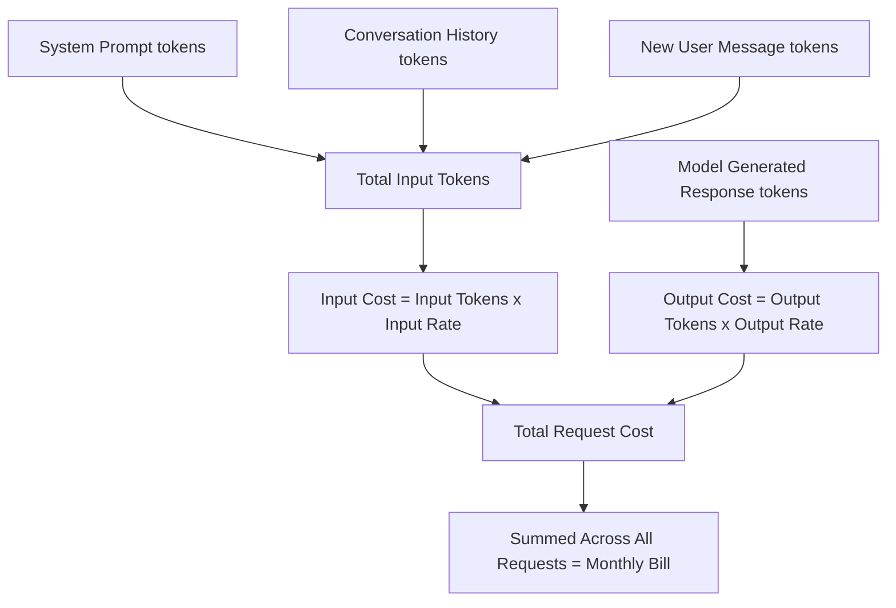

# Cost Per Token

## 1. Introduction

Almost every commercial AI API charges you based on the number of tokens processed, not the number of requests, words, or characters. Understanding cost-per-token is understanding your bill: how much a prompt costs, how much a response costs, and why some tasks are dramatically more expensive than others.

Pricing is typically quoted as a rate **per million tokens (or per 1,000 tokens)**, split into two separate prices: one for **input tokens** (what you send) and one for **output tokens** (what the model generates) — output is almost always priced higher than input.

## 2. Why This Topic Exists

If you're building anything with AI — a chatbot, a summarizer, an internal tool — token-based pricing directly determines whether your product is financially viable at scale. A prompt that seems "free" to test once can become expensive at 100,000 requests a day. Engineers need to reason about cost the same way they reason about cloud compute cost: predictably, and before shipping, not after the bill arrives.

## 3. Core Concept

### Beginner

Every time you send a prompt and get a reply, you're charged for:

- The tokens in your prompt (input).
- The tokens in the model's reply (output).

A longer conversation, a longer document pasted into the prompt, or a longer generated answer all cost more. Nothing is free — even a system prompt (invisible instructions) and prior conversation history you re-send each turn all count as input tokens.

### Intermediate

Pricing structures share a common shape across providers:

| Concept | Meaning |
|---|---|
| Input price | Cost per million (or thousand) tokens sent to the model |
| Output price | Cost per million (or thousand) tokens generated by the model — usually 3-5x the input price |
| Context caching / prompt caching | Discounted rate for reusing large, repeated chunks of context (e.g. a long system prompt) across calls |
| Batch pricing | Discounted rate for non-real-time bulk requests |

Larger, more capable models cost more per token than smaller, faster models. This creates a real engineering trade-off: use the cheapest model that reliably does the job, and reserve the largest models for tasks that actually need their extra capability.

### Advanced

Real cost modeling requires estimating **both** sides of a conversation over its full lifetime, not just one call:

- **Conversation history accumulates.** In a multi-turn chat without a memory-management strategy, each new turn re-sends the entire prior conversation as input tokens — so a 20-turn conversation can cost far more in cumulative input tokens than a single 20th message would suggest.
- **System prompts repeat every call.** A 2,000-token system prompt sent on every single request in a high-traffic app adds up fast — this is exactly the case that prompt/context caching is designed to discount.
- **Output is the expensive lever.** Because output tokens are priced higher and are generated one at a time (computationally more expensive than reading input in parallel), techniques like setting max output length, asking for concise answers, or using cheaper models for drafts and only the best model for final polish meaningfully cut cost.
- **Retrieval-augmented generation (RAG) trades tokens for accuracy.** Injecting retrieved documents into the prompt increases input token cost per call but can reduce hallucination and avoid needing a larger, pricier model.

## 4. Deep Explanation

Cost-per-token pricing exists because of *how* inference actually works computationally: processing tokens consumes GPU compute and memory proportional to sequence length (roughly quadratic-ish for attention, though optimized in practice), so providers pass that compute cost on directly per token processed and generated.

This is fundamentally different from traditional software billing (per API call, per seat, per month) — it's usage-metered like electricity, but metered in tokens instead of kilowatt-hours. A one-line prompt asking for a 3,000-word essay may look cheap on the input side but be expensive on the output side, while pasting a 10-page document to summarize is expensive on the input side but cheap on output.

## 5. Step-by-Step Flow

1. You send a request containing a system prompt, conversation history, and your new message.
2. The API counts total **input tokens** across everything sent.
3. The model generates a response, and the API counts **output tokens** as they're produced.
4. Your bill = (input tokens × input rate) + (output tokens × output rate).
5. If caching is enabled and part of the input matches a previous call, that portion may be billed at a discounted cached rate.
6. Over a billing period, all calls are summed to produce your total usage cost.

## 6. Architecture Explanation

## 7. Visual Analogy

Think of a taxi meter that charges separately for two things: the distance you traveled to get in the cab (your prompt, the setup) and the distance the driver takes you to your destination (the model's answer). Both segments cost money, and the "destination" segment (output) is charged at a higher per-mile rate than the "pickup" segment (input). The longer either segment, the bigger the fare — and if you keep the same cab idling with the meter running while you chat over multiple stops (multi-turn conversation), every stop re-bills the distance already traveled.

## 8. Real Industry Example

- OpenAI, Anthropic, and Google all publish per-model, per-million-token pricing (e.g. a smaller/faster model priced far below a flagship model, with output priced several times higher than input for the same model).
- Anthropic's Claude API offers **prompt caching**, which can cut costs substantially for repeated large contexts (like a fixed system prompt, a codebase, or reference documents reused across many calls) by charging a reduced rate on cache hits.
- Companies building customer-support chatbots often route easy/common questions to a cheap, fast model and only escalate complex questions to an expensive flagship model — a practice called **model routing** — purely to control token cost at scale.

## 9. Common Misconceptions

- **"Pricing is per request."** No — it's per token, so identical requests can cost wildly different amounts depending on prompt and response length.
- **"Input and output cost the same."** They don't — output tokens are typically priced several times higher than input tokens.
- **"A short question is always cheap."** Not if it triggers a long answer, or if it's the 30th turn in a conversation carrying a large accumulated history.
- **"Caching means it's free the second time."** Caching discounts repeated content, but it isn't free — and cache eligibility has specific rules (e.g. minimum size, exact-prefix matching) that vary by provider.

## 10. Best Practices

- Estimate token counts (input + expected output) before shipping a feature, using the provider's tokenizer tool.
- Trim or summarize conversation history instead of resending the full unbounded transcript every turn.
- Set explicit max-output-length limits to avoid runaway generation costs.
- Use the smallest/cheapest model that meets quality requirements for each specific task; reserve top-tier models for tasks that truly need them.
- Use prompt/context caching for large, frequently reused context like system prompts or reference documents.

## 11. Summary

AI API pricing is metered per token, split into an input rate and a (usually higher) output rate. Because token count depends on prompt length, conversation history, and response length, real cost can vary enormously between seemingly similar requests. Engineering for cost means measuring token counts up front, controlling response length, trimming or caching repeated context, and matching model size to task difficulty rather than defaulting to the most powerful (and most expensive) model for everything.

## 12. Key Takeaways

- You pay per token, not per request — both input and output tokens count.
- Output tokens are typically priced several times higher than input tokens.
- Multi-turn conversations re-send prior history each turn, so cost compounds as conversations grow.
- Prompt/context caching can significantly discount repeated large context like system prompts.
- Matching the cheapest capable model to each task is one of the biggest cost levers available.
- Cost estimation should happen before shipping a feature, not after the first bill.
