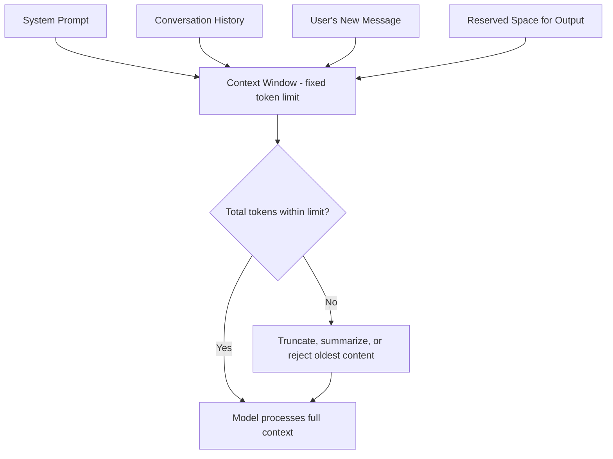

# Context Window

## 1. Introduction

The **context window** is the maximum amount of text (measured in tokens) a language model can "see" and consider at one time — including your system prompt, the conversation history, any documents you paste in, and the response it's currently generating.

If the total tokens in a conversation exceed the context window, something has to give: the oldest parts of the conversation get dropped, truncated, or summarized, and the model literally cannot "remember" or reference anything outside that window.

## 2. Why This Topic Exists

The context window explains some of the most confusing real-world AI behavior: why a chatbot "forgets" something you said earlier, why pasting a huge document sometimes fails or gets summarized oddly, and why longer conversations can start to feel less coherent. It's also directly tied to cost — a bigger context window means more tokens can be sent per request, and providers charge for every one of them.

## 3. Core Concept

### Beginner

Think of the context window as the model's short-term memory span. It's measured in tokens, and every model has a fixed limit — common sizes today range from around 8,000 tokens (older/smaller models) to over 1,000,000 tokens (newer large-context models). Once you exceed the limit, older content has to be dropped for new content to fit.

### Intermediate

The context window is shared between everything present in a single call:

- The system prompt (hidden instructions defining the assistant's behavior).
- The full conversation history sent so far (unless the app manages/truncates it).
- Any documents, code, or data pasted into the prompt.
- The space reserved for the model's own output.

If input + expected output exceeds the limit, the request either fails, gets truncated, or (in well-designed apps) triggers a strategy like summarizing older turns to free up space. This is why chat apps sometimes feel like they "lose the thread" in very long conversations — older messages may be quietly dropped or compressed.

### Advanced

Context window size is an architectural property of the model, tied to how it handles positional information and to the computational cost of self-attention, which historically scaled roughly quadratically with sequence length (longer context = disproportionately more compute and memory). Newer architectural techniques (e.g. more efficient attention variants, sliding-window attention, and better positional encoding schemes like RoPE) have allowed providers to push context windows from a few thousand tokens to hundreds of thousands or even millions of tokens, while keeping inference cost manageable.

Important nuance: a large context window does not guarantee the model *uses* everything in it equally well. Research on long-context models has repeatedly found a "lost in the middle" effect — models tend to pay more attention to information near the start and end of a long context, and can under-use information buried deep in the middle, even though it's technically "in view."

## 4. Deep Explanation

Every token in the context window participates in the self-attention computation — every token's meaning gets refined by "looking at" every other token in the window. This is powerful (it's why the model can reference something you said several paragraphs ago) but expensive: doubling the context length multiplies the attention computation, which is why context windows historically grew slowly and why very large windows are still relatively costly to use.

Practically, "context window" and "memory" are often confused:

- **Context window** = what's visible to the model in *this specific request*.
- **Memory** (as in ChatGPT's "memory" feature or similar) = a separate product feature that stores facts about you *outside* the model and re-inserts them into the context window on future requests. It's not the model "remembering" — it's an engineered system feeding old information back in as fresh input tokens.

## 5. Step-by-Step Flow

1. A conversation begins; the system prompt and first user message occupy some tokens of the context window.
2. The model generates a response, consuming more tokens.
3. On the next turn, the *entire prior exchange* (system prompt + all previous turns + new message) is resent as input, because the model itself doesn't retain memory between calls.
4. As the conversation grows, total tokens climb toward the context window limit.
5. If the limit is reached, the application must choose a strategy: truncate the oldest turns, summarize old turns into a shorter form, or reject/warn the user.
6. The model only ever "sees" whatever tokens are actually included in that specific request's context window.

## 6. Architecture Explanation

## 7. Visual Analogy

Picture a whiteboard of fixed size that the model can look at while composing a reply. Everything relevant — instructions, past conversation, documents — has to be written on that whiteboard. If the conversation runs long, new writing has to erase the oldest notes to make room. The model can only base its answer on what's currently written on the board right now — nothing erased is remembered, no matter how important it was.

## 8. Real Industry Example

- Early GPT-3.5-era models had context windows around 4,000–8,000 tokens (roughly a few pages of text); modern flagship models from OpenAI, Anthropic, and Google now offer context windows of 128,000 to over 1,000,000 tokens, enabling entire books, codebases, or hours of transcripts to be processed in a single request.
- Legal and research tools built on large-context models (e.g. reviewing a 300-page contract in one pass) are a direct product of expanded context windows — something simply impossible on older 4K-token models.
- Coding assistants that read an entire codebase to answer a question rely heavily on large context windows, since useful answers often depend on code spread across many files.

## 9. Common Misconceptions

- **"A big context window means the model remembers everything perfectly."** Large windows can still suffer from uneven attention across very long inputs (the "lost in the middle" effect) — inclusion isn't the same as equal usage.
- **"The model remembers past chats after this conversation ends."** No — unless a separate memory feature explicitly re-injects saved facts, each new conversation starts with an empty context window.
- **"Context window and cost are unrelated."** They're directly linked — every token inside the context window, including resent history, is billed input tokens.
- **"Exceeding the limit just gets ignored gracefully."** Depending on the app, exceeding the limit can cause errors, silent truncation, or degraded answers — it's not always handled invisibly.

## 10. Best Practices

- Track approximate token usage in long conversations, especially in apps you build yourself.
- Summarize or prune old conversation turns instead of endlessly appending full history.
- For large documents, consider retrieval (fetching only the relevant sections) instead of pasting an entire document into context every time.
- Put the most important instructions/information near the start or end of a long prompt, given the "lost in the middle" tendency.
- Choose a model with a context window sized to your actual use case — don't pay for a huge window you don't need, but don't under-provision for genuinely long documents either.

## 11. Summary

The context window is the fixed-size token "workspace" a model uses for a single request — encompassing system instructions, conversation history, pasted content, and the space needed for its response. It directly determines how much information a model can consider at once, shapes real product behavior like forgetting older turns, and has a direct, linear relationship with cost, since every token inside it is billed. Modern models have dramatically expanded context windows, but bigger doesn't always mean uniformly better use of that space.

## 12. Key Takeaways

- The context window is the maximum tokens (input + output) a model can process in one request.
- It includes the system prompt, full conversation history, pasted documents, and reserved output space.
- Exceeding the limit forces truncation, summarization, or rejection of older content.
- The model has no memory outside the current context window unless a separate feature re-injects saved information.
- Larger context windows enable whole-document/codebase use cases but can suffer from uneven attention ("lost in the middle").
- Every token inside the context window is billed, so context size and cost are directly linked.
