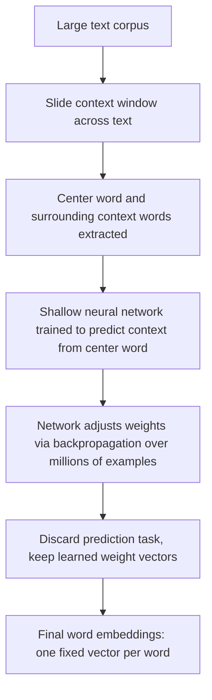

# Word Embeddings (Word2Vec, GloVe)

## 1. Introduction

A **word embedding** is a way of representing a word as a list of numbers (a vector) so that a computer — which only understands numbers, not language — can work with meaning mathematically. Instead of treating "king," "queen," and "car" as unrelated symbols, embeddings place words in a numeric space where similar or related words end up near each other.

**Word2Vec** and **GloVe** are two foundational (pre-Transformer) techniques for learning these embeddings from large amounts of text, and they laid the conceptual groundwork for how modern language models represent words and tokens internally.

## 2. Why This Topic Exists

Before a language model can predict the next token, it must first turn each token into something math can operate on. Understanding embeddings answers the question "how does a neural network 'understand' words at all?" It's also the historical bridge between classic NLP (natural language processing) and today's Transformer-based language models — the same core idea (represent meaning as vectors) still powers modern models, just learned differently and used more richly (see **Static vs Contextual Embeddings**).

## 3. Core Concept

### Beginner

Imagine every word gets assigned a list of numbers, like coordinates on a map — for example `"king" = [0.21, -0.45, 0.88, ...]`. Words with similar meanings get coordinates that are close together, so `"king"` and `"queen"` end up near each other, while `"king"` and `"banana"` end up far apart. This lets a computer measure how related two words are just by measuring the distance between their number-lists.

### Intermediate

Word2Vec and GloVe both learn embeddings from patterns of word co-occurrence in huge amounts of text, but with different approaches:

| Method | Core idea | How it learns |
|---|---|---|
| **Word2Vec** | A word's meaning is defined by its neighbors ("you shall know a word by the company it keeps") | Trains a small neural network to predict a word from its surrounding context (CBOW) or predict surrounding context from a word (Skip-gram) |
| **GloVe** | Meaning comes from global word co-occurrence statistics across the whole corpus | Builds a giant word-by-word co-occurrence count matrix, then factorizes it into dense vectors that preserve those co-occurrence ratios |

Both produce the same kind of output: a fixed vector per word, typically 100–300 numbers long, learned once from a large text corpus.

A famous illustration of what these vectors capture is vector arithmetic:

```
vector("king") - vector("man") + vector("woman") ≈ vector("queen")
```

This shows the embedding space captures relationships (like gender or plurality) as consistent directions, not just similarity.

### Advanced

Both methods produce **static** embeddings — a single fixed vector per word, regardless of context (see **Static vs Contextual Embeddings**). This is a real limitation: the word "bank" gets exactly one vector, blending "riverbank" and "financial bank" senses together, because Word2Vec/GloVe cannot tell which meaning is intended in a given sentence.

Technically:

- Word2Vec is a **predictive** model — it's trained via a lightweight neural network objective (a shallow network with one hidden layer) using techniques like negative sampling to make training efficient over huge vocabularies.
- GloVe is a **count-based** model — it explicitly builds a co-occurrence matrix (how often word A appears near word B across a huge corpus) and finds vectors whose dot products approximate the log of those co-occurrence counts.
- Despite different derivations, both converge on embedding spaces with similar useful properties (analogy structure, clustering by semantic/syntactic similarity), which is part of why they were both influential.
- These pre-trained embeddings were often used as the *first layer* of larger NLP models before the Transformer era — a technique called using "pre-trained embeddings" as initialization.

## 4. Deep Explanation

Word2Vec (Skip-gram variant) trains a small neural network on a simple task: given a word, predict the words that tend to appear near it in real text. The network never actually gets used for that prediction task in production — instead, the *weights* the network learns while getting good at that task become the word embeddings. Words that end up needing similar surrounding-word predictions naturally get similar internal weight patterns, i.e. similar vectors.

GloVe instead starts directly from statistics: it counts, across an entire corpus, how often every pair of words appears near each other, producing a huge co-occurrence matrix. It then finds a lower-dimensional vector for each word such that the mathematical relationship between vectors (dot products) matches the observed co-occurrence ratios. This is closer to classical matrix factorization techniques than to a predictive neural network.

Both approaches share the same underlying assumption, called the **distributional hypothesis**: words that occur in similar contexts tend to have similar meanings. This single assumption, extracted at massive scale from text, is enough to produce surprisingly rich, structured representations of meaning — without any explicit dictionary, grammar rules, or hand-labeled data.

## 5. Step-by-Step Flow (Word2Vec, Skip-gram)

1. Collect a huge corpus of text.
2. Slide a small window (e.g. 5 words) across the text; for each center word, treat the surrounding words as its "context."
3. Train a shallow neural network: input = center word, task = predict the context words.
4. Adjust the network's internal weights via backpropagation so its predictions improve over millions of examples.
5. After training, discard the prediction task itself — keep only the learned weight vectors, one per vocabulary word.
6. These vectors are the final word embeddings, usable for similarity, clustering, or as input to other models.

## 6. Architecture Explanation



## 7. Visual Analogy

Imagine plotting every word in a language as a point on a giant map, based purely on which other words tend to appear near it in real sentences. Words that show up in similar sentences — "dog" and "puppy," "happy" and "joyful" — end up clustered in the same neighborhood of the map. Words that never appear in similar contexts — "dog" and "algebra" — end up far apart. Word2Vec and GloVe are two different surveying methods for drawing this same kind of map from raw text.

## 8. Real Industry Example

- Google published Word2Vec in 2013, and it quickly became a standard building block across the NLP industry for tasks like search relevance, recommendation systems, and document clustering — representing products, users, or documents as vectors so "similarity" could be computed mathematically.
- Stanford's GloVe embeddings (trained on massive web crawls and Wikipedia) became a widely used off-the-shelf resource — many research papers and production systems in the 2014–2018 era simply downloaded pre-trained GloVe vectors instead of training their own.
- Modern recommendation and search systems still use the same core idea (embed items as vectors, measure similarity) even though the embeddings themselves are now typically learned by much larger, contextual models rather than Word2Vec/GloVe directly.

## 9. Common Misconceptions

- **"Word2Vec and GloVe are the same algorithm."** They're conceptually related but mechanically different — one is predictive/neural (Word2Vec), the other is count-based/statistical (GloVe).
- **"Embeddings capture 'true meaning.'"** They capture statistical patterns of word usage in the training corpus — including any biases present in that text — not verified semantic truth.
- **"These techniques are how modern LLMs work."** Modern Transformer-based models use contextual embeddings that change per sentence, a significant evolution beyond Word2Vec/GloVe's one-vector-per-word approach (see next topic).
- **"A word only has one embedding, full stop."** True only for static embedding methods like these — it's precisely the limitation that contextual embeddings were built to solve.

## 10. Best Practices

- Use static embeddings (Word2Vec/GloVe) for lightweight, fast tasks like keyword similarity, clustering, or simple recommendation systems where full contextual understanding isn't required.
- Don't rely on static embeddings when word sense matters (e.g. distinguishing "bank" the riverbank from "bank" the institution) — use contextual embeddings instead.
- When using pre-trained embeddings trained on public web text, be aware they can encode and reproduce societal biases present in that text.
- Treat vector-arithmetic analogies (`king - man + woman ≈ queen`) as illustrative, not perfectly reliable — real embedding spaces have many messy exceptions.

## 11. Summary

Word2Vec and GloVe are foundational techniques for turning words into numeric vectors that capture meaning through statistical patterns of usage across huge amounts of text. Word2Vec learns embeddings by training a neural network to predict context from a word (or vice versa); GloVe learns them by factorizing a global word co-occurrence matrix. Both produce one fixed vector per word — a real limitation later solved by contextual embeddings — but they established the core insight that still underlies modern language models: meaning can be represented, and computed with, as vectors in a numeric space.

## 12. Key Takeaways

- Word embeddings represent words as numeric vectors so meaning can be computed mathematically.
- Word2Vec learns embeddings via a predictive neural network task (predict context from word, or vice versa).
- GloVe learns embeddings by factorizing a global word co-occurrence count matrix.
- Both rely on the distributional hypothesis: words in similar contexts have similar meanings.
- Both produce static embeddings — one fixed vector per word, regardless of sentence context.
- These techniques are the conceptual ancestor of the contextual embeddings used inside modern Transformer-based language models.
