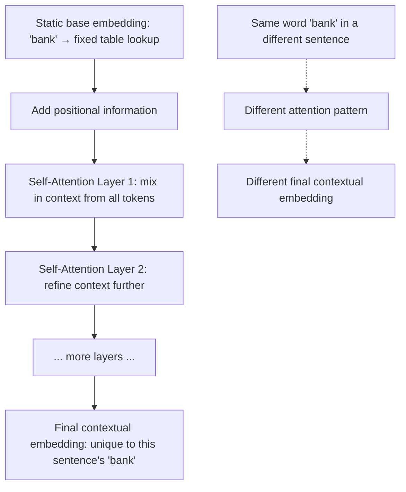

# Static vs Contextual Embeddings

## 1. Introduction

**Static embeddings** (like Word2Vec and GloVe) give every word exactly one fixed vector, no matter what sentence it appears in. **Contextual embeddings**, used inside modern Transformer-based language models, give a word a *different* vector every time, depending on the surrounding words in that specific sentence.

This distinction is one of the most important upgrades between classic NLP and modern large language models — it's a big part of *why* today's models handle ambiguity, tone, and nuance so much better than older systems.

## 2. Why This Topic Exists

The word "bank" means something completely different in "I sat by the river **bank**" versus "I deposited money at the **bank**." Static embeddings cannot tell these apart — they collapse both meanings into one shared vector. Understanding contextual embeddings explains how modern models resolve exactly this kind of ambiguity, and clarifies what actually changed when the field moved from Word2Vec-style NLP to Transformer-based language models.

## 3. Core Concept

### Beginner

- **Static embedding:** one fixed "dictionary entry" vector per word — the same vector for "bank" every single time it appears, anywhere.
- **Contextual embedding:** a "live" vector computed fresh for each occurrence of a word, based on the specific sentence it's in — so "bank" gets a different vector in a river sentence than in a money sentence.

### Intermediate

| Aspect | Static Embeddings | Contextual Embeddings |
|---|---|---|
| Example methods | Word2Vec, GloVe | BERT, GPT, Claude, other Transformer models |
| Vectors per word | One, fixed forever | Many, recomputed per occurrence |
| Handles ambiguity? | No — one vector blends all senses | Yes — different senses get different vectors |
| How it's computed | Looked up from a pre-built table | Computed on the fly using self-attention over the whole sentence |
| Computational cost | Very cheap (simple lookup) | More expensive (requires running the full model) |
| Typical use today | Lightweight similarity/clustering tasks | Nearly all modern language understanding and generation |

Contextual embeddings are produced by a Transformer's self-attention mechanism: every token's vector gets updated by "attending to" every other token in the sentence, so the final vector for a word encodes both its identity and its specific surrounding context.

### Advanced

Static embeddings are essentially a lookup table — computed once during training and frozen afterward. Contextual embeddings are dynamic outputs of a running neural network — every layer of a Transformer produces progressively more context-aware representations, and the vector for a token can (and does) differ across every layer of the network, not just across sentences.

This means a single word like "bank" doesn't just get two vectors (river vs. money) — it can get subtly different vectors depending on tense, tone, surrounding clauses, and even the broader document, because attention lets *every* other token in the context window influence it. This is also why contextual embeddings can't be simply "downloaded" and reused like GloVe vectors — they only exist as an intermediate computation inside a specific forward pass of a specific model, on a specific piece of text.

## 4. Deep Explanation

In a Transformer, tokens start out with a static base embedding (a lookup from an embedding table, similar in spirit to Word2Vec) plus a positional signal indicating where the token sits in the sequence. That's just the starting point. The real work happens in the self-attention layers: for every token, the model computes how much attention to pay to every *other* token in the input, then blends information accordingly.

After passing through many stacked layers of this attention process, each token's final vector is no longer just "the meaning of this word" — it's "the meaning of this word, given everything else in this specific sentence/paragraph." That final, context-infused vector is the contextual embedding, and it's what actually feeds into the next-token prediction step described in **Language Models**.

## 5. Step-by-Step Flow

1. Each token starts with a static embedding (looked up from a table) plus positional information.
2. The sequence of token vectors is passed into the first self-attention layer.
3. Each token's vector is updated based on weighted attention to every other token in the sequence.
4. The updated vectors pass into the next layer, where the process repeats, refining context further.
5. After many layers, each token has a rich, context-specific final vector.
6. These final contextual vectors are used for the task at hand — e.g. predicting the next token, or classifying sentiment.

## 6. Architecture Explanation

## 7. Visual Analogy

A static embedding is like a single dictionary definition printed on a card — the same card is handed out every time the word appears, no matter the sentence. A contextual embedding is like asking a knowledgeable friend to explain the word *after reading the whole sentence* — they give you a tailored explanation each time, correctly picking "riverbank" or "financial bank" depending on what else is going on around it.

## 8. Real Industry Example

- **BERT** (Google, 2018) was one of the first widely-used contextual embedding models, dramatically improving performance on tasks like question answering and search relevance by understanding that word meaning depends on context.
- Every modern conversational AI system — ChatGPT, Claude, Gemini — relies entirely on contextual embeddings internally; static embeddings are essentially retired from state-of-the-art language understanding, though still used in smaller, cheaper auxiliary systems (e.g. some search/recommendation pipelines) where full contextual processing is overkill.
- Semantic search and vector-database products today typically use *sentence-level* contextual embeddings (a single vector summarizing a whole sentence/paragraph's contextual meaning) to power similarity search over documents — a direct descendant of both static and contextual embedding ideas.

## 9. Common Misconceptions

- **"Contextual embeddings are just bigger static embeddings."** No — the core difference is architectural: static embeddings are a fixed table, contextual embeddings are computed dynamically per input via attention.
- **"Static embeddings are obsolete and useless now."** They're still useful for lightweight, low-cost tasks where full contextual nuance isn't needed, and they remain simpler to compute and store.
- **"A word has one 'true' contextual embedding."** It doesn't — the same word can have different contextual embeddings even within different layers of the same model on the same sentence.
- **"Contextual embeddings can be pre-computed and cached like GloVe vectors."** Generally not in the same reusable way — they depend on the specific surrounding text, so they're recomputed per input (though some systems do cache sentence-level embeddings for fixed documents).

## 10. Best Practices

- Choose static embeddings for simple, cheap, high-volume similarity tasks where ambiguity resolution doesn't matter much.
- Choose contextual embeddings (i.e., a Transformer-based model) whenever meaning depends on surrounding context — which is most real language understanding and generation tasks.
- When building semantic search, understand whether your embedding model produces sentence-level contextual vectors (most modern systems) versus older static, word-level vectors.
- Don't assume improving embeddings alone fixes ambiguity problems in a system still built on static, pre-Transformer techniques — the architecture, not just the data, needs to change.

## 11. Summary

Static embeddings (Word2Vec, GloVe) assign one fixed vector per word, forever — a simple, cheap, but ambiguity-blind representation. Contextual embeddings, produced by Transformer self-attention, compute a fresh vector for each word every time, shaped by its specific surrounding sentence. This shift — from a frozen lookup table to a dynamic, context-sensitive computation — is one of the key architectural advances that made modern language models dramatically better at handling nuance, ambiguity, and meaning than earlier NLP systems.

## 12. Key Takeaways

- Static embeddings give one fixed vector per word regardless of context; contextual embeddings compute a new vector per occurrence.
- Static embeddings can't distinguish different senses of the same word (e.g. "bank" the river vs. "bank" the institution); contextual embeddings can.
- Contextual embeddings are produced by self-attention layers in Transformer models, refined across many layers.
- Static embeddings are cheaper and simpler; contextual embeddings are more expensive but far more capable.
- Nearly all modern language models (GPT, Claude, BERT, LLaMA) rely on contextual embeddings internally.
- The shift to contextual embeddings is a major reason modern LLMs handle ambiguity and nuance far better than pre-Transformer NLP systems.
