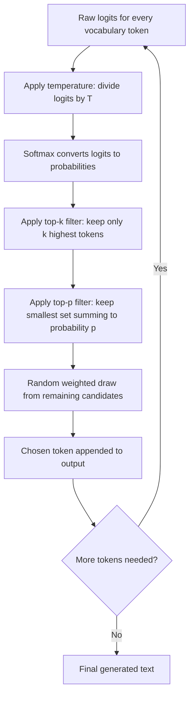

# Temperature and Sampling (Top-p, Top-k)

## 1. Introduction

After a language model computes a probability for every possible next token, something still has to decide which token actually gets chosen. **Sampling** is that decision process, and **temperature**, **top-k**, and **top-p** are the three most common settings that control how "safe and predictable" versus "varied and surprising" the chosen output is.

These settings are why the same prompt sent twice to the same model can produce two different (but equally valid) answers, and why you can tune a model to be more focused/deterministic or more creative/diverse depending on the task.

## 2. Why This Topic Exists

Once you know a model just produces probabilities (see **Language Models**), the natural next question is: probabilities for what, exactly, and how does the model pick one word out of thousands of possible next tokens? Sampling settings are the practical dial available to developers to control that trade-off — and getting them wrong is a common real-world source of either boring, repetitive output or wild, incoherent output.

## 3. Core Concept

### Beginner

Imagine the model has just guessed the next word and has a ranked list of candidates, each with a likelihood score — like `"cat" 70%`, `"dog" 15%`, `"car" 5%`, `"cloud" 2%`, and thousands more with tiny probabilities. **Temperature** controls how "adventurous" the model is willing to be when picking from that list:

- **Low temperature** (close to 0) → almost always picks the top candidate → safe, predictable, repetitive text.
- **High temperature** (closer to 1 or above) → gives lower-ranked candidates a real chance → more varied, surprising, creative text (but riskier — more chance of an odd or wrong choice).

### Intermediate

Temperature mathematically reshapes the probability distribution before a token is chosen — it doesn't change the *ranking* of candidates, but it changes how *sharply peaked* or *flattened* the distribution is:

- Temperature = 0 → the distribution collapses toward always picking the single highest-probability token (this becomes greedy decoding, see next topic).
- Temperature = 1 → the distribution is used roughly as-is, as originally predicted by the model.
- Temperature > 1 → the distribution is flattened further, giving unlikely tokens more of a chance, increasing randomness (and risk of nonsense).

**Top-k** and **top-p** are complementary filters, usually applied *before* the final random draw:

| Setting | What it does | Example |
|---|---|---|
| **Top-k** | Only consider the k highest-probability candidate tokens; discard the rest entirely | Top-k = 40 → only the 40 most likely next tokens are eligible, no matter how many thousands of options exist |
| **Top-p** (nucleus sampling) | Only consider the smallest set of top candidates whose probabilities add up to p | Top-p = 0.9 → keep adding candidates from most to least likely until their combined probability reaches 90%, discard the rest |

Top-p adapts to the situation: when the model is very confident (one token dominates), the eligible set is small; when the model is uncertain (many tokens have similar probability), the eligible set is larger. Top-k is fixed regardless of confidence, which can be too strict or too loose depending on context.

### Advanced

These controls are typically combined in production systems: a request might apply top-k, then top-p, then temperature, then finally sample randomly from what remains. The exact order and defaults vary by provider and API.

Nuances worth knowing:

- Temperature alone does not restrict *which* tokens are eligible — it only reweights probabilities among however many tokens are being considered. Top-k/top-p do the restricting.
- Very low temperature isn't quite the same as pure greedy decoding unless it's exactly 0 (or the implementation treats near-zero specially) — but in practice, low temperature strongly approximates greedy behavior.
- Some APIs also expose **frequency penalty** and **presence penalty** — separate settings that discourage repeating the same tokens/topics, which is a related but distinct tool from temperature/top-k/top-p.
- Choosing sampling settings is task-dependent: factual Q&A, code generation, and structured data extraction typically want low temperature (accuracy, consistency); creative writing, brainstorming, and idea generation typically benefit from higher temperature (variety).

## 4. Deep Explanation

After the neural network produces raw scores (called **logits**) for every token in the vocabulary, those scores are converted into probabilities using a function called **softmax**. Temperature is applied *before* softmax, dividing every logit by the temperature value:

```
adjusted_logit = logit / temperature
probability = softmax(adjusted_logit)
```

Dividing by a small temperature (e.g. 0.2) makes differences between logits larger after softmax, sharpening the distribution toward the top candidate. Dividing by a large temperature (e.g. 1.5) shrinks differences, flattening the distribution and giving weaker candidates a more meaningful chance.

Top-k and top-p then act as a *filter* on this (possibly reshaped) distribution — restricting the candidate pool before a token is randomly drawn according to the remaining probabilities. This combination gives fine-grained control: top-k/top-p decide "how wide is the net," and temperature decides "how evenly weighted is everything caught in the net."

## 5. Step-by-Step Flow

1. The model computes raw scores (logits) for every token in its vocabulary for the next position.
2. Temperature is applied to the logits, sharpening or flattening the distribution.
3. Softmax converts adjusted logits into a probability distribution summing to 1.
4. Top-k and/or top-p filtering trims the distribution down to a smaller eligible candidate set.
5. A token is randomly drawn from the remaining eligible candidates, weighted by their (adjusted) probabilities.
6. The chosen token is appended to the output, and the whole process repeats for the next token.

## 6. Architecture Explanation



## 7. Visual Analogy

Imagine a dartboard where each region's size represents how likely the model thinks that word is to come next. Temperature is like adjusting the dartboard: at low temperature, the board is almost entirely one giant bullseye region (the top guess) with everything else tiny; at high temperature, the regions become more evenly sized, giving weaker guesses a real shot. Top-k is like taping over all regions except the biggest k of them before throwing. Top-p is like taping over regions until only the smallest group covering 90% of the total board area remains. Only after all that tape is applied does the model actually "throw the dart" (sample) to pick the next word.

## 8. Real Industry Example

- Coding assistants and structured-data-extraction tools typically default to low temperature (often 0–0.3) because consistency and correctness matter far more than variety — you want the same query to reliably produce working code or valid JSON.
- Creative writing tools, brainstorming assistants, and marketing copy generators often use higher temperature (0.7–1.0+) intentionally, so repeated generations produce varied, less repetitive ideas.
- Many production chat APIs (OpenAI, Anthropic) expose `temperature` and `top_p` as request parameters directly, letting developers tune this per API call, per use case — a customer-support bot might use a different setting than a story-generation feature within the same company's product.

## 9. Common Misconceptions

- **"Temperature = 0 makes the model 100% deterministic across all hardware/settings."** In practice it's close to deterministic, but subtle implementation details (floating-point behavior, batching) can still introduce tiny variation in some systems.
- **"Higher temperature makes the model smarter or more accurate."** No — higher temperature increases variety and creativity but also increases the risk of incoherent or incorrect output; it doesn't add capability.
- **"Top-k and top-p do the same thing."** They're similar in spirit but behave differently: top-k is a fixed-size cutoff, top-p is an adaptive, probability-mass-based cutoff.
- **"Sampling settings fix hallucination."** They don't — hallucination stems from the model's underlying knowledge and training, not from how tokens are sampled; low temperature only makes output more consistent/predictable, not more factually correct.

## 10. Best Practices

- Use low temperature (near 0) for tasks needing consistency, correctness, or reproducibility: code, structured data, factual Q&A.
- Use moderate-to-high temperature for tasks that benefit from variety: brainstorming, creative writing, generating multiple distinct options.
- Prefer adjusting either temperature or top-p, not both aggressively at once — combining extreme settings can produce unpredictable results.
- Test sampling settings against your specific task rather than assuming defaults are optimal — the right setting is genuinely task-dependent.

## 11. Summary

Once a language model produces probabilities for the next token, sampling settings determine how that token is actually chosen. Temperature reshapes the probability distribution — lower values sharpen it toward the top guess, higher values flatten it toward more variety. Top-k and top-p filter which candidates are even eligible before the random draw, with top-p adapting its cutoff based on the model's confidence at each step. Together, these settings are the practical dials for balancing predictable/accurate output against varied/creative output, without changing the model's underlying knowledge or capability.

## 12. Key Takeaways

- Sampling is the step that turns predicted probabilities into an actual chosen next token.
- Temperature sharpens (low) or flattens (high) the probability distribution before a token is picked.
- Top-k keeps only a fixed number of the most likely candidates; top-p keeps the smallest set covering a target cumulative probability.
- Low temperature/tight top-k/top-p suits factual, consistent tasks; higher settings suit creative, varied tasks.
- These settings control style and variety, not factual accuracy — they don't fix hallucination.
- Different tasks (code vs. creative writing) genuinely warrant different sampling settings.
